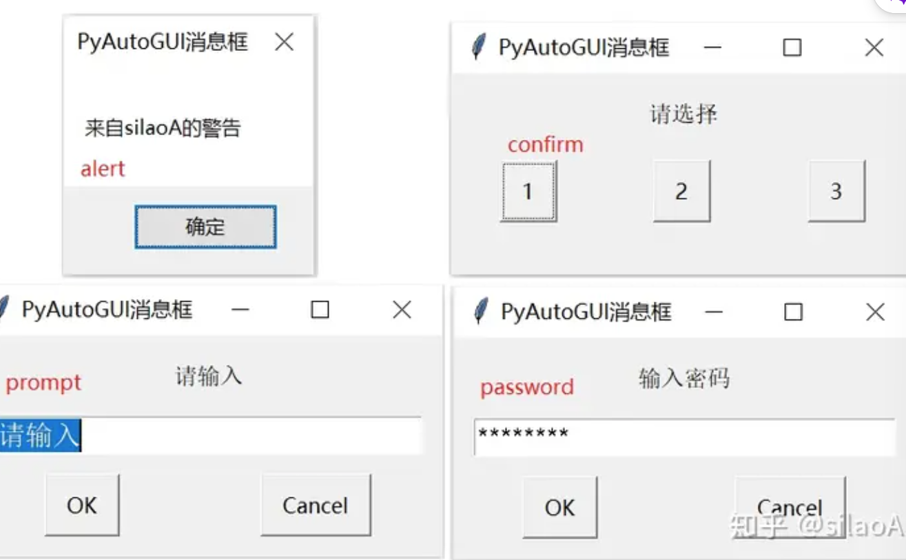

安装PyAutoGUI

```bash
python -m pip install -U pyautogui
```

获取屏幕信息

```python
import pyautogui
sizex,sizey = pyautogui.size() # 获取屏幕尺寸，x,y∈[0, 分辨率-1]
pyautogui.position() # 获取鼠标当前位置
pyautogui.onScreen(100,200) # 判断坐标是否在屏幕范围内
```

鼠标移动

```pythton
pyautogui.moveTo(sizex/2,sizey/2,duration=1) # 绝对位置移动
pyautogui.moveRel(100, -200, duration=0.5) # 相对位置移动
```

鼠标点击

``` python
# 点击
pyautogui.click(sizex/2,sizey/2, duration=0.5) # 移动后点击，过渡时间0.5s
pyautogui.click(button='right') #当前位置点击右键
pyautogui.click(100,100, clicks=3,interval=0.1,button='right',duration=0.5) # 移动至绝对路径100，100，右键点击三次，间隔0.1s，移动过渡0.5s

# 滚轮
pyautogui.scroll(2) # 向上滚2个单位
pyautogui.scroll(-10,1000,700) # 鼠标移动至1000，700后向下滚10个单位

# 拖拽
pyautogui.dragTo(sizex/2,sizey/2) # 拖拽移动到位置
pyautogui.dragRel(-100,200,duration=0.5,button='right') # 拖拽移动到位置，持续0.5s，右键

```

 键盘键入

``` python
pyautogui.press('a') # 按字母A键，字母支持大小写
pyautogui.hotkey('ctrl', 'shift', 'esc') #调出任务管理器
pyautogui.press(['p','y','space'], interval=0.1) # 按键p、按键y、空格），按键之间间隔0.1秒
pyautogui.typewrite('hello, PyAutoGUI!\n') # 键入字符串
pyautogui.typewrite(['s','r','f','space'], interval=0.1) # 用列表键入字符串
输入法 # 往终端输入中文，就能将输入法切换到中文状态

```

消息窗口

```python
#输入的内容将被返回
pyautogui.alert(text='警告',title='PyAutoGUI消息框',button='OK')
pyautogui.confirm(text='请选择',title='PyAutoGUI消息框',buttons=['1','2','3'])
pyautogui.prompt(text='请输入',title='PyAutoGUI消息框',default='请输入')
pyautogui.password(text='输入密码',title='PyAutoGUI消息框',default='',mask='*')
```



截图

```python
pyautogui.screenshot('shot.png',region=(1000,600,600,400))
# 截图区域，由左上角坐标、宽度、高度4个值确定，默认全屏，超出部分黑色填充
# 需要安装pillow库，返回image对象
```

```python
# 计算出指定图片在屏幕上的坐标位置并返回屏幕上对应的中心坐标
# 左上角坐标、宽度、高度4个值的四元组
loc = pyautogui.locateCenterOnScreen("icon_xx.png", region=(0, 0,sizex/2, sizey/10) ) # region参数限制查找范围，加快查找速度
pyautogui.moveTo(*loc, duration=0.5) # 移动鼠标
pyautogui.click(clicks=1) #点击
# 可以提前将菜单、软件、按钮等界面保存下来，用于自动查找对应的位置
```

[Python自动操作GUI神器PyAutoGUI (zhihu.com)](https://www.zhihu.com/tardis/zm/art/302592540?source_id=1005)

