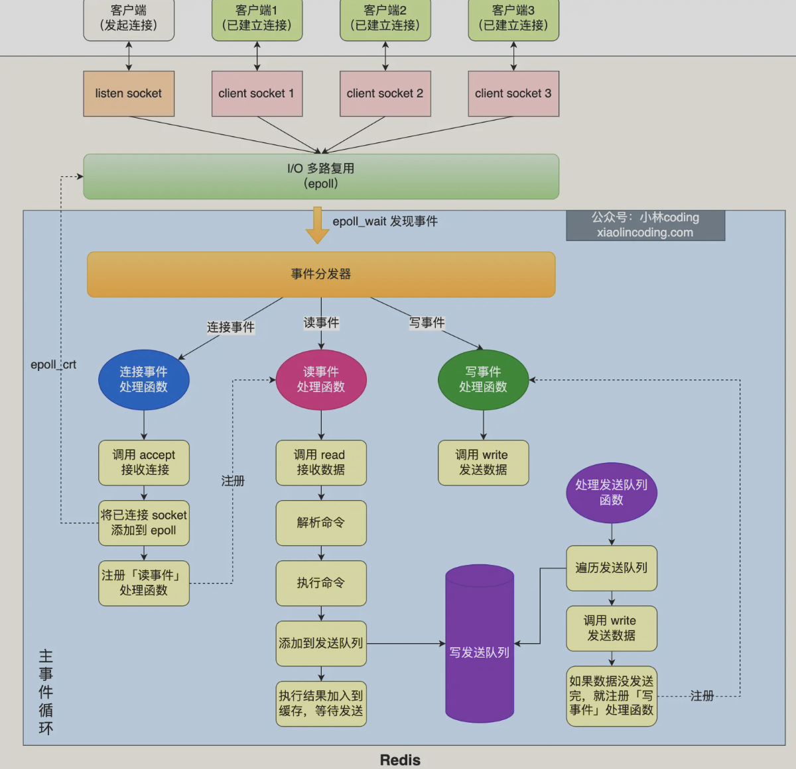

# redis概述

## 简介
是一种内存数据结构存储，用作数据库、缓存、消息代理、流引擎

redis作为msql的缓存，因为其有高性能和高并发

**特点**

- 定期将数据转到磁盘持久化，也可以关闭这个功能
- 支持多种数据结构并对其运行原子操作：
- 基于内存的数据库，读写操作在内存中完成，读写速度很快
- 支持事务 、持久化、Lua 脚本、多种集群方案（主从复制模式、哨兵模式、切片机群模式）、发布/订阅模式，内存淘汰机制、过期删除机制等等

**redis和etcd**

redis有更好的查询性能，支持更多的数据结果
etcd更为可靠安全，故障转移和持续数据可用，数据均持久化

**redis和memcached**

共同点：
两者都是基于内存的数据库，作为缓存使用，有极高的性能
都有过期策略

区别：
- redis支持更多数据类型，memcached是kv数据类型
- redis有持久化功能，memcached没有
- redis支持集群模式，memcached没有原生的集群模式
- redis支持发布订阅模型、lua脚本、事务等功能，memcached不支持

# redis线程模型

redis的线程：

主线程完成：接收客户端请求->解析请求->数据读写->发送给客户端

一个后台线程处理关闭文件

一个后台线程负责AOF刷盘

一个后台线程lazyfree来释放redis内存

3个后台线程的任务操作都很耗时，因此有单独的线程完成

生产者把耗时任务丢到任务队列中，后台线程相当于消费者轮询队列处理

## redis单线程模式

redis 6.0之前的单线程模式

通过epoll接收客户端的相应，事件分发器生成对应的连接事件、读事件、写事件，主线程做事件循环依次处理事件

### **事件循环函数**

调用处理发送队列函数：对于这一轮，如果有发送任务，通过write函数将客户端缓冲区的数据发送出去，如果没有，注册写事件处理函数，epoll_wait函数发现事件后再处理

接着，调用epoll_wait函数等待事件

- 对于连接事件，调用连接事件处理函数
  - 调用accpet获取已连接的socket
  - 调用epoll_ctl将已连接的socket加入到epoll
  - 注册读事件处理函数
- 对于读事件，调用读事件处理函数
  - 调用read获取发来的数据
  - 解析命令
  - 处理命令
  - 将客户端对象添加到发送队列
  - 将执行结果写入发送缓存区
- 对于写事件，调用写事件处理函数
  - 通过write函数将客户端发送缓存区的数据发送出去，
  - 如果这一轮数据没有发完，继续注册写事件处理函数，等待epoll_wait发现后再处理

### redis为什么使用单线程

redis吞吐量可以达到10W/s

**redis的单线程为什么快**

1. 大部分操作在内存中完成+高效的数据结构
2. 单线程模型避免了多线程的竞争和切换开销
3. I/O多路复用机制

**redis 6.0前为什么用单线程**

redis的性能瓶颈并不是CPU，更多时候是内存大小和网络I/O的限制，因此采用单线程即可（多线程会使得CPU性能过剩）

如果要使用多线程，则可以在一台服务器上启动多个节点或采用分片集群

单线程易于维护，不会产生并发读写的问题，不会有线程切换竞争等损耗

