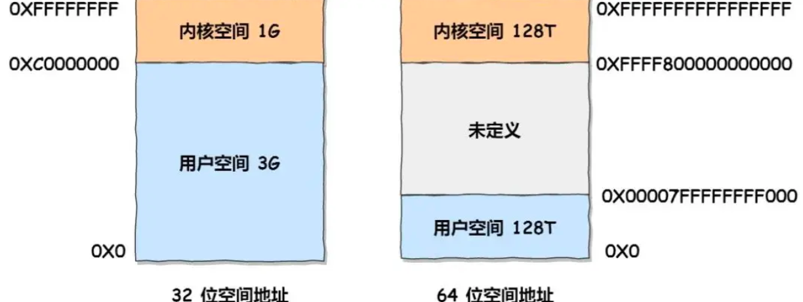
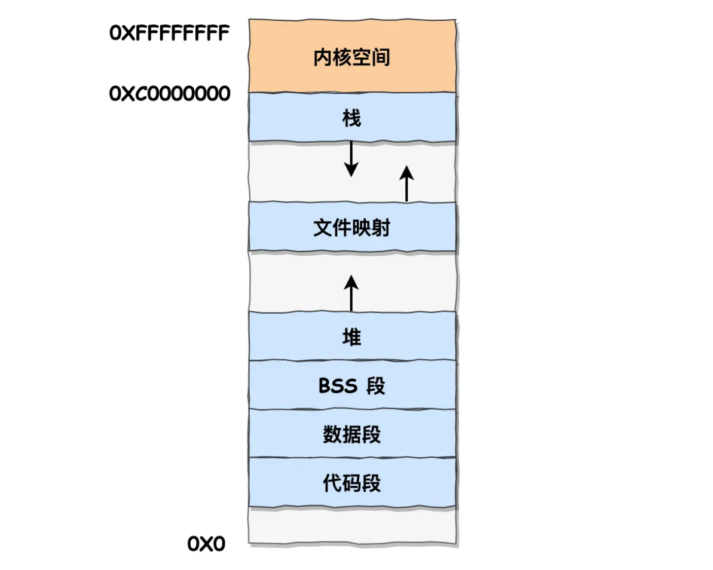

# linux进程的内存分布

虚拟地址空间被分为内核空间和用户空间，内核空间位于高地址



- 32位内核空间占用1G，位于最高处，剩下的3G是用户空间
- 64位内核空间和用户空间都是128T，中间部分未定义

32位的用户空间划分，栈区位于高地址



- 代码段，包括二进制可执行代码
- 数据段，包括已初始化的静态常量和全局变量
- BSS段，包括未初始化的静态变量和全局变量
- 堆段，动态分配的内存，从低地址向上增长
- 文件映射段，包括动态库、共享内存，从低地址向上增长
- 堆栈，包括局部变量和函数调用的上下文等，栈的大小一般固定为8MB

**@ 之所以区分BSS段和数据段**

BSS段存放的未初始化的数据，因为默认都是0值，因此不需要一一存放它的值，在可执行文件中并不占用存储空间，只记录变量名称和大小，在程序加载到内存中时，再问他们分配内存并初始化为0。从而减少可执行文件的大小

数据段存放已初始化的静态变量和全局变量，这些变量在编译节点就分配了存储空间，在可执行文件中存储了他们的具体值，加载内存时，数据段会将这些变量的具体值拷贝到内存中

# malloc如何分配内存的

## 申请的地址位置

malloc申请内存的时候通过两种方式向操作系统申请堆内存：

**方式一：brk（）系统调用从堆分配内存**

通过brk（）函数将堆顶指针向高地址移动，获得新的内存空间

**方式二：mmap（）系统调用在文件映射区域分配内存**

私有匿名映射，在文件映射区分配一块内存

如果用户分配的内存小于128KB，通过brk申请内存，如果用户分配的内存大于128KB，通过mmap申请内存（不同glibc版本不同）

## malloc执行虚拟内存映射到物理内存

malloc分配的内存是虚拟内存，如果这个虚拟内存没有被访问则不会映射到物理内存，不会占用物理内存

只有在访问已分配的虚拟地址空间时，操作系统通过查找页表，发现虚拟内存对应的页不再物理内存中，就会触发缺页中断，然后建立虚拟地址和物理内存的映射关系

## malloc（1）会分配多大的虚拟内存

和分配的内存管理器有关，内存管理器Ptmalloc2为例

/proc路径下是程序运行时的文件，里面的文件名对应运行的进程号

`cat /proc/3191/maps` ： 查看3191这个进程的内存信息，当程序结束这个文件就会立即删除

**一个实验来分析这个问题**

```cpp
#include <stdio.h>
#include <malloc.h>

int main() {
  printf("使用cat /proc/%d/maps查看内存分配\n",getpid());
  
  //申请1字节的内存
  void *addr = malloc(1);
  printf("此1字节的内存起始地址：%x\n", addr);
  printf("使用cat /proc/%d/maps查看内存分配\n",getpid());
 
  //将程序阻塞
  pause();

  //释放内存
  free(addr);
  return 0;
}
```

执行该程序然后查看linux进程文件

```shell
[root@xiaolin ~]# cat /proc/3191/maps | grep d730
00d73000-00d94000 rw-p 00000000 00:00 0                            [heap]
```

可以看到堆空间的内存地址是00d73000-00d94000，大小为132KB

内存右边没有heap标识表示是以mmap匿名映射的方式从文件映射区分配的匿名内存

> 程序打印的内存起始是d73010，实际显示的地址起始是d73000，多出了16字节，用于放内存块的描述信息

## free释放内存

针对malloc通过brk（）方式申请的内存，直接free后，堆内存还是存在的，并没有归还给操作系统，因为与其把1字节释放给os，不如缓存这放进malloc的内存池里，但再申请时就可以复用

如果是malloc通过mmap方式申请的内存，free释放内存后就会归还给操作系统。将上诉实验改为申请128KB的内存就能验证（free掉后，maps文件里没有这个地址的记录了）

**@ free如何知道释放的内存块的大小**

内存块前16KB保存了该内存块的描述信息，包括内存块的大小，这样每次释放时，free会将传入的内存地址向左偏移16字节，再分析处当前内存块的大小

## brk方式和mmap方式申请内存的优缺

**对于mmap方式**

1. mmap是系统调用，有内核和用户态切换的开销
2. mmap分配的内存每次释放时都会归还给操作系统，于是每次mmap分配都是缺页状态触发缺页中断（一开始分配的虚拟地址，访问时映射物理地址从而触发缺页中断）

**对于brk方式**

brk（）系统调用申请空间时，因为堆空间是连续的，所以直接预分配更大的内存来作为内存池，内存释放时缓存在内存池中，这样减少了缺页中断和系统调用的次数

brk（）的问题是对于频繁地malloc和free申请释放小块内存，如果申请的大小递增，之前free释放的内存池不够，就需要新申请，这样频繁进行，就会导致内存泄漏，且无法用valgrind检测出现
