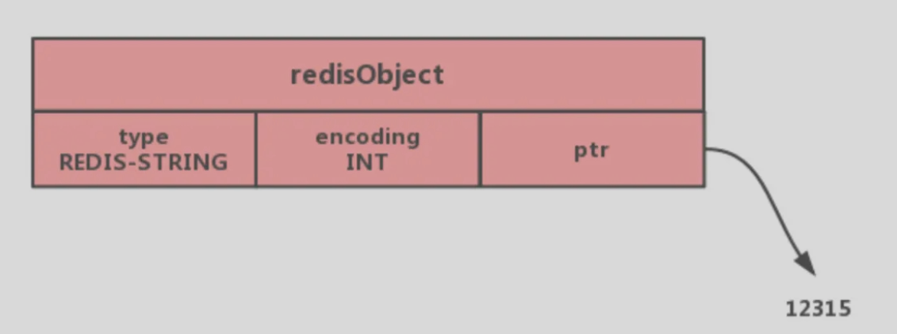
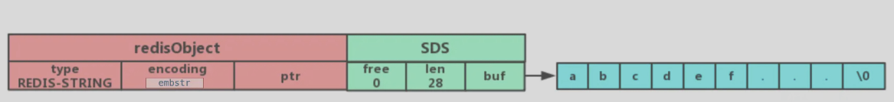
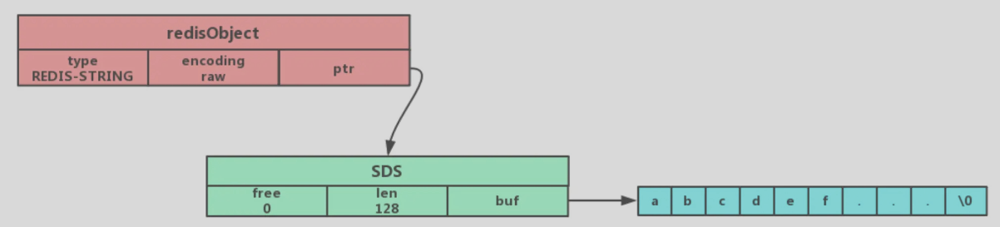
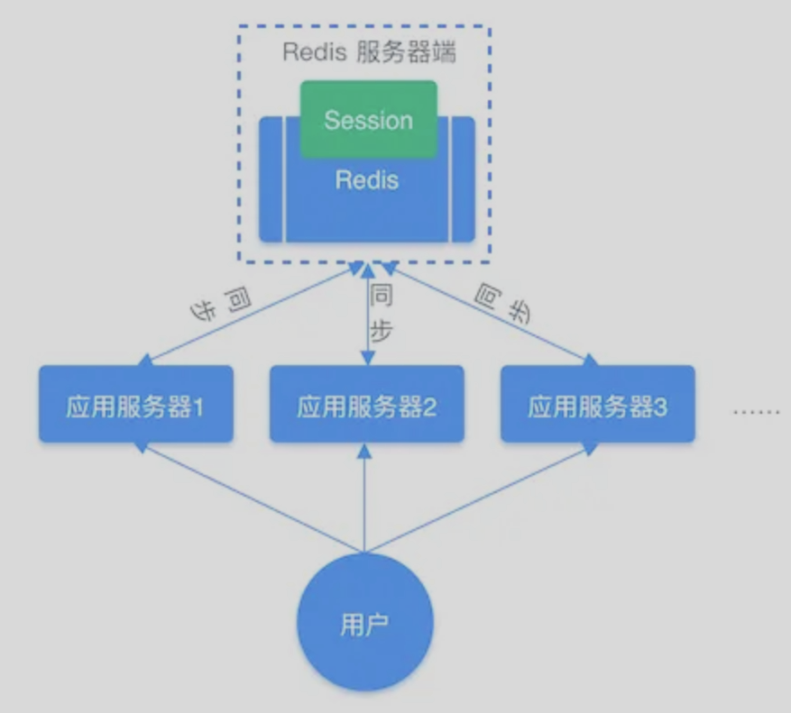
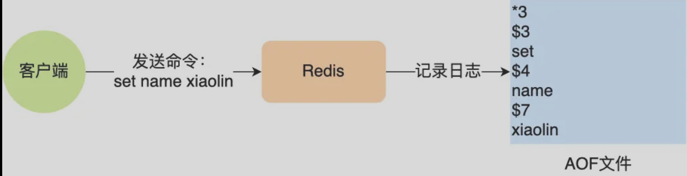

# redis概述

## 简介
是一种内存数据结构存储，用作数据库、缓存、消息代理、流引擎

redis作为msql的缓存，因为其有高性能和高并发

**特点**

- 定期将数据转到磁盘持久化，也可以关闭这个功能
- 支持多种数据结构并对其运行原子操作：
- 基于内存的数据库，读写操作在内存中完成，读写速度很快
- 支持事务 、持久化、Lua 脚本、多种集群方案（主从复制模式、哨兵模式、切片机群模式）、发布/订阅模式，内存淘汰机制、过期删除机制等等

**redis和etcd**

redis有更好的查询性能，支持更多的数据结果
etcd更为可靠安全，故障转移和持续数据可用，数据均持久化

**redis和memcached**

共同点：
两者都是基于内存的数据库，作为缓存使用，有极高的性能
都有过期策略

区别：
- redis支持更多数据类型，memcached是kv数据类型
- redis有持久化功能，memcached没有
- redis支持集群模式，memcached没有原生的集群模式
- redis支持发布订阅模型、lua脚本、事务等功能，memcached不支持

# 数据结构

**支持的数据类型和应用场景**：

-  String(字符串)：缓存对象、分布式锁、共享session信息
-  Hash(哈希)：缓存对象、例如：购物车
-  List (列表)：消息队列
-  Set(集合)：聚合（交并差）计算，例如：共同关注
-  Zset(有序集合)：排序场景
-  Bitmaps（位图）：二值状态的统计，例如：签到、判断登录状态
-  HyperLogLog（基数统计）：例如：网页UV计数（独立访客统计）
-  GEO（地理信息）：储存地理位置信息的场景
-  Stream（流）：消息队列

HyperLogLog比起set占用更小空间，仅实现基数统计，对于2^64个不同元素的基数只需用12KB的内存，结果的误差在一定范围内

stream比起list，自动生成全局唯一消息ID，支持以消费组形式消费数据

例如：数据集{1，3，5，7，5，7，8}的基数集为{1，3，5，7，8}，基数为5

## string类型

是kv结构，value最多容纳数据512M

底层为SDS（简单动态字符串），相比起c字符串

- SDS可以保存文本数据和二进制数据，使用len属性的值来判断字符串是否结束，包含图片、音视频、压缩文件等
- 获取字符串长度的时间复杂度是O（1）
- SDS的API是安全的，拼接字符串会自动扩容

字符串对象的内部编码有三种：int、raw、embstr

### int类型的编码方式

- 保存对象是整数值
- 可以被long类型标识

那么会将整数值保存在字符串对象结构的ptr属性里，编码设置为int



### embstr类型的编码方式

专用于保存短字符串

- 保存的是一个字符串
- 字符串长度<=44字节（redis5.0）

将使用简单动态字符串SDS来保存这个字符串，并将对象的编码设置为embstr

字符串对象结构里保存SDS的数据信息，用buf指针指向实值



### raw类型的编码方式

- 保存的是字符串
- 字符串长度>44字节（redis5.0)

用SDS来保存这个字符串，并将对象的编码设置为raw

ptr指向SDS的数据信息，用buf指针指向实值



### raw相比embstr

embstr一次分配一块连续的内存空间来保存redisObject和SDS

raw编码通过调用两次内存分配函数来分别分配两块空间来保存redisObject和SDS

embstr优点

- embstr有更少的内存分配和释放次数
- 连续的内存空间有更好的查询效率

embstr缺点

- 字符串长度增加时，redisObject和sds都需要重新分配空间

> 因此embstr编码的字符串对象实际上是只读的，没有修改它的程序，如果要修改，会将其转为raw再修改

### 应用场景

1、缓存对象

使用string来缓存对象有两种方式：

- 直接缓存整个对象的JSON，

  例：`SET user:1 ‘{“name” : “xiaolin”, “age”:18’`}

- 将key分离为属性，采用mset存储，有mget获取个属性值

  例：MEST user:1:name xiaolin user:1:age 18 

2、常规计数

redis是单线程的，命令的执行为原子的，适用访问次数、点赞等

3、分布式锁

利用当key不存在再插入这个特性可以用它来实现分布式锁

`set lock_key unique_value NX PX 10000`

- lock_key表示加锁名
- unique_value为客户端生成的唯一标识，用来确认谁加的锁
- NX表示不存在则插入，
- PX表示过期时间为10000

解锁的过程就是将lock_key键删除，注意删除前要先判断下value是当前客户端的唯一标识

解锁过程涉及两个操作因此要用Lua脚本来保证原子性

4、共享session信息

在分布式系统下，用户一的session信息存储在服务器一，第二次访问时被分配到服务器二，这时服务器二没有用户一的session信息，因此需要redis对session信息统一存储管理

将session信息存入redis服务器，多个服务器公用它



## list类型

底层为双向链表或压缩列表

- 列表的元素<512个（可配置），并且每个元素的值小于64字节，redis会使用压缩列表
- 其他情况用双向链表

redis 3.2之后，全部由quicklist实现

## hash类型

底层为压缩列表或哈希表

- 列表的元素<512个（可配置），并且每个元素的值小于64字节，redis会使用压缩列表
- 其他情况用hash表

redis 7.0后压缩列表替换为listpack实现

## set类型

底层为哈希表或整数集合

- 列表的元素<512个（可配置），并且每个元素的值小于64字节，redis会使用整数集合
- 其他情况用哈希表

## ZSet类型

底层用压缩列表或跳表

- 集合的元素<128个（可配置），并且每个元素的值小于64字节，redis会使用压缩列表
- 其他情况用跳表

redis 7.0后压缩列表用listpack实现

# redis线程模型

redis的线程：

主线程完成：接收客户端请求->解析请求->数据读写->发送给客户端

- bio_close_file线程：处理关闭文件

- bio_aof_fsync线程：负责AOF刷盘

- bio_lazy_free线程：来释放redis内存

redis 6.0后引入三个I/O多线程： io_thd_1、io_thd_2、io_thd_3：

即，默认情况下加上主线程有7个线程

后台线程的任务操作都很耗时，因此有单独的线程完成

生产者把耗时任务丢到任务队列中，后台线程相当于消费者轮询队列处理

## redis单线程模式

redis 6.0之前的单线程模式

通过epoll接收客户端的相应，事件分发器生成对应的连接事件、读事件、写事件，主线程做事件循环依次处理事件


### **事件循环函数**

调用处理发送队列函数：对于这一轮，如果有发送任务，通过write函数将客户端缓冲区的数据发送出去，如果没有，注册写事件处理函数，epoll_wait函数发现事件后再处理

接着，调用epoll_wait函数等待事件

- 对于连接事件，调用连接事件处理函数
  - 调用accpet获取已连接的socket
  - 调用epoll_ctl将已连接的socket加入到epoll
  - 注册读事件处理函数
- 对于读事件，调用读事件处理函数
  - 调用read获取发来的数据
  - 解析命令
  - 处理命令
  - 将客户端对象添加到发送队列
  - 将执行结果写入发送缓存区
- 对于写事件，调用写事件处理函数
  - 通过write函数将客户端发送缓存区的数据发送出去，
  - 如果这一轮数据没有发完，继续注册写事件处理函数，等待epoll_wait发现后再处理

### redis为什么使用单线程

redis吞吐量可以达到10W/s

**redis的单线程为什么快**

1. 大部分操作在内存中完成+高效的数据结构
2. 单线程模型避免了多线程的竞争和切换开销
3. I/O多路复用机制

**redis 6.0前为什么用单线程**

redis的性能瓶颈并不是CPU，更多时候是内存大小和网络I/O的限制，因此采用单线程即可（多线程会使得CPU性能过剩）

如果要使用多线程，则可以在一台服务器上启动多个节点或采用分片集群

单线程易于维护，不会产生并发读写的问题，不会有线程切换竞争等损耗

### 为什么引入了多线程

网络硬件性能的提升使得redis的性能瓶颈有时在网络I/O的处理上

redis 6.0用多线程处理网络I/O，对于命令依然是单线程处理

可以通过配置文件修改多线程的使用，默认只针对发送响应数据，不会以多线程的方式处理读请求

线程的数量，官方建议是小于机器核数，8核则分配6个线程即可（加上主线程7个）

# 持久化

## 主要实现方式

- AOF日志：每执行一条写操作，将命令以追加的方式写入到一个文件里
- RDB快照：将某一时刻的内存数据以二进制的方式写入磁盘
- 混合持久化方式：结合上面两种

## AOF日志

每执行一条写操作，将命令追加写入一个文件，文件内容

### AOF日志格式



*3   表示当前命令有三个部分

$数字 表示一个部分的开头，后面跟着命令\键\值，数字表示这部分的有多少字节

@ **为什么先执行命令，再写入**

- 先记录再执行，如果执行失败（语法失败），那么用日志恢复时就会出错
- 单线程执行，不会阻塞写操作的执行

**@ 带来的风险**

- 数据可能丢失
- 单线程执行，可能阻塞其他操作

### AOF写回策略

执行写操作命令，将命令追加到server.aof_buf缓冲区，IO系统调用write，写入内核缓冲区的AOF文件，内核发起写操作进入硬盘

redis的三种写回硬盘策略

- Always：每次写操作都同步AOF到硬盘
- everysec：每次写操作后都写入AOF内核缓冲区，每隔一秒写到硬盘
- NO：不由redis控制写硬盘的时机，os决定

### AOF重写机制

AOF日志过大时会带来性能问题，恢复很慢

因此当AOF文件大小超过设定的阔值后，启动AOF重写机制，压缩AOF文件

**原理**：在重写时，读取当前数据库中的所有键值对，将每一个键值对用一条命令记录到新的AOF文件，全部记录完成后，用新的AOF文件替换掉旧的AOF

**例如：**

旧文件先后执行了[set name xiaolin] 和 [set name xiaolincoding]这两个命令

重写机制后，合为一条命令[set name xiaolincoding]

**重写AOF日志的过程**

重写过程由后台子进程bgrewriteaof来完成，而不是线程，这样做的优势：

使用多个线程对共享内存的修改会涉及到加锁，降低性能，
而子进程以只读的方式共享父进程的数据，当父子进程任意一方修改了该共享内存就会发送写时复制，不需要加锁

触发重写机制后，重写子进程以只读的方式读取数据库里的所有数据，逐一把内存数据的键值对转换为一条命令，再将命令记录到新的AOF

@ 对于重写过程中，主进程的记录修改如何记录到新的AOF？

redis采用了**AOF重写缓冲区**，创建了bgrewriteaof子进程后开始使用，当redis执行完一个写命令后，会同时将这个写命令写入到AOF缓冲区和AOF重写缓冲区

在bgrewriteaof子进程执行AOF重写期间，主进程需要执行以下三个工作：

- 执行客户端发来的命令
- 将执行后的写命令追加到AOF缓冲区
- 将执行后的写命令追加到AOF重写缓冲区

子进程完成AOF重写规则后，向主进程发送信号

主进程收到信号后：

- 将AOF重写缓冲区的所有内容追加到新的AOF的文件
- 新的AOF文件进行改名，覆盖现有的AOF文件

---

## RDB快照

对于故障恢复，AOF以记录操作命令的方式恢复数据比较缓慢

RDB记录某一瞬间的内存数据，恢复时直接将RDB文件读入内存即可，恢复数据效率较高

### 快照的线程阻塞机制

redis提供了三种方案决定以什么样的方式执行快照记录

- save命令，将在主线程生成RDB文件，写入时间过长会阻塞线程
- bgsave命令，创建子进程来生成RDB文件，避免主线程阻塞
- 通过配置文件的选项来实现隔一段时间自动执行依次bgsave命令

redis是全量快照，每次执行都是把内存的所有数据记录到磁盘中，所以如果频率太频繁会对性能有影响

@ RDB在执行快照时数据能修改吗

依托写时复制技术，可以边记录边修改，即父子进程的实现机制

## 混合持久化

RDB恢复数据快，但快照的频率不能太高，使得安全性较低，AOF丢失数据少但数据恢复不快

开启了混合持久化时，在AOF重写日志时，重写子进程会先将与主线程共享的内存数据以RDB方式写入到AOF文件，
此时主线程处理的操作记录记录到重写缓冲区里，重写缓冲区里的增量命令以AOF方式写入到AOF文件，
写入完成后通知主进程将RDB格式和AOF格式的AOF文件替换旧的AOF文件

即混合持久化生成的文件，前半部分是RDB格式的全量数据，后半部分是AOF格式的增量数据

**优点**：恢复速度很快，丢失更少的数据

**缺点**：AOF中添加了RDB格式使得可读性变差、兼容性差，不能用于redis以前的版本

# redis集群

## 主从复制

将一台redis服务器同步数据到多台服务器上，主从服务器间采用读写分离

主服务器进行读写操作，写操作自动将写同步给从服务器，从服务器一般只读

主从服务器的同步过程是异步的：

主服务器收到新的写命令后，发送给从服务器，然后就向客户端返回结果了，因此主从服务器间的数据不一致，即属于ap

## 哨兵模式

当redis的主从服务器出现故障时，需要手动进行恢复，为解决这个问题增加了哨兵模式，可以监控主从服务器，提供主从节点故障转移的功能

## 切片集群模式

当redis缓存数据量大到一台服务器无法缓存时，使用集群模式将数据分布在不同的服务器上，以降低对单节点的依赖，从而提高读写性能

redis cluster采用**哈希槽**来处理数据和节点之间的映射关系，一个切片集群有16384个哈希槽（2^14），每个键值对都会根据它的key映射到一个哈希槽中：

- 根据键值对的key，按照CRC16（循环冗余校验）算法计算一个16bit的值
- 再用16bit值对16384取模，每个模数代表一个编号的哈希槽

哈希槽与具体redis节点的映射关系：

- 平均分配：自动把哈希槽平均分布到集群节点上
- 手动分配：手动建立节点间的连接，组成集群，指定每个节点上的哈希槽个数

手动分配时，需要把16384个槽全部分配完

---

@ 什么是集群脑裂（双主现象）

如果主节点A网络发生问题与所有从节点失联，和客户端网络正常，此时客户端的数据写入只缓存到了主节点A，无法同步给从节点

脑裂引发的数据丢失问题

哨兵发现主节点A失联，重新选举出一个leaderB，然后网络突然好了，旧主节点A降为从节点，从节点A向新主节点请求数据同步，第一次为全量同步，此时节点A清空字节的本地数据，从而之前客户端写入A的数据丢失

---

@ 解决脑裂引发的数据丢失问题

客户端向主节点的写请求，主节点必须满足如下两个条件：

- 主节点必须有x个从节点连接，小于这个数会禁止写
- 主从数据复制和同步的延迟不能超过x秒，超过会禁止写

如果不满足会直接返回错误给客户端

# 过期删除策略

对key设置过期时间，redis会把key带上过期时间存储到一个过期字典

当查询key时，redis会先检查这个key是否存在于过期字典中

不在，正常读值，在，则获取过期时间，与当前系统时间进行对比，判定是否过期

> redis使用的过期删除策略是惰性删除+定期删除

## 惰性删除策略

不主动删除过期键、每次从数据库访问key时，检测key是否过期，过期则删除该key

优点：占用系统最少的资源，性能好

缺点：过期key留在数据库中，一直不被访问，造成了内存空间的浪费

## 定期删除策略

每隔一段时间随机从数据库取出一定数量的key进行检查，删除过期key

定期删除的流程：

1. 从过期字典中随机抽取20个key检查是否过期，删除过期的key
2. 如果过期的数量超过5个（1/4），则重复步骤1
3. 如果过期数量小于1/4则停止，等待下一轮再检查

为保证不循环过度，增加了定期删除循环流程的时间上限为不超过25ms

优点：控制删除的时长和频率，来减少删除操作对CPU的影响

缺点：难以确定删除操作执行具体的时长和频率，需要在CPU和内存占用作权衡

## 持久化时，对于过期键如何处理

### RDB文件

对于RDB文件生成阶段：

从内存状态持久化为RDB时，会对key进行过期检查，过期的键不会被保存到新的RDB文件中

对于RDB加载阶段：

如果redis是主服务器运行模式，载入RDB文件时，程序会对文件中保存的键进行检查，过期键不会被载入到数据库中

如果redis是从服务器运行模式，载入RDB文件时，不论键是否过期都会载入。但主从服务器在进行数据同步时覆盖了从服务器的数据，所以不会造成影响

### **AOF文件**

对于AOF写入阶段：

如果某个过期键还没被删除，会保留次过期键，过期键删除后会向AOF追加DEL命令来显式的删除该键值

对于AOF重写阶段：

会对redis中的键值进行检查，已过期的键不会被保存到重写后的AOF文件

## 主从模式中，对过期键的处理

从库不会过期扫描，主库在key到期时往AOF文件里增加一条del指令，同步所有从库，从库通过执行这条del指令来删除过期的key

## 内存淘汰机制

当运行内存达到了阔值，就会触发内存淘汰机制

**不进行数据淘汰**：运行内存超过最大设置则不再提供服务

**进行数据淘汰**：

对设置了过期时间的数据中进行淘汰：

	- 随机淘汰设置了过期时间的任意键值
	- 优先淘汰更早过期的键值
	- 淘汰所有设置了过期时间的键值中最久未使用的LRU
	- （默认）淘汰所有设置了过期时间的键值中最少使用的LFU

对所有数据范围内进行淘汰：

- 随机淘汰任意键值
- 淘汰整个键值中最久未使用的键值LRU
- （默认）淘汰整个键值中最少使用的键值LFU

### LRU算法(redis4.0前使用)

利用链表实现最近最少未使用的数据，存在两个问题：

- 链表的管理有额外开销
- 数据被访问需要移动链表，大量的移动会带来很多链表的移动操作，降低性能

redis的实现在对象结构体添加一个额外字段，用于记录此数据的最后一次访问时间

当redis进行内存淘汰时，随机取5个值，淘汰最久没有使用的那个

优点：不用维护链表，节省了空间占用 | 不同每次访问都移动链表，提升了性能

缺点：无法解决缓存污染，一次读取大量数据造成的

### LFU算法（redis4.0后默认）最近最不常用

根据数据访问次数来淘汰数据，增加关键字来记录数据访问频次

```c++
typedef struct redisObject {
    ...
      
    // 24 bits，用于记录对象的访问信息
    unsigned lru:24;  
    ...
} robj;
```

在LRU算法中，lru字段用于记录key的访问时间戳
在LFU算法中，lru字段，高16位用来记录key的访问时间戳，低8位存储logc，记录访问频次

# redis缓存设计

redis作为缓存数据库直接在内存运行，有更高的查询效率，避免直接在磁盘访问

为了保证缓存的数据和数据库中的数据一致性，会给redis的数据设置过期时间，过期后，用户访问的数据如果不在缓存里，业务系统需要重新生成缓存，因此会访问数据库，将数据更新到redis里，后续请求可以直接命中缓存

## 缓存雪崩

当大量缓存在同一时间过期时，面对大量的用户请求，需要大量直接访问数据库，从而增大数据库压力，进一步会造成数据库宕机

解决：

- 随机打散缓存失效时间：在原有的失效时间上增加一个随机值
- 设置缓存不过期：通过后台服务来更新缓存数据

## 缓存击穿

缓存击穿可以是缓存雪崩的子集

有时有几个数据会被频繁访问，例如秒杀活动，这类数据被称为**热点数据**

如果热点数据过期了，大量的请求访问了该热点数据，无法在缓存中命中，直接访问数据库从而使得数据库很容易被冲垮

解决：

- 互斥锁保证同一时间只有一个业务线程请求缓存
- 不给热点数据设置过期时间，由后台异步更新缓存，在热点数据要过期前，通知后台线程更新缓存即重新设置过期时间


