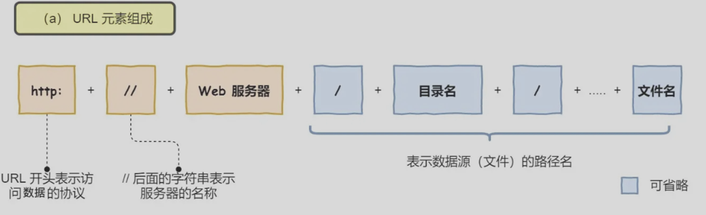
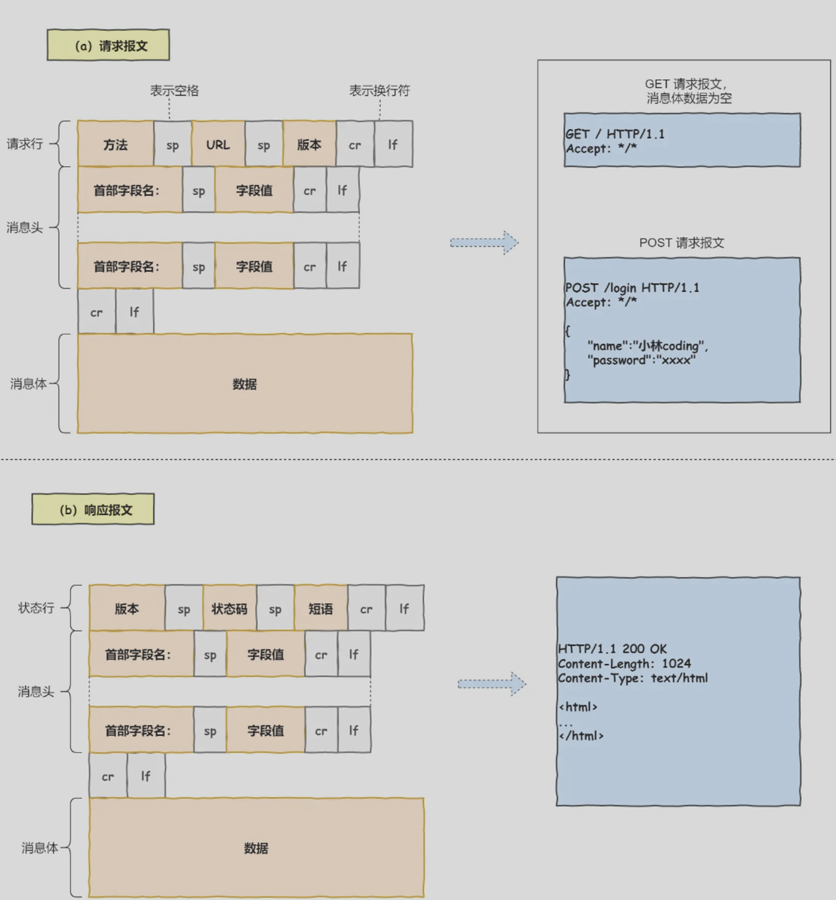
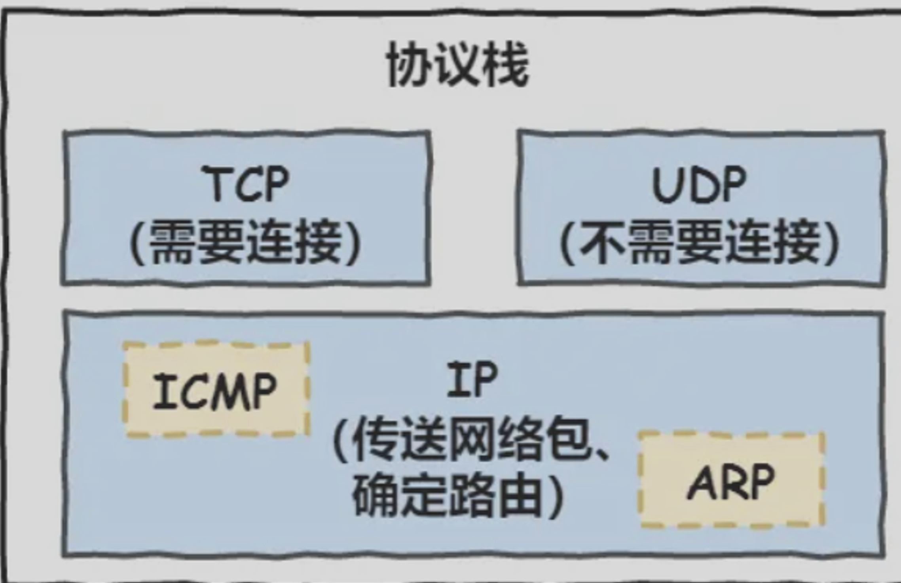

[TOC]

# 基础

TCP/IP的四层模型：应用层、传输层、网络层、网络接口层（数据链路层、物理层）

OSI模型：应用层、**表示层、会话层**、传输层、网络层、数据链路层、物理层

应用层在用户态下，其他层在内核态下，专注于为用户提供应用功能，比如HTTP、FTP、Telnet、DNS、SMTP等

传输层为应用层提供网络支持，帮助实现应用到应用的通信。传输协议包括TCP、UDP。应用层传输的数据可能很大，不好直接传输，传输层的数据包大小超过MSS（TCP最大报文段长度）就要将数据包分块，每个分块即一个TCP段。

网络层负责实际的传输功能，最常使用的是IP协议，将传输层的报文作为数据部分，加上IP包头组装成IP报文，报文大小超过MTU（以太网中一般为1500字节）就会再次分片。

用ip地址区分设备，ip地址分为网络号和主机号

配合子网掩码算出IP地址的网络号和主机号，比如10.100.122.0/24，/24表示255.255.255.0子网掩码（其中有24个1）

将10.100.122.0和255.255.255.0进行按位与运算得到网络号，将255.255.255.0取反与IP地址进行按位与运算得到主机号

寻址中，先匹配到网络号再匹配主机

IP协议还有路由的选择，实际场景多台设备通过众多网络设备连接起来，形成多条网络的路径，因此需要通过路由算法决定路径选择

即IP协议的寻址决定了方向，路由选择路径

网络接口层在IP头部前加锁MAC头部，并封装成数据帧发送到网络上

以太网指在局域网内把附近的设备连接起来使他们可以进行通讯，包括电脑的以太网接口，wifi接口，以太网交换机，路由器的以太接口。

以太网在判断网络包目的地与IP的方式不同，因此必须采用相匹配的方式，MAC头部就起到这个目的，其中包含了接收方和发送方的MAC地址等信息，可以通过ARP协议获取对方的MAC地址

# 键入网址到网页显示

HTTP

解析URL

URL的组成：协议+服务器名称+路径

路径的/地址不是linux系统的根/，而是web服务器配置文件中指定的根，为某个路径

如果不指定文件路径，则访问一个默认地址

生成HTTP请求信息

请求行/状态行+消息头+消息体

真实地址查询——DNS

查询服务器域名对应的IP地址，DNS服务器记录了web服务器域名和IP的对应关系

域名越靠右层级越高，**域名的层级关系如下**

- 根DNS服务器（.)默认隐藏
- 顶级域DNS服务器（.com）
- 权威DNS服务器（[server.com](http://server.com)）

根域的DNS服务器信息保存在互联网所有的DNS服务器中

**域名解析的过程**

- 客户端发出DNS请求，查询域名对应的IP，发给本地的DNS服务器（客户端TCP/IP设置中填写的DNS服务器地址）
- 本地域名服务器收到客户端请求后，询问**根域名服务器**得到.com顶级域名服务器的地址
- 本地DNS访问**.com顶级域名服务器**，得到负责www.server.com区域的权威DNS服务器地址
- 本地DNS访问**权威DNS服务器**，得到对应的IP地址
- 本地DNS将IP地址返回客户端

并不是每次访问都需要经过全步骤，其中浏览器、操作系统、hosts文件、本地域名服务器都会有缓存

协议栈

获取到IP后，将http的传输工作交给os的协议栈

应用程序通过socket库来委托协议栈工作，协议栈上半部分为负责收发数据的TCP和UDP协议，下半部分是用IP协议控制网络包收发操作，包括ICMP协议（告知网络包传送过程中产生的错误和控制信息）和APR协议（根据IP地址查询相应的以太网MAC地址）