[TOC]

# 基础

TCP/IP的四层模型：应用层、传输层、网络层、网络接口层（数据链路层、物理层）

OSI模型：应用层、**表示层、会话层**、传输层、网络层、数据链路层、物理层

应用层在用户态下，其他层在内核态下，专注于为用户提供应用功能，比如HTTP、FTP、Telnet、DNS、SMTP等

**传输层**为应用层提供网络支持，帮助实现应用到应用的通信。传输协议包括TCP、UDP。应用层传输的数据可能很大，不好直接传输，传输层的数据包大小超过MSS（TCP最大报文段长度）就要将数据包分块，每个分块即一个TCP段。

**网络层**负责实际的传输功能，最常使用的是IP协议，将传输层的报文作为数据部分，加上IP包头组装成IP报文，报文大小超过MTU（以太网中一般为1500字节）就会再次分片。

用ip地址区分设备，ip地址分为网络号和主机号

配合子网掩码算出IP地址的网络号和主机号，比如10.100.122.0/24，/24表示255.255.255.0子网掩码（其中有24个1）

将10.100.122.0和255.255.255.0进行按位与运算得到网络号，将255.255.255.0取反与IP地址进行按位与运算得到主机号

寻址中，先匹配到网络号再匹配主机

IP协议还有路由的选择，实际场景多台设备通过众多网络设备连接起来，形成多条网络的路径，因此需要通过路由算法决定路径选择

即IP协议的寻址决定了方向，路由选择路径

**网络接口层**在IP头部前加锁MAC头部，并封装成数据帧发送到网络上

以太网指在局域网内把附近的设备连接起来使他们可以进行通讯，包括电脑的以太网接口，wifi接口，以太网交换机，路由器的以太接口。

以太网在判断网络包目的地与IP的方式不同，因此必须采用相匹配的方式，MAC头部就起到这个目的，其中包含了接收方和发送方的MAC地址等信息，可以通过ARP协议获取对方的MAC地址

# 键入网址到网页显示

HTTP

解析URL

URL的组成：协议+服务器名称+路径


路径的/地址不是linux系统的根/，而是web服务器配置文件中指定的根，为某个路径

如果不指定文件路径，则访问一个默认地址

生成HTTP请求信息

请求行/状态行+消息头+消息体


真实地址查询——DNS

查询服务器域名对应的IP地址，DNS服务器记录了web服务器域名和IP的对应关系

域名越靠右层级越高，**域名的层级关系如下**

- 根DNS服务器（.)默认隐藏
- 顶级域DNS服务器（.com）
- 权威DNS服务器（[server.com](http://server.com)）

根域的DNS服务器信息保存在互联网所有的DNS服务器中

**域名解析的过程**

- 客户端发出DNS请求，查询域名对应的IP，发给本地的DNS服务器（客户端TCP/IP设置中填写的DNS服务器地址）
- 本地域名服务器收到客户端请求后，询问**根域名服务器**得到.com顶级域名服务器的地址
- 本地DNS访问**.com顶级域名服务器**，得到负责www.server.com区域的权威DNS服务器地址
- 本地DNS访问**权威DNS服务器**，得到对应的IP地址
- 本地DNS将IP地址返回客户端

并不是每次访问都需要经过全步骤，其中浏览器、操作系统、hosts文件、本地域名服务器都会有缓存

协议栈

获取到IP后，将http的传输工作交给os的协议栈


应用程序通过socket库来委托协议栈工作，协议栈上半部分为负责收发数据的TCP和UDP协议，下半部分是用IP协议控制网络包收发操作，包括ICMP协议（告知网络包传送过程中产生的错误和控制信息）和APR协议（根据IP地址查询相应的以太网MAC地址）

# TCP

## QUIC

## TCP和UDP

1. 连接：TCP需要连接，UDP不需要
2. 连接数量：TCP一对一，TDP支持一对多，多对多
3. 可靠性：TCP可靠交付，UDP最大努力交付
4. 拥塞控制：TCP有拥塞控制和流量控制，UDP没有
5. 首部开销：TCP首部长度较长，使用了选项会使得字段变长，UDP首部8字节，固定不变
6. 传输方式：TCP流式传输，没有边界，保证顺序和可靠，UDP一个包一个包的发送有边界，可能丢包和乱序
7. 分片：TCP数据大于MSS大小，则会在传输层分片，UDP数据大于MTU大小，会在IP层分片，目标主机在IP层组装数据

> CP有可变长字段，UDP长度不会变化，不需要UDP首部长度字段

**@UDP有包长度字段，TCP没有**

TCP计算负载数据长度：TCP数据长度=IP总长度-IP首部长度-TCP首部长度

UDP也可以通过这样的方式计算长度，但是

第一种说法：用于补全UDP首部长度为4字节的倍数

第二种说法：早期的UDP协议可能不是基于IP协议的

**@TCP和UDP可以使用同一个端口吗**

可以

传输层的端口号是为了区分同一个主机上不同应用程序的数据包

数据链路层中，通过MAC地址来寻找局域网中的主机，网络层中，通过IP地址来寻找网络中互连的主机或路由器，传输层中，通过端口进行寻址（识别同一计算机中同时通信的不同应用程序）

传输层的TCP和UDP在内核中（传输层）属于两个完全独立的软件模块，他们的端口号相互独立，主机通过在IP包头的协议号字段知道该包是TCP/UDP，根据这个信息确定送给哪个模块处理


## **TCP协议**

### 定义

**有连接**：发送数据之前，需要进行连接，且一对一。

**可靠传输**：保证数据时有序且可靠的到达对端机器。

**面向字节流**：与面向数据报相反，数据可以在传递的过程中分成多个TCP报文，有序报文。

**回环地址**：IPv4所有127.开头的都是回环地址，IPv6表示为::1

**0.0.0.0**指代本机的所有IP地址，即回环地址和所有网卡

**loopback地址，**每一台路由器创建一个loopback 接口，并在该接口上单独指定一个IP 地址作为管理地址，管理员会使用该地址对路由器远程登录（telnet ），该地址实际上起到了类似设备名称一类的功能。


**标志位包含：**

**序列号**SEQ：建立连接时生成的随机数，每发一次数据累加一次，用于解决网络包乱序问题，32位无符号数，循环使用

**确认应答号：**下一次期望收到的数据的序列号，发送端收到这个确认应答后可以认为这个序号以前的数据都已被正常接收，用于解决丢包问题

**控制位:**

- ACK ,为1表示确认应答字段有效

- RST：表示TCP连接出现异常强制断开连接

- SYN:表示希望建立连接

- FIN：表示希望断开连接


### TCP连接

**@什么是TCP连接**

用于保证可靠性和流程控制维护的某些状态信息的组合，包括socket（由ip地址和端口号组成），序列号（用来解决乱序问题），窗口大小（作流量控制）

**@如何唯一确定一个TCP连接**

TCP四元组：

源地址和目标地址：32位，在IP头部，通过IP协议发送报文给对方主机

源端口和目的端口：16位，在tcp头部，告诉TCP协议应该把报文发给哪个进程

**@一个ip的服务端监听一个端口，他的TCP最大连接数是多少**

最大TCP连接数=客户端的IP数*客户端的端口数（IPv4为2^32 * 2^16）

当实际上并不会达到理论上限，会收到以下因素的影响

文件描述符限制：系统级（系统可打开的最大数量）、用户级（用户可打开的最大数量）、进程级（单个进程可打开的最大数量）

内存限制：每个TCP连接都要占用一定内存

#### TCP的建立（三次握手）

一开始，客户端和服务处于close状态，服务端主动监听某个端口，处于LISTEN状态

**第一次握手：**建立连接时，客户端**发送syn包**(syn=j)到服务器，并进入**SYN_SEND**状态，等待服务器确认；SYN：同步序列编号(Synchronize Sequence Numbers)。

报文：将**SYN标志**位置1，随机初始化序列号，将此序号置于TCP首部的**序列号**字段中，发送，不包含应用层数据


**第二次握手：**服务器收到syn包，必须确认客户的SYN（ack=j+1），同时自己也**发送一个SYN包**（syn=k），即**SYN+ACK**包，此时服务器进入**SYN_RECV状态**； 

报文：服务端也随机初始化自己的**序列号**（server_isn），填入TCP首部的序列号字段中，其次把TCP首部的确认应答号填入server_isn+1的**确认应答号**，**SYN和ACK**标志为1，发送报文，不包含应用层数据


**第三次握手**：客户端收到服务器的SYN+ACK包，向服务器发送确认包ACK(ack=k+1)，此包发送完毕，

报文：ACK标志位置1，填入应答号字段

客户端进入ESTABLISHED状态，完成三次握手。 服务端收到后也进入**ESTABLISHED**状态


@linux中查看TCP连接状态

`netstat -napt`


#### TCP快速建立连接

需要由于第三次握手可以携带数据，一个完整的交互过程需要2个RTT的时延

对HTTP GET请求，linux提供了TCP Fast Open功能，可以减少建立的时延

- 在第一次建立连接时，第二次握手会产生一个cookie（已加密）通过SYN、ACK包发给客户端，客户端会缓存这个Cookie

- 下次请求的时候，客户端在SYN包带上cookie发给服务端，就可以跳过三次握手，这时HTTP GET请求只需要1个RTT时延

客户端存储了Fast Open Cookie之后，可以不断重复TCP Fast Open直至服务器认为cookie无效

net.ipv4.tcp_fastopen

#### 为什么是三次握手，不是两次、四次

1. 三次握手才能阻止**<u>重复连接的初始化</u>**，防止旧的重复连接初始化造成混乱，

   想象一个场景：客户端发送给SYN报文，然后客户端宕机，这个SYN被网络阻塞服务端没有收到，客户端重启后又重新发送SYN（不是重传，是以新的序列号发送）

   - 客户端连续发的多次SYN，如果旧的报文先到，服务端回应SYN+ACK报文给客户端

   - 客户端收到这个回应，发现和期望收到的确认号不一致，回复RST报文，服务端收到RST释放连接

   - 后续服务端收到新的SYN，完成正常握手

   **@如果服务端第一次收到旧SYN，再收到新的SYN**

   再收到新的SYN会回Challenge ack，即上一个SYN的序号，客户端收到此报文发现不是自己期望收到的，回复RST报文，重发新的SYN

   **@那为什么两次握手不行**

   如果是两次握手就无法阻止历史连接，没有中间状态给客户端来阻止历史连接，导致服务端建立了一个历史连接造成资源浪费

   服务端收到SYN报文就进入了ESTABLISHED状态，但客户端还没有进入ESTABLISHED状态，客户端会RST时服务端才会断开连接

   **@如果第三次握手的包丢失了**或者**第一个数据包先于第三次握手的包到服务端**

   服务端收到第一次握手的syn包进入syn_received状态，丢失了第三次的ACK，但是收到了客户端发送的数据，还是可以建立连接并正常收到这个数据包，因为数据报文中有ack标识位和确认号

2. 三次握手才能**<u>同步双方的初始序列号</u>**

   TCP协议通信双方维护各自的序列化，这可以起到去重复的数据，保证包的顺序，确认包的接收

   发送一次接收一次才能保证双方的初始序列号能被可靠同步

   四次握手也可以可靠同步，但第二步服务端回复客户端，和第三步服务端发出初始序列号可以合成一步

3. 三次握手才能**<u>避免资源浪费</u>**

   两次握手对于每一个客户端发来的SYN都要主动建立连接，而服务端发出的ACK报文因网络阻塞无法到达客户端，客户端一直收不到ACK就会重发，服务端因此建立多个无效连接，造成资源浪费

#### 每次握手分别丢失了会发生什么

**@如果第一次握手丢失了**

客户端会因迟迟收不到ACK而超时重传（重传的报文SYN序列号是一样的），时长写死在内核中，最大重传次数可定义一般为5（超时时长每次为1，2，4，8，16，32），总耗时约1分钟

**@如果第二次握手丢失了**

服务进入SYN_RCVD状态，此时第二次握手丢失，客户端会触发超时重传，服务端收不到回应也会触发超时重传，

**@如果第三次握手丢失了**

第三次握手如果丢失，服务端收不到确认报文会认为自己发出的SYN+ACK报文丢失了，而触发超时重传，客户端的ACK是不会重传的，只由服务端重传，客户端再收到SYN+ACK会再回复ACK。如果服务端超时重传两次后还是没等到第三次ACK就会断开连接

### 如何理解TCP是面向字节流的协议

UDP是面向报文的协议，通过UDP协议传输时不会对消息进行拆分，发出去UDP报文的数据就是完整的用户消息，每个UDP报文就是一个用户消息的边界，

对于收到两个UDP报文，会将其插入到队列中，队列中的每一个元素就是一个UDP报文，用户调用读数据时就会从队列中取出一个数据从内核拷贝给用户缓冲区

用户通过TCP协议传输时，消息可能被操作系统分组成多个TCP报文，因此不能认为一个用户消息对应一个TCP报文，当两个消息的部分内容分到同一个TCP报文时，即粘包问题，这时接收方不知道消息的边界就无法读取有效的消息，这个问题的解决交给应用程序

**解决粘包：**

**固定长度的消息**

实际灵活性太差，很少用

**特殊字符作为边界**

HTTP采用特殊字符作为边界，设置回车符、换行符作为HTTP报文协议的边界

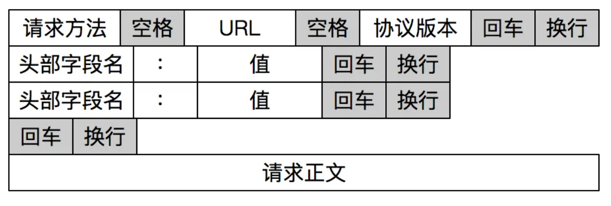

如果消息内容里有这个特殊字符，需要对这个字符转义，避免读取错误

**自定义消息结构**

例如，定义消息结构由包头和数据，包头固定大小，里有一个字段来说明其后的数据有多大

### SYN攻击

……

### 初始序列号ISN

如何随机产生：

ISN=M（计时器）+F(hash算法，根据四元组随机生成)，循环一次需要4.55小时

**@为什么每次建立TCP连接初始化的序列化都要求不一样**

1. 防止历史报文被下一个相同四元组的连接接收

   如果每次连接的序列号一样，将出现如下场景

   - 服务端和客户端建立连接，客户端发送一个包由于网络阻塞超时重传
   - 服务端断电重启，建立的连接消失，因此回复RST
   - 客户端与服务端建立与上一个连接相同的四元组
   - 之前网络阻塞的包现在到达，被服务端接收了，造成数据错乱

   虽然初始化序列号不一样很大程度避免了历史报文被下一个相同四元组的连接接收，但并没有完全避免

2. 为安全性，防止黑客伪造相同序列号的TCP报文

### 既然IP层会分片，为什么TCP层还需要MSS


MTU：网络包最大长度，通常为为1500
MSS：除去IP和TCP头部，能容纳的实际数据大小

如果不使用MSS，当IP层有超过MTU大小的数据就分片。但这存在的问题就是如果一个IP分片丢失，整个IP报文的所有分片都得重传，而IP层没有超时重传，由传输层的TCP负责超时和重传

当一个IP分片丢失后，接收方的IP层无法组成完整的TCP报文交付到TCP，使得TCP触发超时重传整个报文的所有分片

设定了最大MSS长度，会小于MTU长度，确保每次重发时以MSS为单位

### TCP连接的终止

#### TCP连接的终止（四次挥手释放）


1. 客户端发出TCP首部FIN标志位为1的报文，之和客户端进入FIN_WAIT_1状态
2. 服务端收到报文后向客户端发送ACK，进入CLOSE_WAIT状态
3. 客户端收到服务端的ACK后，进入FIN_WAIT_2状态
4. 服务端处理完数据后，向客户端发送FIN报文，进入LAST_ACK状态
5. 客户端收到服务端的FIN报文后，回一个ACK应答报文，进入TIME_WAIT状态，经过2MSL的时间后自动进入CLOSE状态
6. 服务端收到了ACK应答报文后进入CLOSE状态

#### 每次挥手的丢失

**@第一次挥手丢失**

超时重传，通常为3次，超时时间每次2倍叠加，一直丢失就会断开连接

**@第二次挥手丢失**

ACK的报文都不会重传，因此第二次挥手丢失，客户端收不到回复就会超时重传FIN报文，如果一直收不到第二次挥手，客户端就会断开连接

默认情况下，客户端收到第二次挥手，就会处于FIN_WAIT2状态，这个状态下，对于调用close关闭的连接，如果60s后没有收到FIN报文，客户端的连接会直接关闭

如果使用shutdown函数关闭连接，指定了只关闭发送方向，而接收方向没有关闭，意味这主动关闭方还可以接收数据，此时主动关闭方一直没收到第三次挥手，将一直处于FIN_WAIT_2状态

**@第三次挥手丢失**

内核收到客户端的FIN报文后回复了ACK，等待进程主动调close来触发服务端发送FIN报文，进入LAST_ACK状态

如果服务端迟迟收不到这个ACK服务端就会重发FIN报文（tcp_orphan_retrie控制重发次数），如果一直收不到这个ACK，服务端就会断开连接

客户端一段时间内没有收到第三次挥手就会断开连接

**@第四次挥手丢失**

当客户端收到服务端的第三次挥手的FIN报文后就会回ACK报文，进入TIME_WAIT状态，在linux系统，TIME_WAIT状态回持续2MSL后才会进入关闭状态

客户端收到第三次挥手后就会进入TIME_WAIT状态，开启时长为2MSL的定时器，如果途中再收到第三次挥手就会重置定时器，定时器到了就会断开连接

服务器如果发出第三次挥手没等到ACK超时重传，始终没收到ACK就会断开连接

**@为什么TIME_WAIT等待时间是2MSL**

MSL是报文最大生存时间，在网络上的最大存在时间，超过这个时间将被丢弃，IP协议里有个TTL字段代表IP数据报可以经过的最大路由数，没经过一个路由值减1，值为0则数据报被丢弃，同时发送ICMP报文通知源主机。

MSL>=TTL消耗为0的时间，通常TTL的值是64，MSL为30s，2MSL为60S

TIME_WAIT等待2倍的MSL主要是网络中存在来自发送方的数据包被接收方处理后又会向对方发送响应，这个一来回需要2倍的时间。

即客户端发送ACK，如果服务端没有收到最后断开连接的ACK报文触发超时重发FIN报文，到达客户端时，正好2个MSL。即2MSL的时长用于允许回复的ACK报文丢失一次

**@为什么不是4或者8MSL的时长**

因为对于丢包率1%的网络两次连续丢包的概率很低，忽略它更有性价比
占用端口资源，端口资源有限，如果客户端的TIME_WAIT状态过多，就无法对同一个[IP+port]发起连接

#### 为什么需要TIME_WAIT状态

1. 防止历史连接中的数据，被后面相同的四元组的连接错误的接收

   首先序列号会循环绕回初始值，如果没有TIME_WAIT状态或者时间过短：

   - 服务端在关闭连接之前发送的SEQ=301报文被网络延迟了
   - 客户端和服务端完成四次挥手
   - 客户端三次握手建立连接，SEQ=301报文抵达并被接收，产生数据错乱

   确保新的连接产生的数据一定是新建立的连接产生

   如果开启了TCP的时间戳则不存在这个问题

2. 保证被动关闭连接的一方能被正确的关闭

   如果客户端没有TIME_WAIT状态：

   - 客户端最后一次ACK报文在网络中丢失了，那么服务端会重发FIN报文
   - 客户端发完ACK进入CLOSE状态，收到服务端的FIN报文就会回RST报文
   - 服务端收到RST将其解释为错误，对于可靠的协议来说这种终止方式不够安全

#### 优化TIME_WAIT

1. 打开net.ipv4.tcp_tw_reuse和tcp_timestamps参数，可以复用处于TIME_WAIT的socket为新的连接所用（在调用connect函数时，内核随机找一个time_wait状态超过1s的连接给新的连接复用）
2. 开启*net.ipv4.tcp_max_tw_buckets*，当系统中处于TIME_WAIT的连接超过这个值，则将后面的TIME_WAIT连接状态重置
3. 使用SO_LINGER，不使用TIME_WAIT状态，跳过第四次挥手

服务端如果要避免TIME_WAIT状态的连接，就不要主动断开连接，让客户端去断开承受TIME_WAIT

#### 服务器出现大量TIME_WAIT状态的原因

即，什么场景下服务端会主动断开连接

1. HTTP没有使用长连接

   当不使用长连接时，每次请求分为 建立TCP->请求资源->响应资源->关闭连接

   大多数Web服务器，不管哪一方禁用了长连接服务，都由服务端主动关闭连接

   - 如果客户端禁用长连接，服务端开启，那么在请求响应模型下，客户端发来的请求携带了非长连接的信息，这时只有在服务端发起断开连接了
   - 如果客户端开启长连接，服务端禁用，服务端响应资源后，如果不立即发起关闭连接，那么就要调epoll/select去等待事件，再调read才能知道连接被关闭，有两次系统调用（原本只需要调一次close），且socket保持的时间也更长

2. HTTP长连接超时

   长连接下，只要任意一段没有明确提出断开连接则保持连接状态，客户端发完请求后，再计时器的时间内都没有发起新的请求就会触发服务端的主动断开

3. HTTP长连接的请求数量达上限

   nginx的keepalive_requests参数默认为100，在QPS较高的场景可以调大这个参数

#### 服务器出现大量CLOSE_WAIT状态的原因

说明服务端的程序没有调用close函数关闭连接，通常是服务端代码的错误

对于一个TCP服务端的流程：建立socket，再注册epoll


1. 没有将socket注册到epoll，当新的连接到来时，服务端无法获取已连接的socket
2. 新连接到来时没有调用accpet获取该连接的socket导致客户端主动断开连接，而服务端无法对这些socket调用close函数
3. 没有把获取的已经连接的socket注册到epoll，导致后续收到FIN报文时服务端无法感知这个事件，即无法调close函数
4. 对方关闭连接时，服务端没有调用close函数

### 故障注入

#### 建立了连接，客户端故障

如果客户端故障导致 TCP连接一直处于ESTABLISH状态

**保活机制：**

一端时间（net.ipv4.tcp_keepalive_time=7200s，2小时）没有活动后将触发**保活机制**：每隔一个时间间隔（tcp_keepalive_intvl=75s）发送一个探测报文，连续的几个（tcp_keepalive_probes=9）探测报文没有响应，内核将通知给上层。即linux中，最少要2小时11分种15秒才能发现一个死亡连接

socket接口设置SO_KEEPALIVE选项开启保活机制

注意的是：

- 探测报文如果收到回复将重置TCP保活时间
- 客户端如果宕机重启，TCP发送探测报文后，客户端会回复一个RST报文，这样会发现TCP连接被重置
- 如果进程崩溃，os在回收进程时会发送FIN报文，只有主机宕机时服务端无法感知

linux 的保活机制检测的时间较长，可以在应用层使用心跳机制，web服务软件一般都会提供keepalive_timout参数来指定HTTP长连接的超时时间

#### 建立了连接，服务端的进程崩溃

TCP连接信息内核维护，服务端进程崩溃后，内核会回收进程的TCP连接资源


## 底层实现

最大报文段长度MSS，指的是在一个 TCP 报文段中能够携带的最大有效载荷，也就是 TCP 协议在传输数据时，每个报文段中可以携带的最大数据量。MSS 的值一般由网络的最大传输单元 MTU 减去 TCP 和 IP 协议头的长度得出。

### ARO超时重传

ARQ（自动重传请求）模型响应有两种，UNA（此编号前所有包已收到，如TCP）和ACK（该编号包已收到），根据情况选择其中一种

#### 对于如何触发重传：超时重传、快重传

**超时重传**

发送数据时，指定时间没有收到对方的ACK就会重发

数据包丢失、确认应答丢失都会触发超时重传

**超时重传时间RTO**的确定取决于**最大往返时延RTT**，因为网络RTT的值经常变化，所以RTO的值也应该动态变化

RTO的计算：采样RTT，加权平均计算出平滑RTT的值，采样RTT的波动范围，两者加权求和

第一次计算RTO，R1为第一次测量的RTT


后续计算RTO，R2为后续测量的RTT


SRTT是计算平滑的RTT，DevRTR是计算平滑的RTT与新RTT的差距，Linux 下，**α = 0.125，β = 0.25， μ = 1，∂ = 4**

每次超时重传，下次超时间隔翻倍

**快速重传**

收到失序报文时立即发出重复确认（不需要等到之间发送数据时才捎带确认），发送方只要一连收到三个重复确认就应当立即重传（不必继续等待为其设置的重传计时器到期）


重传时不确定要从M2开始全部重传还是只传M2

#### 对于丢包的发送

**回退N帧：**即收到一个包丢失的消息后，重传这个包以后的所有包

**选择重传（**SACK方法-选择性确认）：

linux需要双方打开SACK选项，net.ipv4.tcp_sack（默认开启）

在TCP头部加SACK字段，可以将已收到的数据信息发给发送方，从而知道哪些数据丢失哪些接收了，只传丢失的数据

发送方维持一个窗口包含未被确认的序号、可发送的序号。
接收方维持一个窗口包含可接收的序号

每到达一个帧检测他的序号是否落在窗口内，如果落在窗口内且没有接收过，则接收并返回确认，等前面的帧都到达则交付给上层

发送端每个发送缓存都有一个超时计时器

问题：


如上情况收到0号数据时不能确认是前一组还是后一组的0（前一组发送方没有收到ACK而重发）

解决：

对于帧序号n，将发送窗口大小=接收窗口大小=2^（n-）

即，对于帧序号7，发送窗口大小=4=接收窗口大小

> TCP协议中的16位窗口大小就是为窗口协议提供支持的。UDP协议的目标是尽最大努力交付，不管你收到没有，所以没有该字段

> UDP协议每次传输的最大数据量并不是2^16 - 1 - 8 - 20（8表示UDP头长，20表示IP头长），而是与MTU有关，即数据链路层的最大传输单元(Maximum Transmission Unit)，值是1500。

#### Duplicate SACK(D-SACK)

使用SACK告诉发送方哪些数据被重复接收了

- 当包1接收后，ack丢失了，发送方重发，接收方回的ack带sack信息告诉发送方这个包已经被接收了
- 当数据包1发送遇到网络延迟，发送方因快重传重发并接收这个包，后数据包1到达了，发送方发ack带者D-SACK信息，表示收到了重复的包

这样做可以有几个好处

- 让发送方知道是发出的包丢失了还是接收方回应的ACK丢了
- 让发送方知道是不是发送的包被网络延迟了
- 是不是网络中把发送方的数据包给复制了

linux下net.ipv4.tcp_dsack参数控制这个功能（默认开）

### 如何处理网络拥塞

窗口协议，流量控制是对接收方的能力控制，网络拥塞是对整个网络能力的控制

拥塞窗口cwnd，是发送方维护的一个状态变量，根据网络的拥塞程度动态变化，发送窗口的值=min（拥塞窗口，接收窗口）

基本规则：只要网络没有出现拥塞（发送方在规定时间内接收到ACK应答报文），cwnd增大，出现拥塞（发生了超时重传），cwnd减少

拥塞控制主要是四个算法：慢启动、拥塞避免、拥塞发生、快速恢复

慢启动门限ssthresh是一个阈值，通常为65535（2^16）

**慢启动：**是在刚开始发送数据时让窗口缓慢扩张（将初始的cwnd置1个MSS，然后以2倍的速度指数增长

**拥塞避免**：到ssthresh时执行拥塞避免，即+1线性增长

**拥塞发生：**

如果是**超时重传的重传机制**则直接恢复到慢启动，从1开始，并降低慢启动门限为cwnd的一半


AIMD算法：乘法减小（慢开始和拥塞避免阶段，出现超时就把开始门限ssthresh的值减半），加法增大（执行拥塞避免算法后，使拥塞窗口缓慢增大 ）

**快恢复**（退半避让）： （与快重传同时使用，能收到3个重复ack说明网络还行）它允许发送方在接收到丢失数据包的部分确认（ACK包）后，把拥塞窗口cwnd设置为慢开始门限ssthresh减半后的值，然后执行拥塞避免算法（加法增大）


1. 在快恢复中，首先ssthresh = cwnd/2,cwnd = ssthresh+3，这是为了减少cwnd避免拥塞，
2. 随后继续重传丢失的数据包，如果再收到重复的ACK，cwnd+1，这是为了尽快将丢失的数据包发给目标
3. 知道收到新数据的ACK，把cwnd设置为第一步的ssthresh的值，恢复guo'c


当采用快恢复时，慢开始只在TCP连接建立和网络超时时才使用

### 如何连续发送大量数据-滑动窗口

传统TCP每发送一个数据进行一次确认应答，效率较低，往返时间长

概念：

- 发送方和接收方之间各自维持一个滑动窗口（大小不一定相同）控制发送和接收方的分组的数量和编号
- 它允许发送方发送多个分组而不需等待确认，TCP的滑动窗口是以字节为单位的
- 每收到一个确认，发送方就把发送窗口向前滑动。

**发送窗口之内：**

如果窗口大小为3，则连续发送3个TCP端


用两个指针SND.UNA、SND.NXT表示发送窗口的起始，和可用窗口的起始，通过SND.UNA+窗口大小得到#4的第一个字节

当发送窗口被#2部分占满时，则无法继续发送数据

收到ack应答后就右移窗口

**接收窗口之内：**


一个指针RCV.NXT表示接收窗口的起始

**@窗口大小由哪一方决定**

通常由接收方的窗口大小来决定，TCP里的window字段表示窗口大小，建立连接时，发送方根据这个接收端的处理能力来发送数据，通常小于等于接收方的窗口大小

### 流量控制

#### **窗口关闭**

发送方回根据接收方的能力动态控制发送的数据量，即流量控制

通常的消息发送，发送方的窗口会随接收方的窗口大小改变


当窗口大小为0时回阻止数据发送，即窗口关闭

TCP发送方收到零窗口通知，就启动持续计时器，持续计时器超时，就会发送窗口探测报文，接收方收到时回返回现在的接收窗口大小

如果接收窗口认为0，则重新启动计时器，窗口探测的次数一般为3次，每次30-60s，超过3次可能会中断连接


#### **操作系统缓冲区和滑动窗口**：

- TCP不允许操作系统即减少缓存又收缩窗口，而是先收缩窗口，过段时间再减少缓存

如果可以同时减少缓存和收缩窗口


接收方缓存区因操作系统资源紧张而收缩，并且通知发送窗口收缩，而此时已经发送的数据到来时接收方缓冲区因收缩而装不下，无法接收丢弃改包，

发送方收到窗口收缩，这时已经发送的没有收到ack的数据超出了接收窗口的范围

先只收缩窗口不减少缓存，使得接收方在窗口缩小的消息发给对方之前，收到的消息可以在缓存区里接收，并返回给发送方ack

#### 糊涂窗口综合症

如果接收方窗口很小，每次只能腾出几个字节的窗口大小，这时发送方再来为几个字节发送一次太不经济了

解决方式：

对于接收方：当窗口大小<min（MSS, 缓存空间/2），向发送方通知窗口为0，即阻止请求发过来

对于发送方：Nagle算法，满足下面两个的条件的一个才能发送数据：

- 可用窗口大小>=MSS && 可发送的数据大小>=MSS, 
- 收到之前发送数据的ack包

必须要接收方满足【不通告小窗口给对方】和发送方满足【开启Nagle算法】才能避免糊涂窗口

nagle算法默认打开，对于一些需要小数据包交互的场景，如telnet、ssh等需要关闭这个算法

# HTTP

## 概念

是一种超文本协议传输：
协议：两个以上的参与者的一种行为约定和规范
传输：通过中转或接力在两点之间双向传输数据
超文本：包含文字、图片、视频、超链接（一个超文本跳到另一个超文本），例如HTML

## **特点**

**简单**：基本报文格式header+body，头部信息是key-value简单文本的形式，易于理解

**灵活和易于拓展**：HTTP协议里各类请求方法、URI/RUL、状态码、头字段等每个组成没有被固定死，可被开发人员自定义和扩充

HTTP工作在应用层，下层可以随意变化

HTTPS是在HTTP和TCP层加了SSL/TLS安全传输层，HTTP/1.1和HTTP/2.0传输协议使用的是TCP协议，HTTP/3.0使用的UDP协议

**应用广泛和跨平台**：是的

### HTTP常见的状态码


### HTTP常见字段

**Host字段**，表示请求指定的服务器的域名（例：Host: www.A.com)，使得可以将请求发往同一台服务器上的不同网站

**content-length字段**，表面本次回应的数据长度

HTTP协议通过设置回车符、换行符作为HTTP header的边界，通过Content-Length字段作为HTTP body的边界，从而解决沾包的问题

**connection字段**，如果开启，即客户端要求服务器使用HTTP长连接机制

**content-type字段**，用于服务器回应时标识本次数据的格式（例，content-type:test/html;charset=utf-8）

**content-encoding字段**，表示服务器使用的数据的压缩方法

### Keep-Alive

**长连接**：HTTP发送请求时，先创建一个TCP连接，把HTTP请求发送并接收，浏览器和服务器协商是否关闭TCP，不关闭虽然有一定损耗，但如果还有请求可以直接在这个TCP连接上发送，不需要再三次握手，长连接可以设置一定时间内没有请求自动关闭

**短连接**：请求结束后直接关闭TCP连接，下次请求需要重新创建TCP连接

通常默认打开，这给**HTTP流水线**技术提供了基础：客户端先一次性发送多个请求，而在发送过程中不需先等待服务器的回应，可以减少整体的响应时间

> TCP的keepalive是TCP的保活机制，如果TCP建立了连接，客户端一直不发消息，就会触发服务端发送探测报文，和Keep-Alive不是一个东西

## GET和POST

RFC规范中（请求评论，是一种文档规范，描述互联网的各自协议、标志等）

GET的语义是从服务器**获取指定的资源**，GET请求的参数位置是在URL中，URL只支持ASCII，所以GET请求的参数只能ASCII字符，且浏览器对URL的长度有限制，可以携带报文body

POST的语义是根据请求负荷（报文body）**对指定的资源做出处理**，POST请求携带数据的位置一般写在报文body中，可以是任意格式，且无大小限制

> 在文章的留言通常用POST请求发送
> 打开文章通常用GET请求

**@GET和POST方法是安全和幂等的吗**

**安全**是指请求方法不会破坏服务器上的资源
**幂等**指多次执行相同的操作，结果都是相同的

GET方法是安全且幂等的，所以GET请求的数据可以缓存到浏览器（书签）上，也可以缓存到代理上（nginx）

POST因为是新增或提交数据的操作，会修改服务器上的资源，所以是不安全的，也不幂等，无法缓存POST请求

实际开发，不一定按照这个RFC来

## HTTP缓存技术


对于重复性的HTTP请求，可以把请求响应的数据缓存在本地，避免再发送HTTP请求

### 强制缓存

指只要浏览器判断缓存没有过期，则直接使用浏览器的本地缓存，由浏览器主导

利用下面两个HTTP响应头部字段实现的，用来表示资源在客户端缓存的有效期：

- Cache-Control，是一个相对时间
- Expires，是一个绝对时间

Cache-Control优先级高于Expires，实现流程如下

- 浏览器第一次请求访问服务器资源时，服务器在返回资源的同时，在response头部加上Cache-Control，Cache-Control中设置了过期时间大小
- 浏览器再次请求访问服务器中的该资源时，会先通过请求资源的时间和Cache-Control中设置的过期时间大小来计算出该资源是否过期，如果没有，则使用缓存
- 服务器再次收到请求后，会再次更新response头部的cache-control字段

### 协商缓存

第一次请求得到数据后，对于后面的客户端的请求，服务端告诉客户端是否可以继续使用缓存的方式即为协商缓存，回复请求码304表示浏览器可以使用本地缓存的资源

第一种实现：基于时间实现

响应头部中Last-Modified，标识这个响应资源的最后修改时间，
请求头部中的If-Modified-Since，标识当这个资源过期了，发现响应头中有Last-Modified声明，则再次发起请求的时候带上Last-Modified的时间，
服务端收到请求后发现有If-Modified-Since则和被请求资源的最后修改时间进行对比，如果最后修改时间较新，说明资源又被改过，返回新资源（HTTP 200 OK），否则说明资源无新修改，响应HTTP304走缓存

第二种实现：基于标识实现

响应头部中Etag：唯一标识响应资源
请求头部中的If-None-Match：当资源过期时，浏览器发现响应头里有Etag，则再次向服务器发起请求时，会将请求头If-None-Match值设置为Etag的值。服务器收到请求后进行对比，如果资源没有变化返回304，变化了返回200

两种实现，后者相对安全，前者可能出现时间篡改导致不可靠问题，当一次请求同时带有Etag和Last-Modified字段，那么客户端下一次请求时，Etag的优先级更高，如果Etag有变化就不用判断Last-Modified了，如果Etag没有变化，再看Last-Modified

**@为什么Etag优先级更高**

1. Last-Modified字段不可靠，最后修改时间可能改变
2. 有些文件是秒级以内修改的，If-Modified-Since能检查到的粒度是秒级的，Etag能保证这种需求下客户端在1s内能刷新多次
3. 有些服务器不能精确获取文件的最后修改时间

协商缓存只有在强制缓存未命中时才会触发带有协商缓存字段的请求

## HTTP/1.1特性

### 无状态

好处是服务器不需要额外的资源来记录状态信息从而减轻负担
缺点是在完成有关联性的操作时会更麻烦

> 例如登录->添加购物车->下单，这一系列操作都要知道用户的身份，但服务器不知道这些请求是有关联的，每次都要问一遍身份

一种解决方案是在请求和响应报文中加入Cookie信息来控制客户端的状态，即客户端第一次请求后，服务器下发一个cookie，客户端请求服务器时，填上cookie信息发送

### 不安全

明文传输数据，可阅读，易于调试，但也不安全，泄漏隐私

不验证通信方的身份，因此可能遭遇伪装，（访问假的淘宝网站）

无法证明报文的完整性，可能遭篡改（植入垃圾广告）

### 性能

采用了长连接和管道网络传输（默认不开启管道）

管道网络传输：即流水线传输，可以传输多个请求不必等回复，但服务端处理时必须按请求顺序串行处理，存在一个请求处理很久阻塞整个队列的问题。（解决了请求队列的队头阻塞，没有解决响应队列的队头阻塞）

整体性能一般

## HTTPS

明文传输的HTTP存在安全风险（窃听、篡改信息、冒充），HTTPS在HTTP和TCP层之间加入了SSL/TLS协议解决这个问题，分别用信息加密、校验机制、身份证书来抵御这三种风险

建立连接时，多了TLS的握手过程，传输内容时，https会把数据加密

### 混合加密

在通信建立前采用**非对称加密**的方式交换会话密钥，在通信过程中使用**对称加密**的会话密钥加密明文数据

---

**@为什么采用混合加密**

对称加密只使用一个密钥，运算速度快，密钥必须保密，因此无法做到安全的密钥交换

**非对称加密**使用两个密钥，公钥和私钥，公钥任意分发而私钥保密，解决了密钥交换问题，但速度慢

---

### 摘要算法+数字签名

为了确保传输的内容不被篡改，对内容计算出一个指纹，同内容一起传输给对方，接收方收到内容后也计算出指纹，和发来的指纹对比相同

摘要算法（哈希函数）计算出内容的哈希值，这个哈希值是唯一的，且无法通过哈希值推导出内容

**非对称加密：**

公钥和私钥可以双向加解密，不是对内容进行加密，而是对内容的哈希值加密

公钥加密，私钥解密：可以保证内容传输的安全，只有持有私钥的人才能解读实际的内容

私钥加密，公钥解密：可以保证消息不会被冒充，公钥能解析出数据，则证明这个消息的来源是正确的

但这个过程比较耗时，因此只用于连接的建立，私钥由服务端保管，服务端会向客户端颁发公钥

**数字证书**

可以通过哈希算法来保证消息的完整性，通过数字签名来保证消息来源可靠性，但这还缺少身份验证的环节（伪造一对公私钥）

CA（数字证书认证机构）

- 将服务器公钥放在数字证书中（数字证书认证机构颁发），
- 客户端拿到服务器的数字证书后，使用CA的公钥确认服务器数字证书的真实性，（CA的公钥已事先置入了浏览器或操作系统里）
- 从数字证书获取服务器公钥后，使用它对报文加密后发送，
- 服务器用私钥对报文解密

### HTTPS如何建立连接

SSL/TLS协议基本流程：（SSL和TLS是一个东西）

- 客户端向服务器索要并验证服务器的公钥
- 双方协商生产会话密钥
- 双方采用会话密钥进行加密通信

前两步的握手涉及四次通信，使用不同的密钥交换算法

**TLS握手过程**

1. clienthello

   客户端向服务器发送：

   - 客户端支持的TSL协议版本、

   - **生产的随机数**（用于生成会话密钥）

   - 客户端支持的密码套件列表、如RSA加密算法

2. serverhello

   服务器收到请求后，发出响应：

   - 确认TLS协议版本，不支持则关闭通信

   - **生产随机数**（用于生成会话密钥）

   - 确认的密码套件列表，如RSA加密算法

   - **服务器的数字证书**

3. 客户端回应

   通过浏览器或os中的CA公钥确认数字证书的真实性

   客户端从数字证书中取出**服务器的公钥，使用其加密报文**，向服务器发送如下信息：

   - **随机数**（被服务器公钥加密）

   - 加密通信算法改变通知，表示随后的信息将用会话密钥加密通信

   - 客户端握手结束通知，表示客户端的握手阶段已经结束，这一项同时把之前所有内容发生的**数据做个摘要**，用来供服务端校验

   > 此时生成了三个随机数，之后的通信将依赖这三个随机数

4. 服务器最后的回应

   通过协商的加密算法，**计算**出本次通信的**会话密钥**，向客户端回应：

   - 加密通信算法改变通知，表示随后的信息都将用会话密钥加密通信

   - 服务器握手结束通知，这一项同时把之前所有内容发生的**数据做个摘要**，用来供服务端校验

@ SSL/TLS 1.2需要4次握手，SSL/TLS 1.3优化后只需三个握手

### 签发证书：

CA把持有者的公钥、用途、颁发者、有效时间等信息打包，作hash计算得到一个hash值
CA会使用自己的私钥将该hash值加密，生成证书签名
最后添加证书签名，形成数字证书

**客户端校验服务端数字证书**

客户端使用同样的hash算法获取该证书的hash值H1
浏览器和os集成CA的公钥信息，浏览器收到证书后使用CA的公钥解密证书签名，得到hash值h2
比较H1和H2，值相同，则为可信赖的证书，否则不可信

**证书信任链**

向CA申请的证书一般不是根证书签发的，而是中间证书签发，浏览器只存放根证书（公钥）

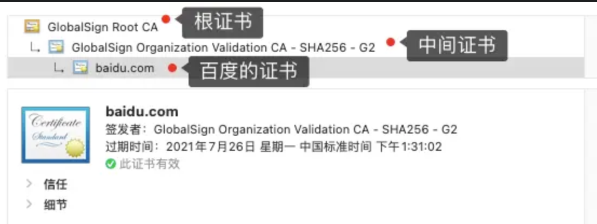

对三层关系的证书验证过程：

- 客户端收到baidu.com的证书后，由于这个证书不是根证书，无法根据本地已有的根证书的公钥区验证，因此向上找到证书的颁发机构，向CA请求该中间证书
- 请求证书后发现G2证书是由GlobalSign Root CA签发，即根证书，自签证书，应用软件检查此证书是否预载于根证书清单上，有，则用根证书的公钥去验证G2证书，通过则认为中间证书可信
- G2被信任后，用其中的公钥去验证baidu.com证书的可信，通过则可信任

中间层级的出现是 为了将根证书隔离，确保证书的绝对安全性

### HTTPS的应用数据如何保证完整性

TLS在实现上为握手协议和记录协议：

- 握手协议为TLS四次握手的过程，负责协商加密算法和生成对称密钥，后续用此密钥来保护应用程序数据
- TSL记录协议负责保护应用程序数据并验证其完整性和来源，对数据加密使用记录协议

TSL记录协议负责消息的压缩，加密及数据的认证：

1. 消息分割成多个较短的片段，对每个片段进行压缩
2. 压缩的片段加上消息认证码（MAC值），为了数据完整性的认证
3. 通过对称密码进行加密
4. 再加上数据类型、版本号、压缩后的长度组成的报头就是最终的报文数据

记录协议完成后，最终的报文数据将传递到传输控制协议TCP层进行传输

### HTTPS一定安全可靠吗

1. 客户端向服务端发起HTTPS建立连接请求时，被假基站转发到中间人服务器，中间人向服务端发起HTTPS建立连接请求，
2. 客户端和中间人TLS握手中，中间人发送自己的公钥证书给客户端，客户端验证证书，从证书拿到公钥，生成随机数，用公钥加密随机数发送给中间人，中间人私钥解密得到随机数，双方都有随机数，通过算法生成对称加密密钥，后续通过这个对称加密密钥加密通信
3. 中间人和服务端握手
4. 后续通信中，中间人用对称加密密钥A解密客户端的HTTPS请求，用对称加密密钥B加密HTTPS请求后转给服务端，接收同样

客户端不知道中间人这个角色，中间人可修改偷看数据

发生这种场景的前提是用户点击了中间人服务器的证书

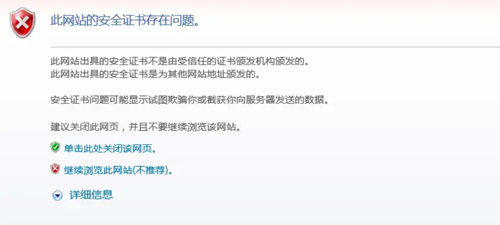

另外，如果电脑中毒了，恶意导入了中间人的根证书，此时系统认为这个证书合法，此时不会出现风险提醒

因此，HTTPS协议本身没有漏洞，用中间人攻击本质上是利用了客户端的漏洞

**@为什么抓包工具能截取HTTPS数据**

工作原理同中间人一致

中间人实现明文代理需要满足两点：

- 服务端不会校验客户端身份，因此中间人作为客户端和服务端建立连接这一步不会有问题
- 中间人与客户端连接，中间人必须有对应域名的私钥

中间人要拿到私钥只能通过如下方式：

- 去网站服务端拿到私钥
- CA处拿域名签发私钥
- 自己签发证书且被浏览器信任

只能用第三种方式，即用抓包工具抓包时需要先在客户端安装根证书

**@如何避免被中间人抓取数据**

不要点击证书非法的网站、保证电脑不受病毒入侵

可以通过HTTPS双向认证来避免这个问题，一般只要单向验证，双向验证服务端也需要验证客户端的身份，发现服务端不可信任会中止通信

## HTTP/1.1、HTTP/2、HTTP/3演变

### HTTP/1.1比起HTTP/1.0的改进

改进

- 使用长连接的方式改善了HTTP/1.0短连接造成的性能开销
- 支持管道网络传输，第一个请求发出后不必等其回来，可以发第二个请求出去，减少整体响应时间

缺点

- 请求/响应头部未经压缩就发送，首部信息越多延迟越大，只能压缩body
- 发送冗长的首部，每次发送相同的首部造成浪费
- 服务器按请求顺序响应，会造成队头阻塞
- 没有请求优先级控制
- 请求只能从客户端开始，服务器被动响应

## HTTP/2做了什么优化

基于HTTPS，因此安全性有保证

### 头部压缩

如果发出多个请求有相同或相似的头，那么协议会消除重复的部分

HPACK算法：客户端和服务器同时维护一张头信息表，所有字段存入这个表，生成索引号，以后不用发送同样字段，只发送索引号，从而提高速度

### 二进制格式

全面采用二进制（头信息和数据体），统称为帧：头信息帧、数据帧

### 并发传输

HTTP/1.1基于请求响应模型，完成一个事务才能处理下一个事务，因此有队头阻塞问题

HTTP/2引入了stream概念，多个stream复用一条TCP连接，

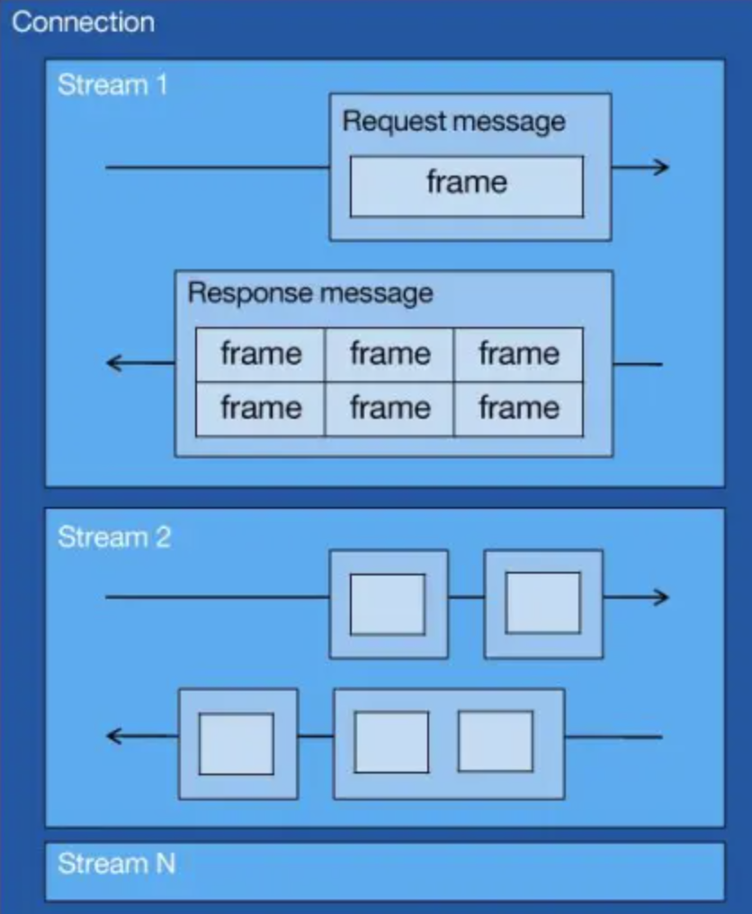

一个TCP连接包含多个stream，stream里包含多个message，对应HTTP/1中的请求或响应，由HTTP头部和包体构成，message里包含多个Frame，是HTTP/2最小单位，以二进制压缩格式存放HTTP/1中的内容

针对不同的HTTP请求用独一无二的StreamID来区分，接收端可以通过streamID有序组装成HTTP消息，不同Stream的帧可以乱序发送，因此可以并发不同的stream，即可以并行交错地发送请求和响应

### 服务器推送

服务器可以主动发送消息

客户端和服务器双方可以建立stream，客户端建立的stream是奇数号，服务器建立的stream是偶数号

例如：HTTP/1.1中，客户端从服务器获取到了HTML文件，仍需CSS来渲染页面，此时客户端还要发起CSS请求，HTTP/2中，客户端访问HTML时，服务器可以主动推送CSS文件，减少消息传递次数

### HTTP/2的缺陷

stream解决了HTTP这一层面队头阻塞的问题，但在TCP层面依然有队头阻塞问题

HTTP/2基于TCP传输，TCP必须保证收到的字节数完整且连续才会返给HTTP应用层，否则在缓存区中

发送方发的多个packet，接收方必须按序接收后，才能返给上层，如图，丢失了一个，则后面的包不会给上层，从而出现队头阻塞

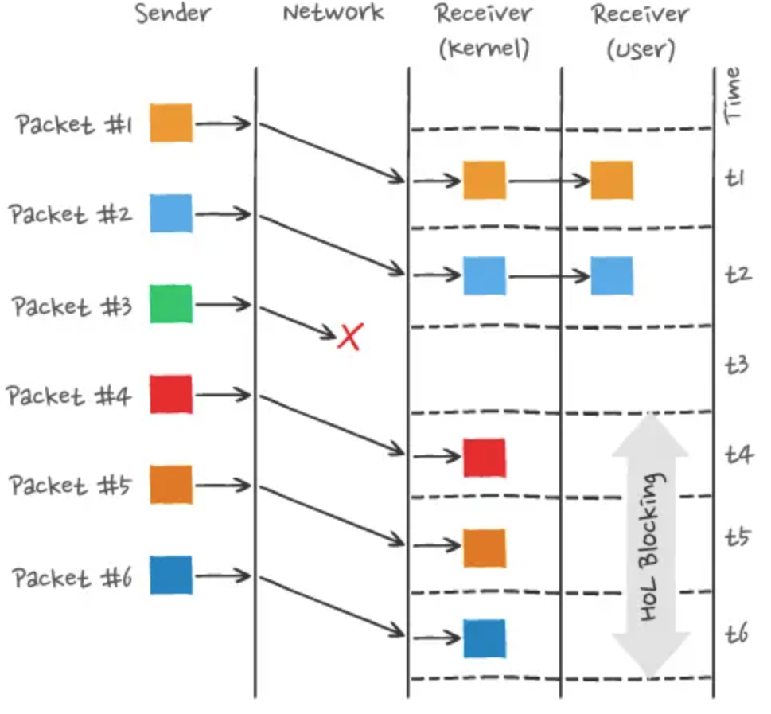

## HTTP/3做了哪些优化

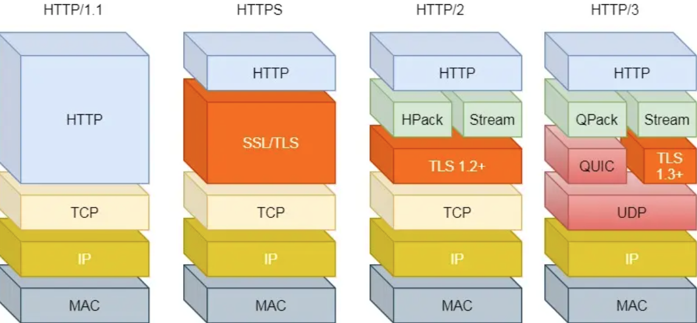

将底层从TCP改成了UDP，采用QUIC通信

QUIC的特点也对应了HTTP/3的优点：

### 无队头阻塞

QUIC中也有类似stream与多路复用的概念，当某个流发生丢包时，只阻塞这个流，其他流不受影响，因此不存在队头阻塞问题

### 更快的连接建立

对于HTTP/1和HTTP/2协议，TCP和TSL是分层的，需要分批次来握手，先TCP握手再TLS握手

HTTP/3的QUIC协议握手过程只需要1RTT，

在HTTP/3的QUIC协议并不和TLS分层，QUIC内部包含了TLS，在自己的帧里携带TLS的记录，QUIC使用的TLS/1.3，仅需1个RTT就可以同时完成建立连接与密钥协商

甚至在第二次连接时，应用数据包可以和QUIC握手信息一起发送，达到0-RTT的效果

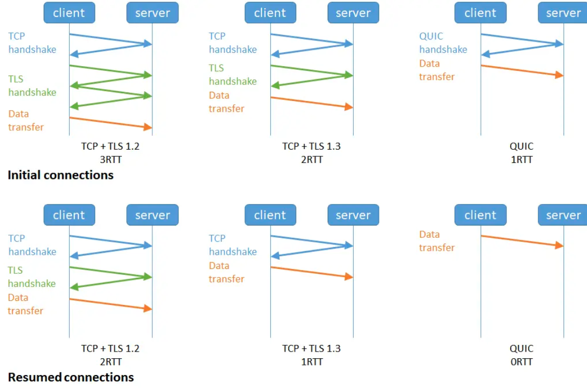

### 连接迁移

基于TCP传输协议的HTTP协议，通过四元组确定一条连接（源IP端口，目的IP端口）

当设备的网络从4G切换到wifi时，意味这IP地址改变了，必须要断开重连

QUIC没有用四元组来绑定连接，而是通过连接ID来标记通信的两个端点，客户端和服务端各自选择一组ID来标记自己，因此即使设备网络改变导致IP改变，只要仍有上下文信息，就可以复用原连接

## RPC

**@ 使用纯裸TCP会有什么问题**

TCP的三个特点：面向连接、可靠、基于字节流

对于基于字节流，双向的通道里的数据，是01串，且没有任何边界，会出现沾包问题，因此纯裸TCP不能直接使用，需要再其上加入自定义规则用以区分消息边界

即把每条要发送的数据都要包装一下，加入消息头，其中写清楚一个完整的包长度，还有是否被压缩过和消息体格式等，使得双方可识别，这就是协议，于是基于TCP衍生出了很多协议如HTTP和RPC

而RPC（远程过程调用）本身并不是具体协议而是调用方式，使得调用远端服务器暴露出的方法能像本地方法一样调用，屏蔽调网络细节

**@ 有RPC了，为什么还要有HTTP**

RPC先于HTTP出现，对于自己的客户端和服务端建立连接收发消息，使用自家的RPC协议只管连自己公司的服务器

浏览器不仅要浏览自家服务器，还要访问其他公司的服务器，因此需要有个同一的标准

即RPC更多用于C/S架构，HTTP更多用于B/S架构（Browser/Server）

现在也没分那么清楚。现在很多软件即支持客户端也支持网页版手机端，使用HTTP的话，服务器只用同一套就行，RPC开启退居幕后，用于公司内部集群里，各个微服务之间的通讯

**@ HTTP和RPC的区别：**

**服务发现：**

要向某个服务器发起请求前得先建立连接，而这需要找到知道IP地址和端口，即服务发现

HTTP中，知道服务的域名，通过DNS服务去解析得到IP地址，默认端口80

RPC中，用专门的中间服务去保存服务名和IP信息，如etcd、redis，访问服务前，先用中间服务去获得IP和端口信息。DNS也是服务发现的一种，也可以基于DNS作服务发现组件

**底层连接形式**

主流的HTTP/1.1协议为例，默认在建立底层TCP连接后会一直保持这个连接，之后请求和响应都复用这个连接

RPC协议类似，建立TCP长连接进行数据交互，不同之处在于RPC还会建立连接池，请求量大时，建立多条连接放在池内，要发数据时取出一条连接，用完再放回去

由于连接池有利于提升网络性能，不少编程语言的网络库例都会给HTTP加个连接池，比如go，因此这一块差别不大

**传输内容**

TCP用消息头和消息体

对于HTTP/1.1，虽然叫超文本协议，但设计初衷是用于作网页文本展示，内容以字符串为主，在消息体这块，使用Json来序列化结构体数据，而这其中内容非常冗余，有些信息不需要每次都穿这个字段过来

RPC定制化程度高，可以用体积更小的protobuf或其他序列化协议，也不需要像HTTP考虑各种浏览器行为，比如302重定向跳转等。因此性能会更好一些，因此微服务中常用RPC

上诉情况基于HTTP/1.1，但HTTP/2性能比很多RPC好，甚至gRPC底层直接用HTTP/2

> HTTP/2是2015年出来的，大多公司RPC协议成熟，一般没有更换的必要

## WebSocket

平时浏览网页，从HTTP协议来看就是对网页上的一次点击触发一次HTTP请求，网站返回一次HTTP响应，即客户端主动请求服务器响应。但也有游戏网页中，其他玩家的移动，仿佛是服务器主动给客户端发消息

### 轮询和长轮询

**如何才能在用户不做操作的情况下，网页能收到消息并发送变更**

**轮询：**

网页的前端代码里不断定时发HTTP请求到服务器，服务器收到请求后响应，是一种伪服务器推的形式

比如扫描登录，前端网页不知道用户扫没扫，于是不断向后端服务器询问

这样做带来的问题：

- 消耗带宽，增加下游服务器负担

- 最坏情况，用户扫描1-2s才会触发下一次HTTP请求出现跳转页面，感受到明显卡顿

**一些解决方案，长轮询**

HTTP请求发出后，通常会给服务器留一定响应时间，如果将超时设置的很大，比如30s，在30s内收到扫描请求立马返回给客户端网页，如果超时就发起下一个请求

这样减少了HTTP请求数，百度网盘就是这样

这类在用户不感知的情况下服务器将数据推给浏览器的技术即服务器推送技术comet

上面两种解决方案本质上是客户端主动取数据，对于扫码这样的简单场景可用，但对于网页游戏这种大量的数据就需要websocket

### websocket的建立

TCP是全双工的，同一时间双方都可以主动向对方发送数据，但HTTP/1.1基于TCP协议，只做了半双工，同一时间，只能有一方主动发送数据

> 因为HTTP协议设计之初，考虑的是看网页文本的场景，客户端发起服务器响应，没有考虑网页游戏这样双方都要互发大量数据的场景

因此为了支持这样的场景，新的应用层协议websocket设计出来

对于普通网页访问使用HTTP协议，当打开网页游戏则切换为websocket协议

- TCP三次握手后，先统一使用HTTP协议进行一次通信
- 如果是普通的HTTP请求，后续继续使用HTTP协议，如果想建立websocket连接，会在HTTP请求带上特殊的包头

```shell
Connection: Upgrade # 浏览器想升级协议
Upgrade: WebSocket  # 想升级成websocket协议
Sec-WebSocket-Key: T2a6wZlAwhgQNqruZ2YUyg==\r\n # 随机生成的base64码
```

如果服务器支持websocket协议就会走websocket握手流程，解析客户端生成的base64码放在HTTP响应的包头里，带上101状态码（协议切换）发回浏览器

之后，浏览器也用同样的公开算法将base64转为另一段字符串，如果和传回来的字符串一致，则表示验证通过，此时websocket建立完成，后续使用websocket格式通信

> websocket只在建立时用到了HTTP，升级完成后就和http无关了

### websocket的消息格式

数据包在websocket中称为帧

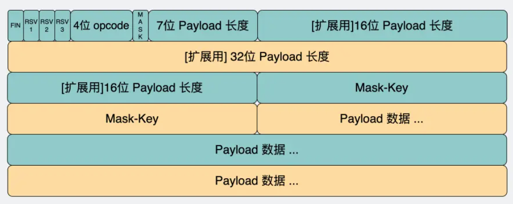

**opcode字段**：标识数据帧类型，1是text类型，2是二进制数据类型，8是关闭连接的信号

**payload字段**：真正想要传输的数据长度，字节为单位

用最开始的7bit做标志位，先读最先的7bit，如果值是0-125，则表示payload全部长度，如果是126则表示接下来还要再读16bit，如果是127表示接下来还要读64bit

**payload data字段**：存放真正要传输的数据，知道了上面的payload长度后，可以根据这个值去截取对应的数据

### websocket的使用场景

继承了TCP协议的全双工能力，并解决了粘包问题，

- 实时性要求高的场景：适用于服务器和浏览器频繁交互的大部分场景，网页聊天室、网页游戏、飞书协同办公软件
- 适用大量数据传输：HTTP每次请求头部信息增加了额外的数据开销，Websocket协议头部相对较少

服务器有能力主动发送给客户端数据

# IP

使得在复杂的网络环境中将数据包发送给最终目的主机

**@ IP和MAC（数据链路层）的关系和区别**

IP的作用是主机之间通信用的，MAC的作用是实现两个设备之间通信，IP则负责在没有直连的两个网络之间进行通信传输，IP指明方向，MAC决定具体怎么走

---

首先每个设备需要配置正确的IP地址

IPv4由32位正整数表示，为方便记忆，将32位IP地址以每8位一组，分为4组转为10进制

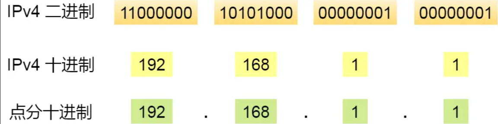

IP地址不是以主机台数来配置的，而是以网卡来配置的，通常路由器、服务器都有2个以上的网卡和IP地址

## IP地址的分类

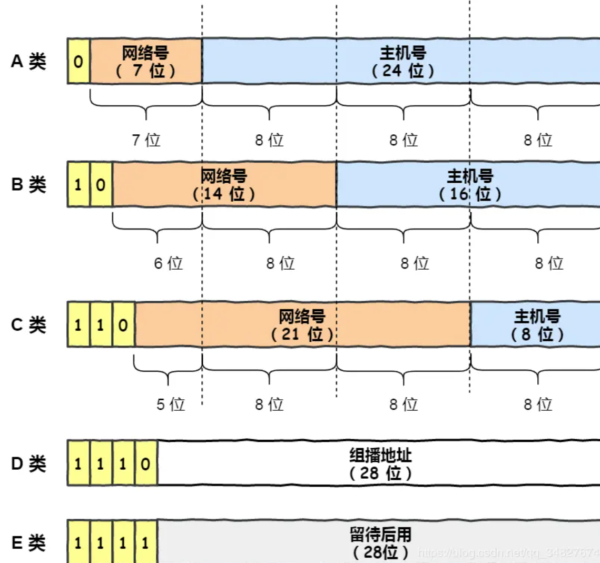

黄色部分为分类号，用以区分IP地址类别

A、B、C类地址分为网络号和主机号两部分。

例如对于C类，最大主机个数


减2是因为两个IP是特殊的，即主机号全为1指定某个网络下的所有主机用于广播，和全为0指定某个网络

D类没有主机号，常被用于多播，E类未使用

**@ 广播地址的作用**

用于在同一个链路中相互连接的主机之间发送数据包

**本地广播**：例如网络地址若为192.168.0.0/24，广播地址为192.168.0.255，这个广播地址的IP包会被路由器屏蔽，所以不会到达192.168.0.0/24以外的链路上

**直接广播：**192.168.0.0/24 向 192.168.1.255/24发送IP包，收到包的路由器转发给192.168.1.0/24，使得所有192.168.1.1 - 192.168.1.254都能收到这个包（由于直接广播有安全问题，通常设置为不转发）

---

**@ 多播地址的作用**

用于将包发给特定组内的所有主机

广播不能穿透路由，若想给其他网段发送同样的包，可以使用穿透路由的多播

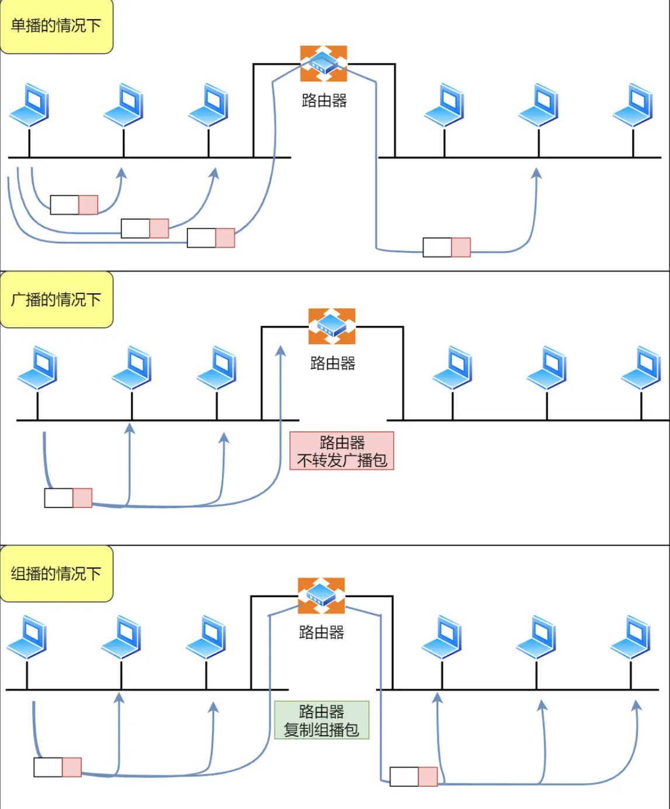

D类地址

4位表示是多播地址，剩下的28位是多播的组编号

- 224.0.0.0 ~ 224.0.0.255 为预留的组播地址，只能在**局域网中**，路由器是不会进行转发的。
- 224.0.1.0 ~ 238.255.255.255 为**用户可用的组播地址**，可以用于 Internet 上。
- 239.0.0.0 ~ 239.255.255.255 为**本地管理组播地址**，可供内部网在内部使用，仅在特定的本地范围内有效。

---

**@ IP分类的优缺**

优点：简单明了，选路简单

缺点：

1. 同一网络下没有地址层次，不能再次细分
2. 不能很好的与现实网络匹配，C类地址能包含的最大主机数量太少，B类地址的最大主机数又太多

## 无分类地址CIDR

只有两部分，前面是网络号，后面是主机号

表示形式 `a.b.c.d/x`，其中/x表示前x位（0-32）属于网络号，

例，10.100.122.2/24表示前24位是网络号，剩余8位为主机号

**子网掩码**

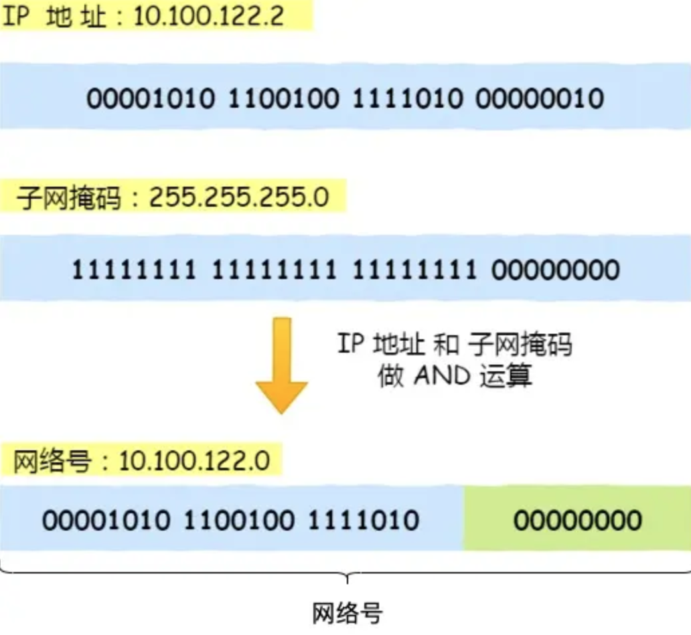

**@为什么要分离网络号和主机号**

两台主机通讯先判断是否处于一个广播域中，即网络地址相同表面在同一网络上，可以直接把数据包发给目标主机

路由器寻址也是通过这样的方式来找到对应的网络号，把数据包发给对应网络中

---

**@子网划分**

通过子网掩码划分子网

将主机地址分为两个部分：子网网络地址+子网主机地址

由于子网网络地址划分为2位，子网地址就有4个，00、01、10、11

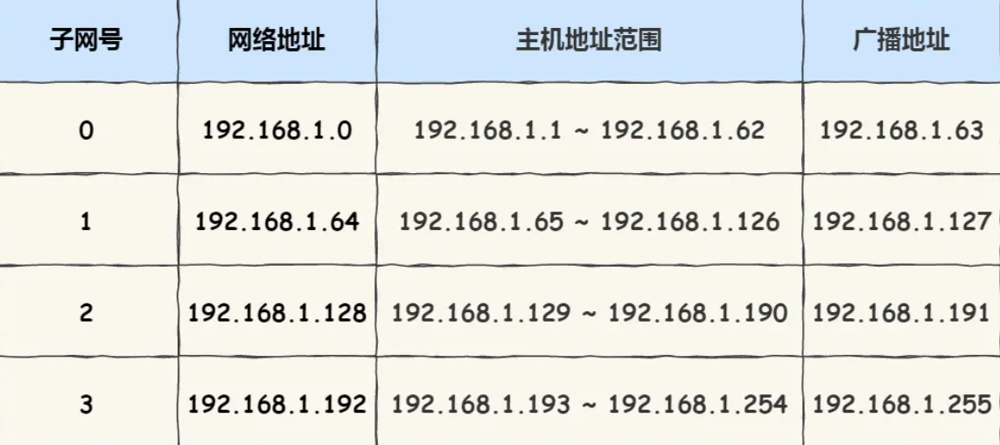

---

## 公有IP地址与私有IP地址

A、B、C分类地址，有分公有IP和私有IP地址

个人用户使用私有IP地址，允许组织内部分配管理，不同网络可以重复

公有IP由ICANN组织统一分配，保持唯一

## IP地址与路由控制

IP地址的网络地址由路由控制，主机和路由器有各自的路由器控制表，路由控制表记录者网络地址与下一步发送至路由器的地址

发送IP包时，首先确定IP包首部中的目标地址，从路由控制表中找到与该地址相同的网络地址的记录，转发给相应的下一个路由器。如果有多条相同网络地址的记录，则选择相同位数最多的网络地址，即最长匹配

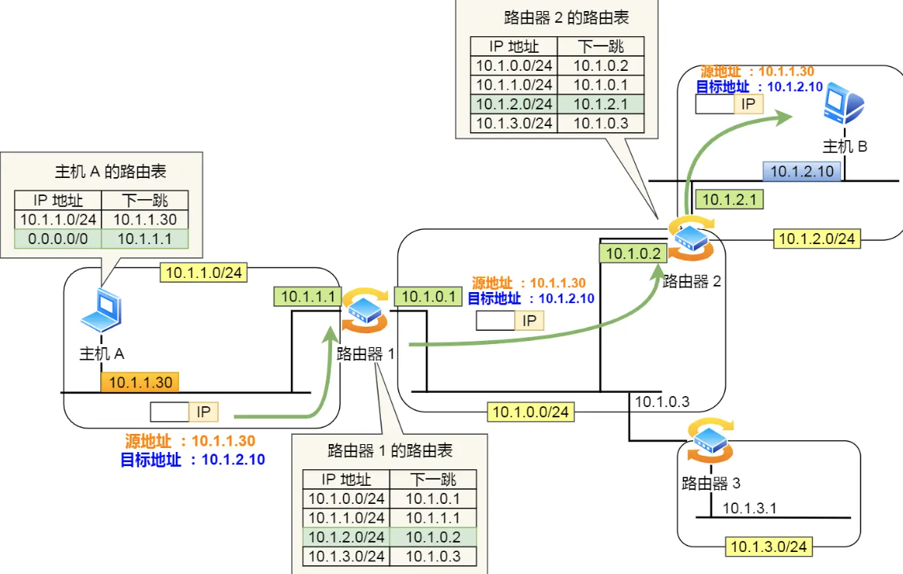

主机A发送一个IP包，源地址是10.1.1.30，目标地址是10.1.2.10

1. 由于主机A中的路由表没有找到这个地址，因此将包转发到默认路由器1
2. 路由器1收到后，查找自身路由表，把IP数据包转发到10.1.0.2这台路由器2
3. 路由器2收到后，查找自身路由表，发现匹配了，把IP包从路由器2的10.1.2.1接口出去，经过交换机把IP数据包转发目标主机

**@ 环回地址**

127.0.0.1是特殊地址，是同一台计算机程序之间进行网络通信使用的默认地址

---

## IP分片与重组

每个数据链路的最大传输单元MTU不同（因为有不同用处），以太网是1500，当IP数据包大于MTU时，IP数据包会被分片，重组只能由目标主机完成，路由器不参与

由于IP层包分片，其中丢失了一个就会整体重发，所以TCP中引入了MSS，即在TCP做了分片，每个分片小于MTU，不交给IP层分片。对于UDP，尽量不要发送一个大于MTU的数据报文

## IPv6

### 概念

**优点：**

- 128位，有更多的地址，更好的安全性和扩展性
- 自动分配IP地址，即插即用
- 包头包首部采用固定的值40字节，去掉包头校验和，简化了首部结构，减轻了路由器负荷，提高了传输的性能
- 提高了安全性，有应对伪造IP地址的网络安全功能及防止线路窃听的功能

但IPv4和IPv6不能兼容，需要设备、网络运营商共同升级，因此普及慢

**IPv6地址的标识：**

以16位作为一组，中间用：隔开

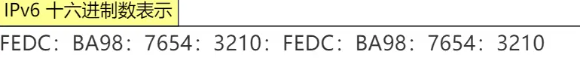

出现连续的0可以将其省略，用：：隔开，但一个IP地址只能出现一次这种省略

### IPv6地址的结构

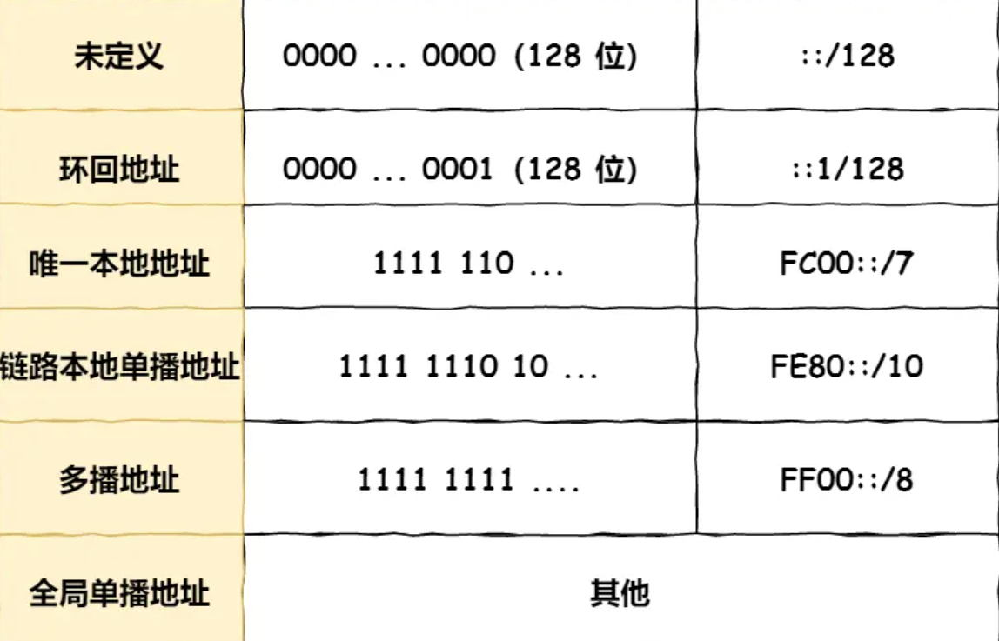

**环回地址**用于当前主机内的通信，不经过网络

#### 单播地址

**全局单播地址**，相当于IPv4的公有IP

**唯一本地地址**，在内网里播通信（相当IPv4的私有IP），常用于当本地IP未配置时，同一网络内的通信，

**链路本地单播地址**，同一链路单播通信，不经过路由器（IPv4没有这个地址）

### IPv6首部与IPv4首部

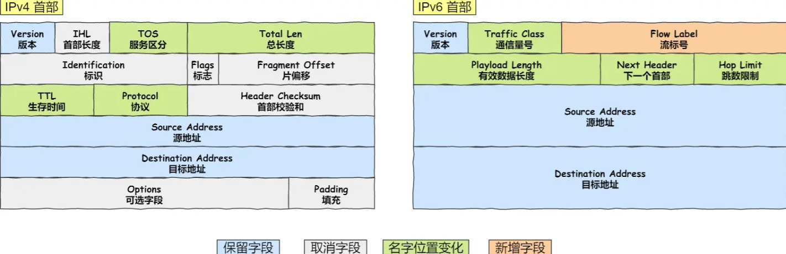

- 取消了首部校验和字段：数据链路层和传输层都会校验，因此取消
- 取消了分片/重组相关字段：上层分片重组了，IPv6不允许在中间路由器进行分片重组，只能在源主机和目标主机，大大提高了路由器的转发速度
- 取消选项字段：放入在IPv6首部中的下一个首部指出的位置上，删除该字段使得IPv6的首部为固定的40字节

## IP协议相关技术

### DNS域名解析

比起IP地址，域名更方便人类记忆，DNS可以将域名网址转为具体的IP地址

#### 域名的层级关系

域名用句点来分割，靠右层级越高

- 根DNS服务器
- 顶级域DNS服务器(com 、cn)
- 权威DNS服务器(server.com)

根域的DNS服务器信息保存在互联网中所有的DNS服务器中，任何DNS服务器可以找到并访问根域DNS服务器

### 域名解析过程

浏览器先查看自己缓存，没有则查看os的缓存，还没有则查看本机域名解析文件hosts，还没有则DNS服务器查询：

1. 客户端发出DNS请求给本地DNS服务器（客户端的TCP/IP中填写的DNS服务器地址）
2. 本地域名服务器收到客户端请求后，如果缓存的表格能找到，则直接返回IP地址，如果没有则去问它的根域名服务器，根DNS发现后置是.com，则返回.com的顶级域名服务器地址
3. 本地DNS收到后请求顶级域名服务器，询问www.server.com，顶级域名服务器给出器的权威DNS服务器的地址
4. 本地DNS收到后请求权威DNS服务器，询问www.server.com，权威DNS服务器给出域名解析的原出处，即IP地址
5. 本地DNS将IP地址返回客户端，客户端和目标建立连接

### ARP

传输IP数据报时，确定了源IP地址和目标IP地址后，需要通过主机路由表依次转发，通过主机的路由表可以找到下一跳的IP地址，即通过ARP协议求得下一跳的MAC地址

**@ 通过ARP查找MAC地址**

ARP借助ARP请求和ARP响应两种类型的包确定MAC地址：

- 主机通过广播发送ARP请求，广播内容包括想知道的MAC地址的主机IP地址
- 同个链路的所有设备收到ARP请求时，会拆开ARP请求包查看目标IP地址是否和自己的IP一致，一致则把自己的MAC地址塞入ARP响应包给主机

os通常会缓存MAC地址，不过这个缓存有一定期限，超过则清除

**@ RARP协议**

ARP是通过IP求MAC，RARP是通过MAC求IP地址，例如打印机等小型嵌入式设备接入网络时会用到

通常需要架设一台RARP服务器，对于新加入的设备：

- 新加入的设备发送MAC地址请求IP的请求信息
- RARP服务器收到后返回MAC地址对应的IP地址的信息给设备
- 设备根据收到的应答信息设置自己的IP

### DHCP

个人电脑通过DHCP动态获取IP地址，省去了配IP信息繁琐的过程

DHCP客户端监听68号端口，DHCP服务端监听67号端口

1. 客户端发起DHCP发现报文的IP数据报，（客户端没有IP地址，也不知道DHCP服务器的地址），所以使用UDP广播通信，目的地址是255.255.255.255：67，源IP地址是0.0.0.0：68。DHCP客户端把该IP数据报传递给链路层，链路层将帧广播到网络
2. DHCP服务器收到DHCP发现报文时，回复报文，携带IP广播地址255.255.255.255，带租约的IP地址、子网掩码、默认网关、DNS服务器
3. 客户端收到多个服务器的DHCP报文，选择一个发送请求报文，包含配置参数
4. 服务用DHCP ACK报文对DHCP请求报文响应，应答参数

此时客户端在租约内可使用DHCP服务器分配的IP地址

如果租约的DHCP IP地址快过期了，客户端会向服务器发送DHCP请求报文

- 服务器同意继续租用，则用DHCP ACK报文进行应答，则客户端延长租期
- 服务器如果不同意，则用DHCP NACK报文，客户端则停止使用该IP

DHCP全程使用UDP广播通信，如果服务端和客户端不在一个局域网内，则需要DHCP中继代理，不同网段的IP地址也可以由一个DHCP服务器同一分配管理

- DHCP客户端以广播的形式发送DHCP请求包给DHCP中继代理，DHCP中继代理以单播的形式发给DHCP服务器
- DHCP服务器收到包后向DHCP中继代理返回应答，再转给DHCP客户端

### NAT网络地址转换

IPv4地址紧张，因此提出网络地址转换NAT，缓解IPv4地址耗尽的问题

同个公司、家庭、教室内的主机对外部通信时，把私有IP转为公有IP，把IP地址+端口号一起转换，即**网络地址与端口转换**NAPT

两个私有IP地址同时发出请求时，路由器将两个不同的私有IP地址转换为同一个公有地址的不同端口号，并在NAPT转换表记录，当连接断开时，从表中删除这条记录

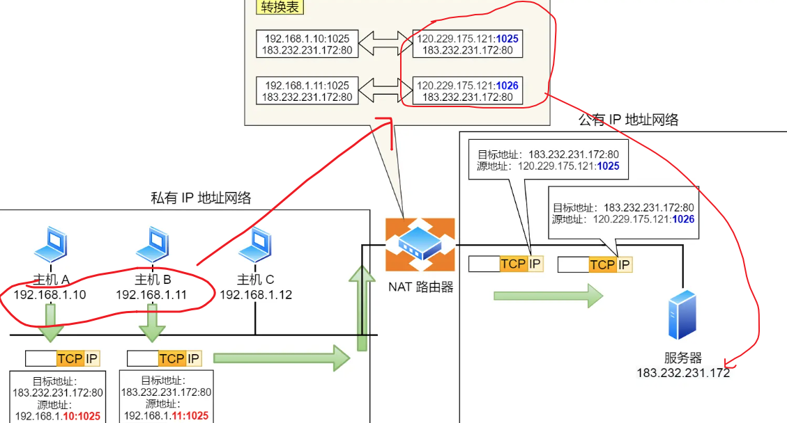

缺点：

- 外部无法主动和NAT内部服务器建立连接，因为NAPT转换表没有转换记录
- 转换表的生成和维护产生性能开销
- 通信时NAT路由器重启，则TCP连接重置

**NAT穿透技术**

应用程序主动建立好映射，从NAT设备获取公有IP地址，自己建立端口映射条目，用这个条目对外通信

### ICMP互联网控制报文协议

当网络包在复杂的网络传输中遇到问题时将由ICMP负责通知

ICMP主要功能：确认IP包能否成功送达目标地址、报告发送过程中IP包被废弃的原因和改善网络设置等

例：

主机A向主机B发送了数据包，由于一些原因，途中的路由器未能发现主机B的存在，这时，路由器会向主机A发送一个ICMP目标不可达数据包，说明发送不成功（这种通知消息会使用IP进行发送）

#### **ICMP报头格式**

封装在IP包里，工作在网络层

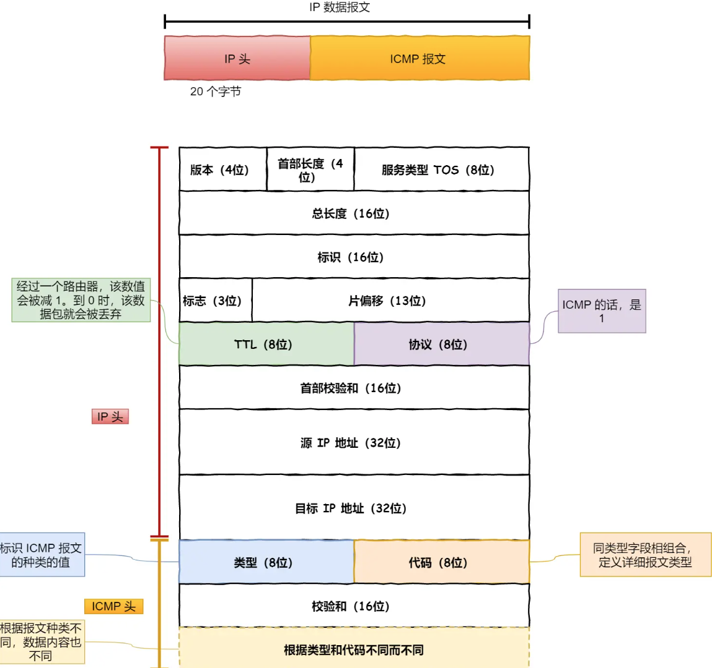

#### **查询报文类型**

用于诊断的查询消息

| 0    | 回送应答         | 查询报文类型 |
| ---- | ---------------- | ------------ |
| 3    | 目标不可达       | 差错报文类型 |
| 4    | 原点抑制         | 差错报文类型 |
| 5    | 重定向或改变路由 | 差错报文类型 |
| 8    | 回送请求         | 查询报文类型 |
| 11   | 超时             | 差错报文类型 |

**回送消息**用于进行通信的主机或路由器之间，用于判断所发送的数据报是否到达对端

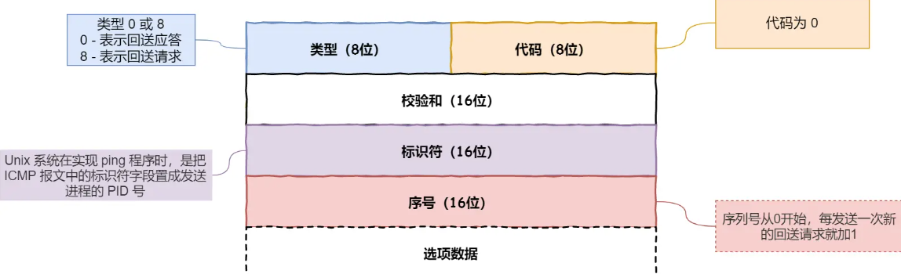

**标识符**用于区分是哪个应用程序发的ICMP包，常用进程PID作为标识符

**序号**从0开始，每发送一次新的回送请求就会加1，用来确认网络包是否丢失

**选项数据**中，平还会存放请求的时间值用于计算往返时间

#### **差错报文类型**：

用于通知出错原因的错误消息

**@ 目标不可达消息**

无法将IP数据包发给目标地址时，会给发送端主机返回一个目标不可达的ICMP消息，原因记录在ICMP包头的代码字段

代码字段包括：

- 0 网络不可达，IP分为网络号和主机号，网络号不匹配时则是这个报错，不再有网络分类后，这个渐渐不使用了
- 1 主机不可达，路由表没有该主机的信息或主机没有连接到网络
- 2 协议不可达，对端防火墙禁止TCP访问，则使用TCP的方式会返回这个报错
- 3 端口不可达，对端主机没有进程监听8080端口
- 4 需要分片但设置了不分片，需要超过MTU大小的包时则丢弃并告知发送端

**@ 原点抑制消息**

使用低速广域线路时，连接WAN的路由器可能遇到网络拥堵，

当路由器向低速线路发送数据时，其发送队列的缓存变为0而无法发送出去时，可以向IP包的源地址发送一个ICMP原点抑制消息

主机收到这个消息后，可以增大IP包的传输间隔，减少网络拥堵

然而，这可能产生不公平的网络通信，因此一般不用

**@ 重定向消息**

如果路由器发现发送端主机使用了不是最优的路径发送数据，那么它会返回一个ICMP重定向消息给主机

消息中包含了最合适的路由信息和源数据

**@ 超时消息**

IP包中的TTL字段，它的值随着每经过一次路由器就会减1，直到减到0时该IP包会被丢弃，此时路由器会发送一个ICMP超时消息给发送端主机

这个TTL字段的目的是为了避免在路由控制中出现循环的情况，避免IP包无休止的在网络上被转发

有时可以将TTL设置为一个较小的值，来控制包到达的范围

#### ping的工作原理

IP协议基于ICMP协议实现

1. ping命令执行时，源主机首先会构建一个ICMP回送请求消息数据包

   ICMP数据包内包含类型（回送请求为8）、序号（区分连续的ping）、发送时间

   ICMP协议将这个数据包连同目标地址一起交给IP层，协议字段为1标识是ICMP协议，再加上其他控制信息构建成IP数据包

2. 加入MAC头，

   如果本地ARP映射表中查找出IP地址对应的MAC地址则直接使用，没有则发送ARP协议查询MAC地址，

   获得MAC地址后，由数据链路层构建一个数据帧，加上控制信息，传送出去

3. 主机B收到数据帧后，先检查MAC地址和本机地址对比，符合则接收，否则丢弃

   从帧中提取数据包给本机的IP层，IP检查后将信息提取给ICMP协议

4. 主机B构建一个ICMP回送响应消息数据包，

   ICMP回送响应包包含类型（回送响应为0）、序号（发来的序号）

ping和TCP都是用socket函数实现，只是TCP发送数据时报头不同，一个是ICMP头，一个是TCP头

#### traceroute——差错报文类型的使用

traceroute（unix、macos），tracert（windows）

**作用一**：设置特殊的TTL，追踪来去目的时经过的路由器

`traceroute 192.168.1.100`

它的原理就是将TTL设置为1，遇到第一个路由就返回差错报文网络，再将TTL设置为2，遇到第二个路由返回差错报文网络，如此反复直到到达目的主机，从而拿到所有路由器的IP

**作用二**：故意设置不分片，从而确定路径的MTU

有时不确定路由器的MTU大小，以太网一般1500字节，非以太网不确定

在发送端主机发送IP数据报时，将IP包首部的分片禁止标志设为1，发送端每次收到ICMP差错报文时就减少包的大小，以此来定位一个合适的MTU值

### IGMP因特网组管理协议

组播地址可以给一组的地址发送数据，如果管理一组需要IGMP协议

IGMP工作在主机和最后一跳路由之间

主机发送IGMP报文申请加入到组播组时，路由器记录IGMP路由表，路由器后续就会转发组播包到对应的主机，如果不加入，默认路由器不会转发组播包到连接中的主机

IGMP报文采用IP封装，IP头部的协议为2，TTL字段通常为1，因为IGMP是工作在主机和连接的路由器之间

**IGMP工作机制**

IGMP分为，IGMPv1，IGMPv2，IGMPv3

**常规查询和响应工作机制**

IGMPv2下

1. 路由器周期性发送**IGMP常规查询报文**给特定组播地址224.0.0.1

2. 主机收到查询，如果本地有对应的组播组成员，则发送**IGMP成员关系报告报文**（源IP为自己主机的IP，目的IP为组播地址）

   这种发送是通过启动延迟计时器（随机0-10s），超时后就会发，如果在定时器超时之前，收到同一组内其他主机发出的成员关系报告报文，则自己不发送，这样可以减少整个组内的网络数量

3. 路由器收到主机成员关系报文后，在IGMP路由表中加入该组播组，

**离开组播组工作机制**

1. 主机发送离组报文给224.0.0.2
2. 路由器收到报文后，以1s为间隔连续发送**IGMP特定组查询报文**（共计发送2个），以便确认该网络是否还有224.1.1.1组的其他成员
3. 如果有主机是这个特定组的成员则立即响应
4. 路由器收到后，则继续向该网络转发组播数据包。如果没有其他成员了，则停止转发该组播地址的数据包

### 为什么断网还能ping通127.0.0.1

ping命令执行时，从应用层到传输层到网络层，这段路径和ping外网一样，到了网络层，系统会根据目的IP在路由表中获取对应的路由信息，包括选择哪个网卡把消息发出

当发现目标IP是外网IP就从真网卡发出，当目标IP是回环地址时，就选择本地网卡

本地网卡是个假网卡，有个input_pkt_queue的链表中挂者发给本地的各自消息，消息发到这个链表会触发有个软中断，内核线程ksoftirqd会负责取出消息，顺着数据链路层、网络层层层上层给应用程序

如果主机负载大，可能ping127.0.0.1会失败

**@ ping回环地址和ping本机地址有什么区别**

没有区别，都不会发送到网络中

**@ 127.0.0.1和localhost和0.0.0.0**

localhost是个域名，等同于网址，默认会把他解析为127.0.0.1，可以在/etc/hosts文件下修改

ping0.0.0.0是不行的，它在IPv4中表示的是无效地址。

当启动服务器时，一般会listen一个IP和端口，等待客户端的连接，如果listen的是本机的0.0.0.0，表示本机上所有IPv4地址。此时用127.0.0.1和192.168.31.6都能访问到这个服务器。当然客户端connect时，不能使用0.

