[TOC]

# 基础

TCP/IP的四层模型：应用层、传输层、网络层、网络接口层（数据链路层、物理层）

OSI模型：应用层、**表示层、会话层**、传输层、网络层、数据链路层、物理层

应用层在用户态下，其他层在内核态下，专注于为用户提供应用功能，比如HTTP、FTP、Telnet、DNS、SMTP等

**传输层**为应用层提供网络支持，帮助实现应用到应用的通信。传输协议包括TCP、UDP。应用层传输的数据可能很大，不好直接传输，传输层的数据包大小超过MSS（TCP最大报文段长度）就要将数据包分块，每个分块即一个TCP段。

**网络层**负责实际的传输功能，最常使用的是IP协议，将传输层的报文作为数据部分，加上IP包头组装成IP报文，报文大小超过MTU（以太网中一般为1500字节）就会再次分片。

用ip地址区分设备，ip地址分为网络号和主机号

配合子网掩码算出IP地址的网络号和主机号，比如10.100.122.0/24，/24表示255.255.255.0子网掩码（其中有24个1）

将10.100.122.0和255.255.255.0进行按位与运算得到网络号，将255.255.255.0取反与IP地址进行按位与运算得到主机号

寻址中，先匹配到网络号再匹配主机

IP协议还有路由的选择，实际场景多台设备通过众多网络设备连接起来，形成多条网络的路径，因此需要通过路由算法决定路径选择

即IP协议的寻址决定了方向，路由选择路径

**网络接口层**在IP头部前加锁MAC头部，并封装成数据帧发送到网络上

以太网指在局域网内把附近的设备连接起来使他们可以进行通讯，包括电脑的以太网接口，wifi接口，以太网交换机，路由器的以太接口。

以太网在判断网络包目的地与IP的方式不同，因此必须采用相匹配的方式，MAC头部就起到这个目的，其中包含了接收方和发送方的MAC地址等信息，可以通过ARP协议获取对方的MAC地址

# 键入网址到网页显示

HTTP

解析URL

URL的组成：协议+服务器名称+路径

路径的/地址不是linux系统的根/，而是web服务器配置文件中指定的根，为某个路径

如果不指定文件路径，则访问一个默认地址

生成HTTP请求信息

请求行/状态行+消息头+消息体

真实地址查询——DNS

查询服务器域名对应的IP地址，DNS服务器记录了web服务器域名和IP的对应关系

域名越靠右层级越高，**域名的层级关系如下**

- 根DNS服务器（.)默认隐藏
- 顶级域DNS服务器（.com）
- 权威DNS服务器（[server.com](http://server.com)）

根域的DNS服务器信息保存在互联网所有的DNS服务器中

**域名解析的过程**

- 客户端发出DNS请求，查询域名对应的IP，发给本地的DNS服务器（客户端TCP/IP设置中填写的DNS服务器地址）
- 本地域名服务器收到客户端请求后，询问**根域名服务器**得到.com顶级域名服务器的地址
- 本地DNS访问**.com顶级域名服务器**，得到负责www.server.com区域的权威DNS服务器地址
- 本地DNS访问**权威DNS服务器**，得到对应的IP地址
- 本地DNS将IP地址返回客户端

并不是每次访问都需要经过全步骤，其中浏览器、操作系统、hosts文件、本地域名服务器都会有缓存

协议栈

获取到IP后，将http的传输工作交给os的协议栈

应用程序通过socket库来委托协议栈工作，协议栈上半部分为负责收发数据的TCP和UDP协议，下半部分是用IP协议控制网络包收发操作，包括ICMP协议（告知网络包传送过程中产生的错误和控制信息）和APR协议（根据IP地址查询相应的以太网MAC地址）

# TCP

## QUIC

## TCP和UDP

1. 连接：TCP需要连接，UDP不需要
2. 连接数量：TCP一对一，TDP支持一对多，多对多
3. 可靠性：TCP可靠交付，UDP最大努力交付
4. 拥塞控制：TCP有拥塞控制和流量控制，UDP没有
5. 首部开销：TCP首部长度较长，使用了选项会使得字段变长，UDP首部8字节，固定不变
6. 传输方式：TCP流式传输，没有边界，保证顺序和可靠，UDP一个包一个包的发送有边界，可能丢包和乱序
7. 分片：TCP数据大于MSS大小，则会在传输层分片，UDP数据大于MTU大小，会在IP层分片，目标主机在IP层组装数据

> CP有可变长字段，UDP长度不会变化，不需要UDP首部长度字段

**@UDP有包长度字段，TCP没有**

TCP计算负载数据长度：TCP数据长度=IP总长度-IP首部长度-TCP首部长度

UDP也可以通过这样的方式计算长度，但是

第一种说法：用于补全UDP首部长度为4字节的倍数

第二种说法：早期的UDP协议可能不是基于IP协议的

**@TCP和UDP可以使用同一个端口吗**

可以

传输层的端口号是为了区分同一个主机上不同应用程序的数据包

数据链路层中，通过MAC地址来寻找局域网中的主机，网络层中，通过IP地址来寻找网络中互连的主机或路由器，传输层中，通过端口进行寻址（识别同一计算机中同时通信的不同应用程序）

传输层的TCP和UDP在内核中（传输层）属于两个完全独立的软件模块，他们的端口号相互独立，主机通过在IP包头的协议号字段知道该包是TCP/UDP，根据这个信息确定送给哪个模块处理

## **TCP协议**

### 定义

**有连接**：发送数据之前，需要进行连接，且一对一。

**可靠传输**：保证数据时有序且可靠的到达对端机器。

**面向字节流**：与面向数据报相反，数据可以在传递的过程中分成多个TCP报文，有序报文。

**回环地址**：所有127.开头的都是回环地址

**0.0.0.0**指代本机的所有IP地址，即回环地址和所有网卡

**loopback地址，**每一台路由器创建一个loopback 接口，并在该接口上单独指定一个IP 地址作为管理地址，管理员会使用该地址对路由器远程登录（telnet ），该地址实际上起到了类似设备名称一类的功能。

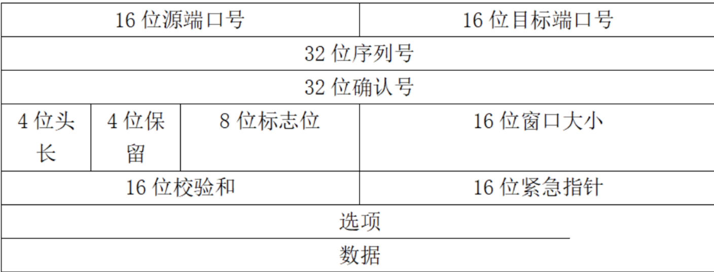

**标志位包含：**

**序列号**SEQ：建立连接时生成的随机数，每发一次数据累加一次，用于解决网络包乱序问题，32位无符号数，循环使用

**确认应答号：**下一次期望收到的数据的序列号，发送端收到这个确认应答后可以认为这个序号以前的数据都已被正常接收，用于解决丢包问题

**控制位:**

- ACK ,为1表示确认应答字段有效

- RST：表示TCP连接出现异常强制断开连接

- SYN:表示希望建立连接

- FIN：表示希望断开连接

### TCP连接

**@什么是TCP连接**

用于保证可靠性和流程控制维护的某些状态信息的组合，包括socket（由ip地址和端口号组成），序列号（用来解决乱序问题），窗口大小（作流量控制）

**@如何唯一确定一个TCP连接**

TCP四元组：

源地址和目标地址：32位，在IP头部，通过IP协议发送报文给对方主机

源端口和目的端口：16位，在tcp头部，告诉TCP协议应该把报文发给哪个进程

**@一个ip的服务端监听一个端口，他的TCP最大连接数是多少**

最大TCP连接数=客户端的IP数*客户端的端口数（IPv4为2^32 * 2^16）

当实际上并不会达到理论上限，会收到以下因素的影响

文件描述符限制：系统级（系统可打开的最大数量）、用户级（用户可打开的最大数量）、进程级（单个进程可打开的最大数量）

内存限制：每个TCP连接都要占用一定内存

#### TCP的建立（三次握手）

一开始，客户端和服务处于close状态，服务端主动监听某个端口，处于LISTEN状态

**第一次握手：**建立连接时，客户端**发送syn包**(syn=j)到服务器，并进入**SYN_SEND**状态，等待服务器确认；SYN：同步序列编号(Synchronize Sequence Numbers)。

报文：将**SYN标志**位置1，随机初始化序列号，将此序号置于TCP首部的**序列号**字段中，发送，不包含应用层数据

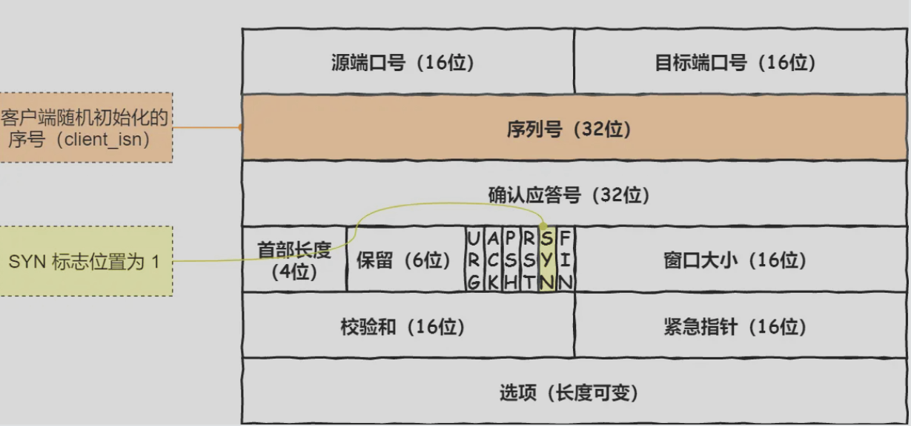

**第二次握手：**服务器收到syn包，必须确认客户的SYN（ack=j+1），同时自己也**发送一个SYN包**（syn=k），即**SYN+ACK**包，此时服务器进入**SYN_RECV状态**； 

报文：服务端也随机初始化自己的**序列号**（server_isn），填入TCP首部的序列号字段中，其次把TCP首部的确认应答号填入server_isn+1的**确认应答号**，**SYN和ACK**标志为1，发送报文，不包含应用层数据

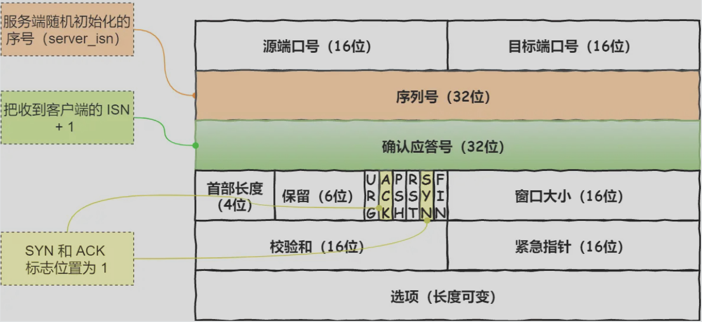

**第三次握手**：客户端收到服务器的SYN+ACK包，向服务器发送确认包ACK(ack=k+1)，此包发送完毕，

报文：ACK标志位置1，填入应答号字段

客户端进入ESTABLISHED状态，完成三次握手。 服务端收到后也进入**ESTABLISHED**状态

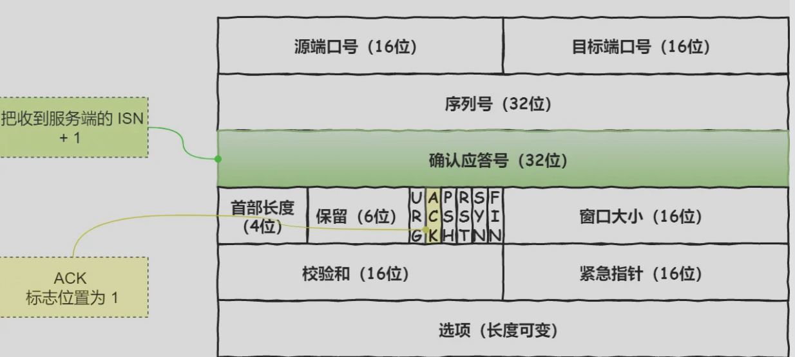

@linux中查看TCP连接状态

`netstat -napt`

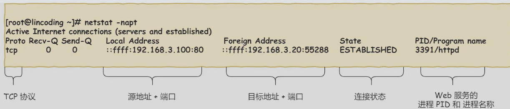

#### TCP快速建立连接

需要由于第三次握手可以携带数据，一个完整的交互过程需要2个RTT的时延

对HTTP GET请求，linux提供了TCP Fast Open功能，可以减少建立的时延

- 在第一次建立连接时，第二次握手会产生一个cookie（已加密）通过SYN、ACK包发给客户端，客户端会缓存这个Cookie

- 下次请求的时候，客户端在SYN包带上cookie发给服务端，就可以跳过三次握手，这时HTTP GET请求只需要1个RTT时延

客户端存储了Fast Open Cookie之后，可以不断重复TCP Fast Open直至服务器认为cookie无效

net.ipv4.tcp_fastopen

#### 为什么是三次握手，不是两次、四次

1. 三次握手才能阻止**<u>重复连接的初始化</u>**，防止旧的重复连接初始化造成混乱，

   想象一个场景：客户端发送给SYN报文，然后客户端宕机，这个SYN被网络阻塞服务端没有收到，客户端重启后又重新发送SYN（不是重传，是以新的序列号发送）

   - 客户端连续发的多次SYN，如果旧的报文先到，服务端回应SYN+ACK报文给客户端

   - 客户端收到这个回应，发现和期望收到的确认号不一致，回复RST报文，服务端收到RST释放连接

   - 后续服务端收到新的SYN，完成正常握手

   **@如果服务端第一次收到旧SYN，再收到新的SYN**

   再收到新的SYN会回Challenge ack，即上一个SYN的序号，客户端收到此报文发现不是自己期望收到的，回复RST报文，重发新的SYN

   **@那为什么两次握手不行**

   如果是两次握手就无法阻止历史连接，没有中间状态给客户端来阻止历史连接，导致服务端建立了一个历史连接造成资源浪费

   服务端收到SYN报文就进入了ESTABLISHED状态，但客户端还没有进入ESTABLISHED状态，客户端会RST时服务端才会断开连接

   **@如果第三次握手的包丢失了**或者**第一个数据包先于第三次握手的包到服务端**

   服务端收到第一次握手的syn包进入syn_received状态，丢失了第三次的ACK，但是收到了客户端发送的数据，还是可以建立连接并正常收到这个数据包，因为数据报文中有ack标识位和确认号

2. 三次握手才能**<u>同步双方的初始序列号</u>**

   TCP协议通信双方维护各自的序列化，这可以起到去重复的数据，保证包的顺序，确认包的接收

   发送一次接收一次才能保证双方的初始序列号能被可靠同步

   四次握手也可以可靠同步，但第二步服务端回复客户端，和第三步服务端发出初始序列号可以合成一步

3. 三次握手才能**<u>避免资源浪费</u>**

   两次握手对于每一个客户端发来的SYN都要主动建立连接，而服务端发出的ACK报文因网络阻塞无法到达客户端，客户端一直收不到ACK就会重发，服务端因此建立多个无效连接，造成资源浪费

#### 每次握手分别丢失了会发生什么

**@如果第一次握手丢失了**

客户端会因迟迟收不到ACK而超时重传（重传的报文SYN序列号是一样的），时长写死在内核中，最大重传次数可定义一般为5（超时时长每次为1，2，4，8，16，32），总耗时约1分钟

**@如果第二次握手丢失了**

服务进入SYN_RCVD状态，此时第二次握手丢失，客户端会触发超时重传，服务端收不到回应也会触发超时重传，

**@如果第三次握手丢失了**

第三次握手如果丢失，服务端收不到确认报文会认为自己发出的SYN+ACK报文丢失了，而触发超时重传，客户端的ACK是不会重传的，只由服务端重传，客户端再收到SYN+ACK会再回复ACK。如果服务端超时重传两次后还是没等到第三次ACK就会断开连接

### SYN攻击

……

### 初始序列号ISN

如何随机产生：

ISN=M（计时器）+F(hash算法，根据四元组随机生成)，循环一次需要4.55小时

**@为什么每次建立TCP连接初始化的序列化都要求不一样**

1. 防止历史报文被下一个相同四元组的连接接收

   如果每次连接的序列号一样，将出现如下场景

   - 服务端和客户端建立连接，客户端发送一个包由于网络阻塞超时重传
   - 服务端断电重启，建立的连接消失，因此回复RST
   - 客户端与服务端建立与上一个连接相同的四元组
   - 之前网络阻塞的包现在到达，被服务端接收了，造成数据错乱

   虽然初始化序列号不一样很大程度避免了历史报文被下一个相同四元组的连接接收，但并没有完全避免

2. 为安全性，防止黑客伪造相同序列号的TCP报文

### 既然IP层会分片，为什么TCP层还需要MSS

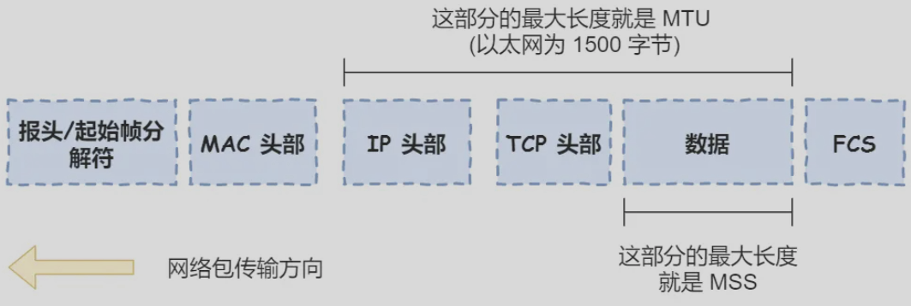

MTU：网络包最大长度，通常为为1500
MSS：除去IP和TCP头部，能容纳的实际数据大小

如果不使用MSS，当IP层有超过MTU大小的数据就分片。但这存在的问题就是如果一个IP分片丢失，整个IP报文的所有分片都得重传，而IP层没有超时重传，由传输层的TCP负责超时和重传

当一个IP分片丢失后，接收方的IP层无法组成完整的TCP报文交付到TCP，使得TCP触发超时重传整个报文的所有分片

设定了最大MSS长度，会小于MTU长度，确保每次重发时以MSS为单位

### TCP连接的终止

#### TCP连接的终止（四次挥手释放）

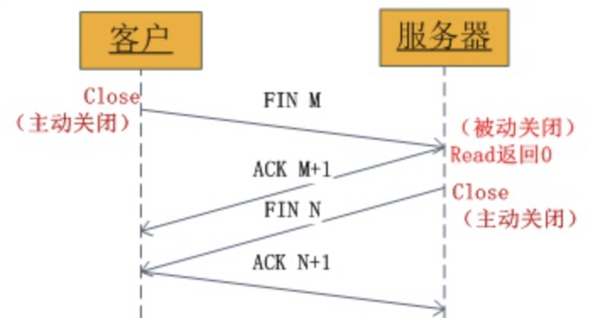

1. 客户端发出TCP首部FIN标志位为1的报文，之和客户端进入FIN_WAIT_1状态
2. 服务端收到报文后向客户端发送ACK，进入CLOSE_WAIT状态
3. 客户端收到服务端的ACK后，进入FIN_WAIT_2状态
4. 服务端处理完数据后，向客户端发送FIN报文，进入LAST_ACK状态
5. 客户端收到服务端的FIN报文后，回一个ACK应答报文，进入TIME_WAIT状态，经过2MSL的时间后自动进入CLOSE状态
6. 服务端收到了ACK应答报文后进入CLOSE状态

#### 每次挥手的丢失

**@第一次挥手丢失**

超时重传，通常为3次，超时时间每次2倍叠加，一直丢失就会断开连接

**@第二次挥手丢失**

ACK的报文都不会重传，因此第二次挥手丢失，客户端收不到回复就会超时重传FIN报文，如果一直收不到第二次挥手，客户端就会断开连接

默认情况下，客户端收到第二次挥手，就会处于FIN_WAIT2状态，这个状态下，对于调用close关闭的连接，如果60s后没有收到FIN报文，客户端的连接会直接关闭

如果使用shutdown函数关闭连接，指定了只关闭发送方向，而接收方向没有关闭，意味这主动关闭方还可以接收数据，此时主动关闭方一直没收到第三次挥手，将一直处于FIN_WAIT_2状态

**@第三次挥手丢失**

内核收到客户端的FIN报文后回复了ACK，等待进程主动调close来触发服务端发送FIN报文，进入LAST_ACK状态

如果服务端迟迟收不到这个ACK服务端就会重发FIN报文（tcp_orphan_retrie控制重发次数），如果一直收不到这个ACK，服务端就会断开连接

客户端一段时间内没有收到第三次挥手就会断开连接

**@第四次挥手丢失**

当客户端收到服务端的第三次挥手的FIN报文后就会回ACK报文，进入TIME_WAIT状态，在linux系统，TIME_WAIT状态回持续2MSL后才会进入关闭状态

客户端收到第三次挥手后就会进入TIME_WAIT状态，开启时长为2MSL的定时器，如果途中再收到第三次挥手就会重置定时器，定时器到了就会断开连接

服务器如果发出第三次挥手没等到ACK超时重传，始终没收到ACK就会断开连接

**@为什么TIME_WAIT等待时间是2MSL**

MSL是报文最大生存时间，在网络上的最大存在时间，超过这个时间将被丢弃，IP协议里有个TTL字段代表IP数据报可以经过的最大路由数，没经过一个路由值减1，值为0则数据报被丢弃，同时发送ICMP报文通知源主机。

MSL>=TTL消耗为0的时间，通常TTL的值是64，MSL为30s，2MSL为60S

TIME_WAIT等待2倍的MSL主要是网络中存在来自发送方的数据包被接收方处理后又会向对方发送响应，这个一来回需要2倍的时间。

即客户端发送ACK，如果服务端没有收到最后断开连接的ACK报文触发超时重发FIN报文，到达客户端时，正好2个MSL。即2MSL的时长用于允许回复的ACK报文丢失一次

**@为什么不是4或者8MSL的时长**

因为对于丢包率1%的网络两次连续丢包的概率很低，忽略它更有性价比
占用端口资源，端口资源有限，如果客户端的TIME_WAIT状态过多，就无法对同一个[IP+port]发起连接

#### 为什么需要TIME_WAIT状态

1. 防止历史连接中的数据，被后面相同的四元组的连接错误的接收

   首先序列号会循环绕回初始值，如果没有TIME_WAIT状态或者时间过短：

   - 服务端在关闭连接之前发送的SEQ=301报文被网络延迟了
   - 客户端和服务端完成四次挥手
   - 客户端三次握手建立连接，SEQ=301报文抵达并被接收，产生数据错乱

   确保新的连接产生的数据一定是新建立的连接产生

   如果开启了TCP的时间戳则不存在这个问题

2. 保证被动关闭连接的一方能被正确的关闭

   如果客户端没有TIME_WAIT状态：

   - 客户端最后一次ACK报文在网络中丢失了，那么服务端会重发FIN报文
   - 客户端发完ACK进入CLOSE状态，收到服务端的FIN报文就会回RST报文
   - 服务端收到RST将其解释为错误，对于可靠的协议来说这种终止方式不够安全

#### 优化TIME_WAIT

1. 打开net.ipv4.tcp_tw_reuse和tcp_timestamps参数，可以复用处于TIME_WAIT的socket为新的连接所用（在调用connect函数时，内核随机找一个time_wait状态超过1s的连接给新的连接复用）
2. 开启*net.ipv4.tcp_max_tw_buckets*，当系统中处于TIME_WAIT的连接超过这个值，则将后面的TIME_WAIT连接状态重置
3. 使用SO_LINGER，不使用TIME_WAIT状态，跳过第四次挥手

服务端如果要避免TIME_WAIT状态的连接，就不要主动断开连接，让客户端去断开承受TIME_WAIT

#### 服务器出现大量TIME_WAIT状态的原因

即，什么场景下服务端会主动断开连接

1. HTTP没有使用长连接

   当不使用长连接时，每次请求分为 建立TCP->请求资源->响应资源->关闭连接

   大多数Web服务器，不管哪一方禁用了长连接服务，都由服务端主动关闭连接

   - 如果客户端禁用长连接，服务端开启，那么在请求响应模型下，客户端发来的请求携带了非长连接的信息，这时只有在服务端发起断开连接了
   - 如果客户端开启长连接，服务端禁用，服务端响应资源后，如果不立即发起关闭连接，那么就要调epoll/select去等待事件，再调read才能知道连接被关闭，有两次系统调用（原本只需要调一次close），且socket保持的时间也更长

2. HTTP长连接超时

   长连接下，只要任意一段没有明确提出断开连接则保持连接状态，客户端发完请求后，再计时器的时间内都没有发起新的请求就会触发服务端的主动断开

3. HTTP长连接的请求数量达上限

   nginx的keepalive_requests参数默认为100，在QPS较高的场景可以调大这个参数

#### 服务器出现大量CLOSE_WAIT状态的原因

说明服务端的程序没有调用close函数关闭连接，通常是服务端代码的错误

对于一个TCP服务端的流程：建立socket，再注册epoll

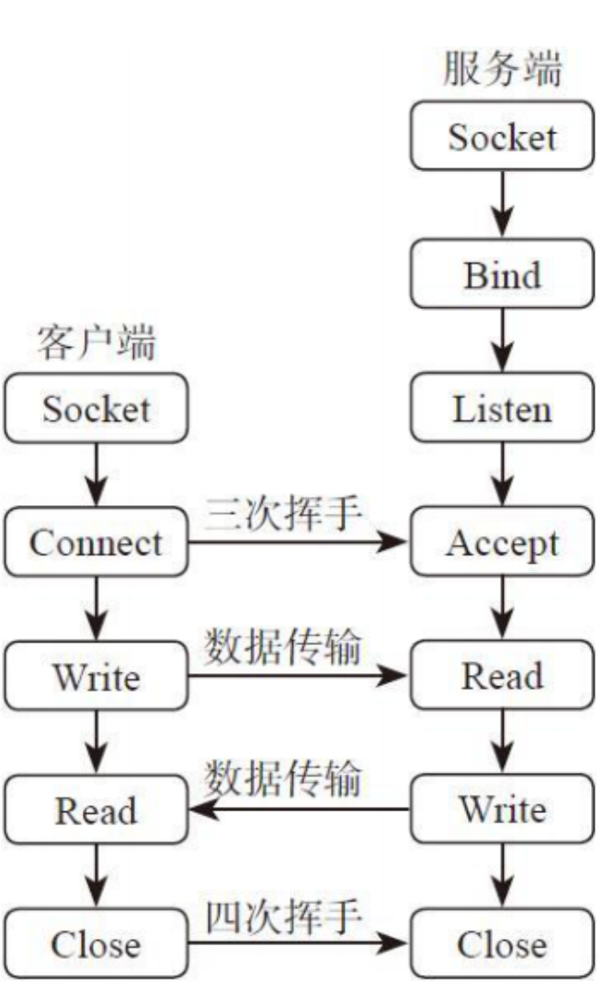

1. 没有将socket注册到epoll，当新的连接到来时，服务端无法获取已连接的socket
2. 新连接到来时没有调用accpet获取该连接的socket导致客户端主动断开连接，而服务端无法对这些socket调用close函数
3. 没有把获取的已经连接的socket注册到epoll，导致后续收到FIN报文时服务端无法感知这个事件，即无法调close函数
4. 对方关闭连接时，服务端没有调用close函数

### 故障注入

#### 建立了连接，客户端故障

如果客户端故障导致 TCP连接一直处于ESTABLISH状态

**保活机制：**

一端时间（net.ipv4.tcp_keepalive_time=7200s，2小时）没有活动后将触发**保活机制**：每隔一个时间间隔（tcp_keepalive_intvl=75s）发送一个探测报文，连续的几个（tcp_keepalive_probes=9）探测报文没有响应，内核将通知给上层。即linux中，最少要2小时11分种15秒才能发现一个死亡连接

socket接口设置SO_KEEPALIVE选项开启保活机制

注意的是：

- 探测报文如果收到回复将重置TCP保活时间
- 客户端如果宕机重启，TCP发送探测报文后，客户端会回复一个RST报文，这样会发现TCP连接被重置
- 如果进程崩溃，os在回收进程时会发送FIN报文，只有主机宕机时服务端无法感知

linux 的保活机制检测的时间较长，可以在应用层使用心跳机制，web服务软件一般都会提供keepalive_timout参数来指定HTTP长连接的超时时间

#### 建立了连接，服务端的进程崩溃

TCP连接信息内核维护，服务端进程崩溃后，内核会回收进程的TCP连接资源

## 底层实现

最大报文段长度MSS，指的是在一个 TCP 报文段中能够携带的最大有效载荷，也就是 TCP 协议在传输数据时，每个报文段中可以携带的最大数据量。MSS 的值一般由网络的最大传输单元 MTU 减去 TCP 和 IP 协议头的长度得出。

### ARO超时重传

ARQ（自动重传请求）模型响应有两种，UNA（此编号前所有包已收到，如TCP）和ACK（该编号包已收到），根据情况选择其中一种

#### 对于如何触发重传：超时重传、快重传

**超时重传**

发送数据时，指定时间没有收到对方的ACK就会重发

数据包丢失、确认应答丢失都会触发超时重传

**超时重传时间RTO**的确定取决于**最大往返时延RTT**，因为网络RTT的值经常变化，所以RTO的值也应该动态变化

RTO的计算：采样RTT，加权平均计算出平滑RTT的值，采样RTT的波动范围，两者加权求和

第一次计算RTO，R1为第一次测量的RTT

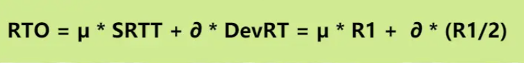

后续计算RTO，R2为后续测量的RTT

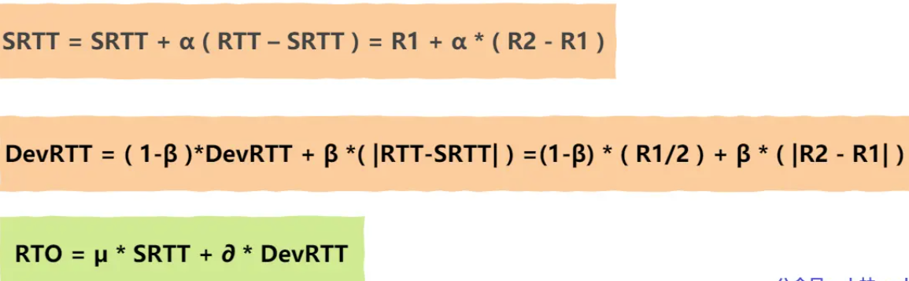

SRTT是计算平滑的RTT，DevRTR是计算平滑的RTT与新RTT的差距，Linux 下，**α = 0.125，β = 0.25， μ = 1，∂ = 4**

每次超时重传，下次超时间隔翻倍

**快速重传**

收到失序报文时立即发出重复确认（不需要等到之间发送数据时才捎带确认），发送方只要一连收到三个重复确认就应当立即重传（不必继续等待为其设置的重传计时器到期）

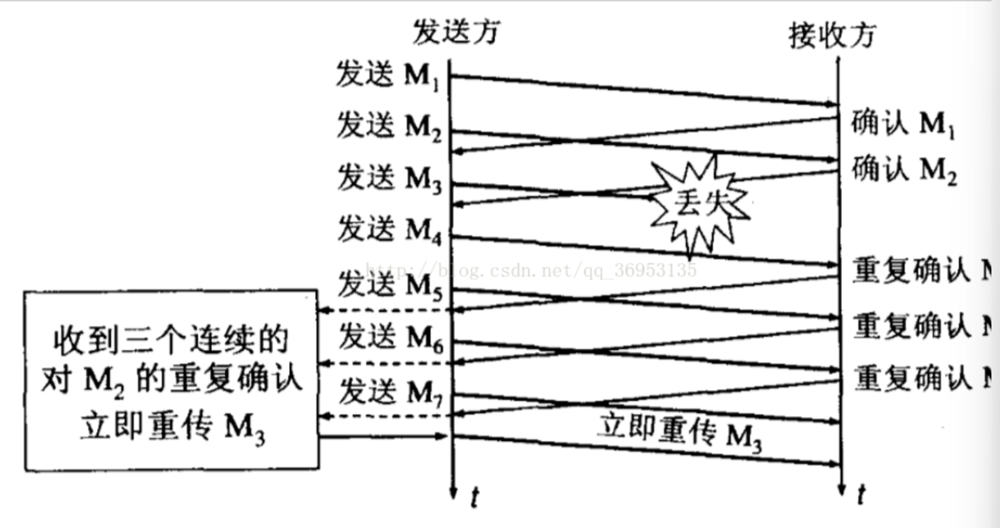

重传时不确定要从M2开始全部重传还是只传M2

#### 对于丢包的发送

**回退N帧：**即收到一个包丢失的消息后，重传这个包以后的所有包

**选择重传（**SACK方法-选择性确认）：

linux需要双方打开SACK选项，net.ipv4.tcp_sack（默认开启）

在TCP头部加SACK字段，可以将已收到的数据信息发给发送方，从而知道哪些数据丢失哪些接收了，只传丢失的数据

发送方维持一个窗口包含未被确认的序号、可发送的序号。
接收方维持一个窗口包含可接收的序号

每到达一个帧检测他的序号是否落在窗口内，如果落在窗口内且没有接收过，则接收并返回确认，等前面的帧都到达则交付给上层

发送端每个发送缓存都有一个超时计时器

问题：

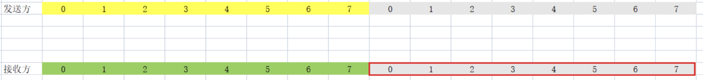

如上情况收到0号数据时不能确认是前一组还是后一组的0（前一组发送方没有收到ACK而重发）

解决：

对于帧序号n，将发送窗口大小=接收窗口大小=2^（n-）

即，对于帧序号7，发送窗口大小=4=接收窗口大小

> TCP协议中的16位窗口大小就是为窗口协议提供支持的。UDP协议的目标是尽最大努力交付，不管你收到没有，所以没有该字段

> UDP协议每次传输的最大数据量并不是2^16 - 1 - 8 - 20（8表示UDP头长，20表示IP头长），而是与MTU有关，即数据链路层的最大传输单元(Maximum Transmission Unit)，值是1500。

#### Duplicate SACK(D-SACK)

使用SACK告诉发送方哪些数据被重复接收了

- 当包1接收后，ack丢失了，发送方重发，接收方回的ack带sack信息告诉发送方这个包已经被接收了
- 当数据包1发送遇到网络延迟，发送方因快重传重发并接收这个包，后数据包1到达了，发送方发ack带者D-SACK信息，表示收到了重复的包

这样做可以有几个好处

- 让发送方知道是发出的包丢失了还是接收方回应的ACK丢了
- 让发送方知道是不是发送的包被网络延迟了
- 是不是网络中把发送方的数据包给复制了

linux下net.ipv4.tcp_dsack参数控制这个功能（默认开）

### 如何处理网络拥塞

窗口协议，流量控制是对接收方的能力控制，网络拥塞是对整个网络能力的控制

拥塞窗口cwnd，是发送方维护的一个状态变量，根据网络的拥塞程度动态变化，发送窗口的值=min（拥塞窗口，接收窗口）

基本规则：只要网络没有出现拥塞（发送方在规定时间内接收到ACK应答报文），cwnd增大，出现拥塞（发生了超时重传），cwnd减少

拥塞控制主要是四个算法：慢启动、拥塞避免、拥塞发生、快速恢复

慢启动门限ssthresh是一个阈值，通常为65535（2^16）

**慢启动：**是在刚开始发送数据时让窗口缓慢扩张（将初始的cwnd置1个MSS，然后以2倍的速度指数增长

**拥塞避免**：到ssthresh时执行拥塞避免，即+1线性增长

**拥塞发生：**

如果是**超时重传的重传机制**则直接恢复到慢启动，从1开始，并降低慢启动门限为cwnd的一半

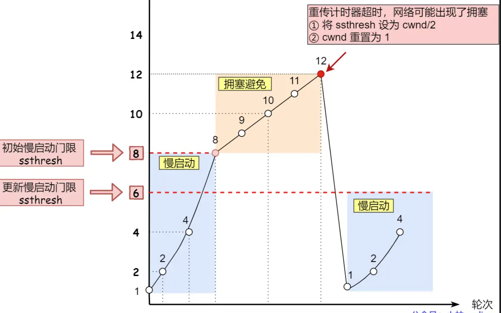

AIMD算法：乘法减小（慢开始和拥塞避免阶段，出现超时就把开始门限ssthresh的值减半），加法增大（执行拥塞避免算法后，使拥塞窗口缓慢增大 ）

**快恢复**（退半避让）： （与快重传同时使用，能收到3个重复ack说明网络还行）它允许发送方在接收到丢失数据包的部分确认（ACK包）后，把拥塞窗口cwnd设置为慢开始门限ssthresh减半后的值，然后执行拥塞避免算法（加法增大）

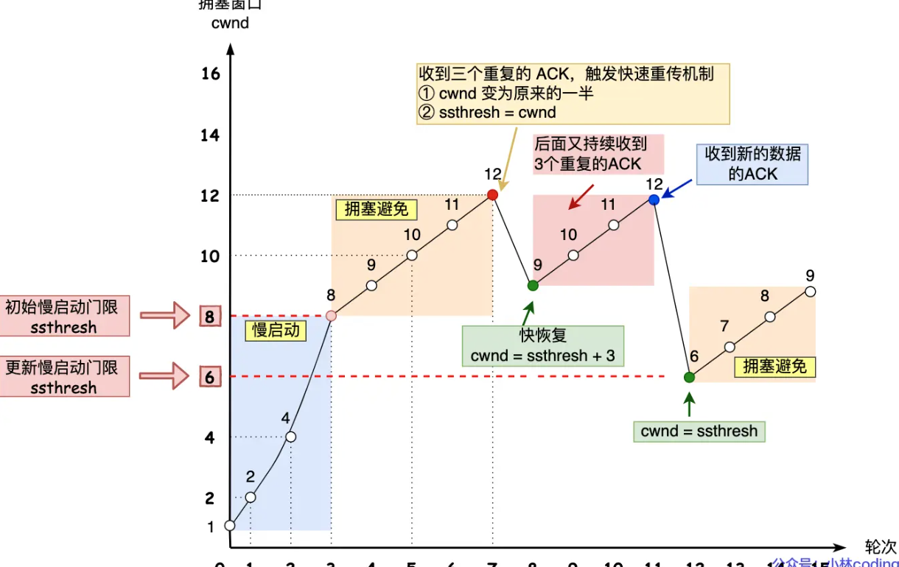

1. 在快恢复中，首先ssthresh = cwnd/2,cwnd = ssthresh+3，这是为了减少cwnd避免拥塞，
2. 随后继续重传丢失的数据包，如果再收到重复的ACK，cwnd+1，这是为了尽快将丢失的数据包发给目标
3. 知道收到新数据的ACK，把cwnd设置为第一步的ssthresh的值，恢复guo'c

当采用快恢复时，慢开始只在TCP连接建立和网络超时时才使用

### 如何连续发送大量数据-滑动窗口

传统TCP每发送一个数据进行一次确认应答，效率较低，往返时间长

概念：

- 发送方和接收方之间各自维持一个滑动窗口（大小不一定相同）控制发送和接收方的分组的数量和编号
- 它允许发送方发送多个分组而不需等待确认，TCP的滑动窗口是以字节为单位的
- 每收到一个确认，发送方就把发送窗口向前滑动。

**发送窗口之内：**

如果窗口大小为3，则连续发送3个TCP端

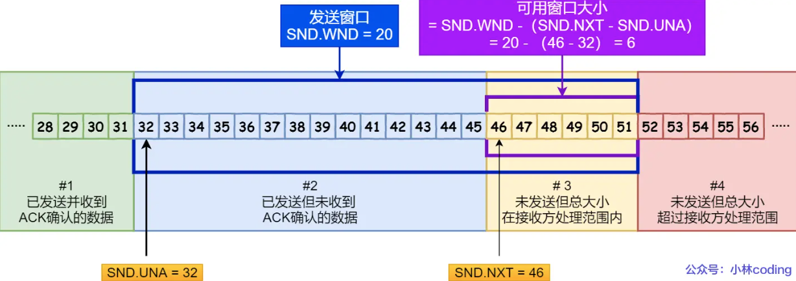

用两个指针SND.UNA、SND.NXT表示发送窗口的起始，和可用窗口的起始，通过SND.UNA+窗口大小得到#4的第一个字节

当发送窗口被#2部分占满时，则无法继续发送数据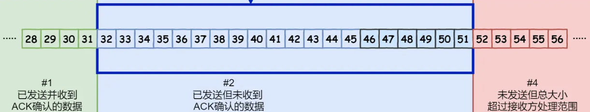

收到ack应答后就右移窗口

**接收窗口之内：**

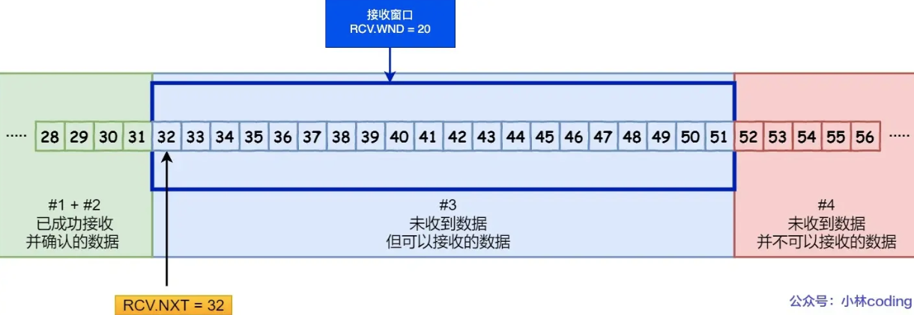

一个指针RCV.NXT表示接收窗口的起始

**@窗口大小由哪一方决定**

通常由接收方的窗口大小来决定，TCP里的window字段表示窗口大小，建立连接时，发送方根据这个接收端的处理能力来发送数据，通常小于等于接收方的窗口大小

### 流量控制

#### **窗口关闭**

发送方回根据接收方的能力动态控制发送的数据量，即流量控制

通常的消息发送，发送方的窗口会随接收方的窗口大小改变

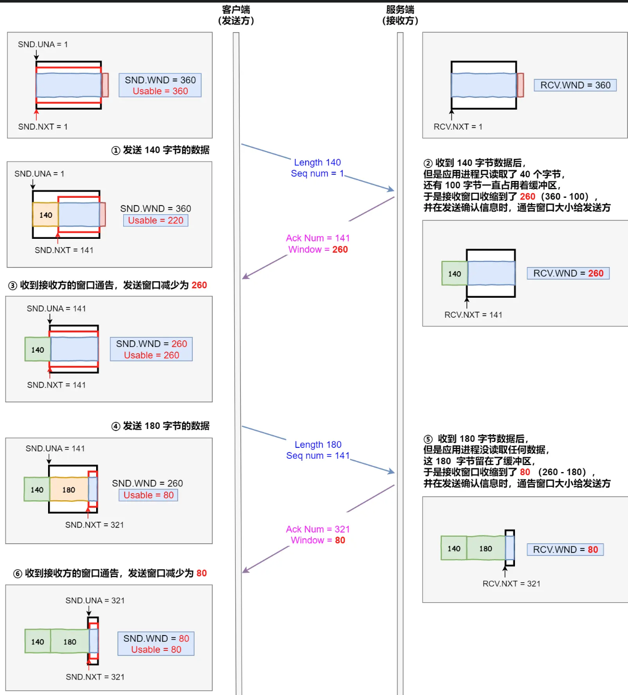

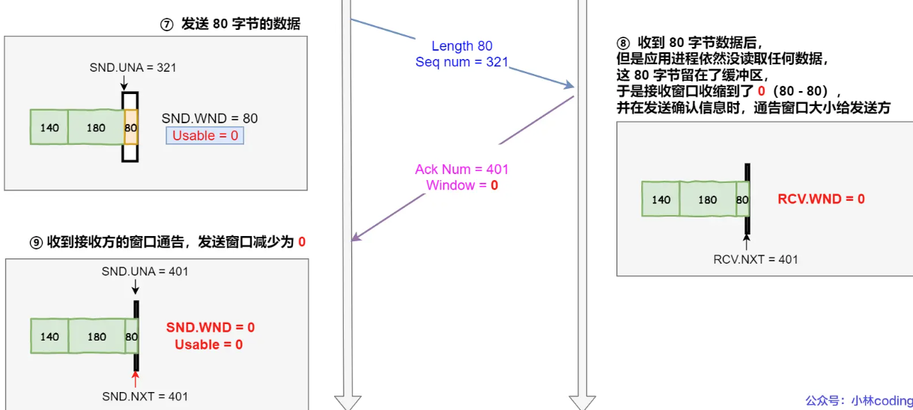

当窗口大小为0时回阻止数据发送，即窗口关闭

TCP发送方收到零窗口通知，就启动持续计时器，持续计时器超时，就会发送窗口探测报文，接收方收到时回返回现在的接收窗口大小

如果接收窗口认为0，则重新启动计时器，窗口探测的次数一般为3次，每次30-60s，超过3次可能会中断连接

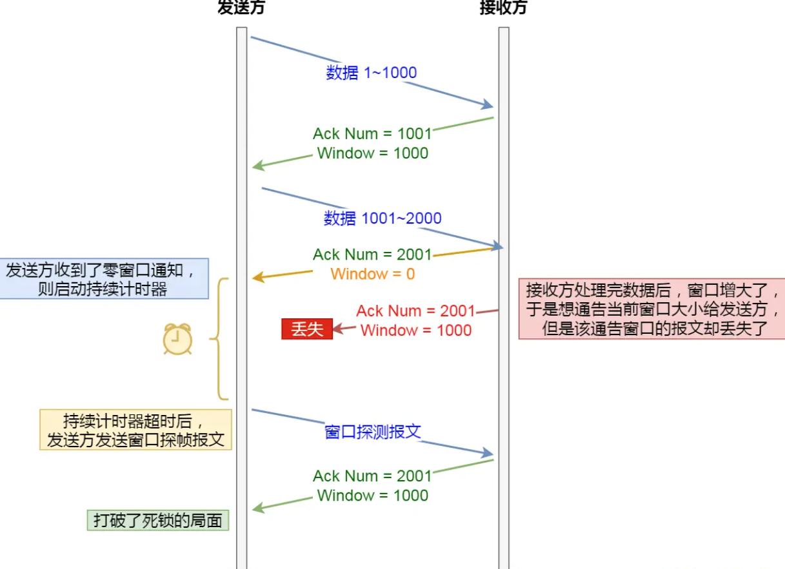

#### **操作系统缓冲区和滑动窗口**：

- TCP不允许操作系统即减少缓存又收缩窗口，而是先收缩窗口，过段时间再减少缓存

如果可以同时减少缓存和收缩窗口

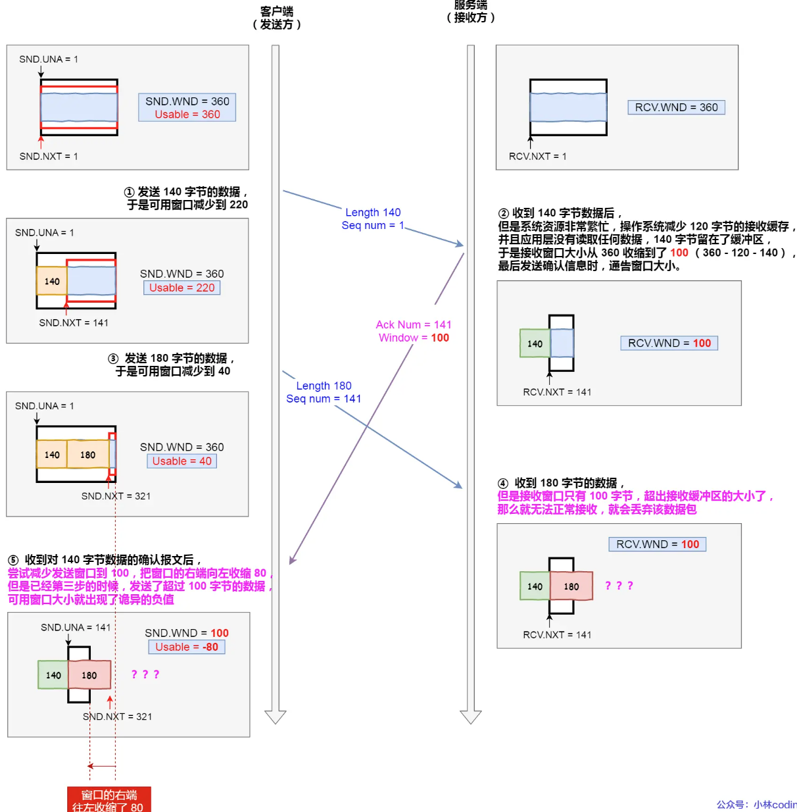

接收方缓存区因操作系统资源紧张而收缩，并且通知发送窗口收缩，而此时已经发送的数据到来时接收方缓冲区因收缩而装不下，无法接收丢弃改包，

发送方收到窗口收缩，这时已经发送的没有收到ack的数据超出了接收窗口的范围

先只收缩窗口不减少缓存，使得接收方在窗口缩小的消息发给对方之前，收到的消息可以在缓存区里接收，并返回给发送方ack

#### 糊涂窗口综合症

如果接收方窗口很小，每次只能腾出几个字节的窗口大小，这时发送方再来为几个字节发送一次太不经济了

解决方式：

对于接收方：当窗口大小<min（MSS, 缓存空间/2），向发送方通知窗口为0，即阻止请求发过来

对于发送方：Nagle算法，满足下面两个的条件的一个才能发送数据：

- 可用窗口大小>=MSS && 可发送的数据大小>=MSS, 
- 收到之前发送数据的ack包

必须要接收方满足【不通告小窗口给对方】和发送方满足【开启Nagle算法】才能避免糊涂窗口

nagle算法默认打开，对于一些需要小数据包交互的场景，如telnet、ssh等需要关闭这个算法

# HTTP

## 概念

是一种超文本协议传输：
协议：两个以上的参与者的一种行为约定和规范
传输：通过中转或接力在两点之间双向传输数据
超文本：包含文字、图片、视频、超链接（一个超文本跳到另一个超文本），例如HTML

## **特点**

**简单**：基本报文格式header+body，头部信息是key-value简单文本的形式，易于理解

**灵活和易于拓展**：HTTP协议里各类请求方法、URI/RUL、状态码、头字段等每个组成没有被固定死，可被开发人员自定义和扩充

HTTP工作在应用层，下层可以随意变化

HTTPS是在HTTP和TCP层加了SSL/TLS安全传输层，HTTP/1.1和HTTP/2.0传输协议使用的是TCP协议，HTTP/3.0使用的UDP协议

**应用广泛和跨平台**：是的

### HTTP常见的状态码

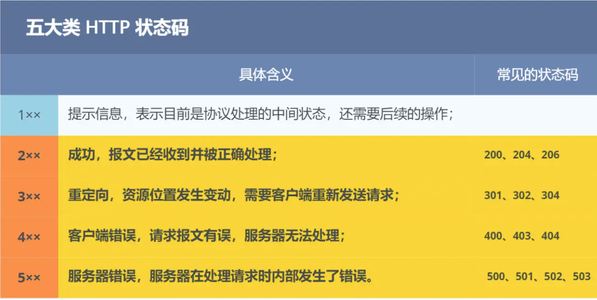

### HTTP常见字段

**Host字段**，表示请求指定的服务器的域名（例：Host: www.A.com)，使得可以将请求发往同一台服务器上的不同网站

**content-length字段**，表面本次回应的数据长度

HTTP协议通过设置回车符、换行符作为HTTP header的边界，通过Content-Length字段作为HTTP body的边界，从而解决沾包的问题

**connection字段**，如果开启，即客户端要求服务器使用HTTP长连接机制

**content-type字段**，用于服务器回应时标识本次数据的格式（例，content-type:test/html;charset=utf-8）

**content-encoding字段**，表示服务器使用的数据的压缩方法

### Keep-Alive

**长连接**：HTTP发送请求时，先创建一个TCP连接，把HTTP请求发送并接收，浏览器和服务器协商是否关闭TCP，不关闭虽然有一定损耗，但如果还有请求可以直接在这个TCP连接上发送，不需要再三次握手，长连接可以设置一定时间内没有请求自动关闭

**短连接**：请求结束后直接关闭TCP连接，下次请求需要重新创建TCP连接

通常默认打开，这给**HTTP流水线**技术提供了基础：客户端先一次性发送多个请求，而在发送过程中不需先等待服务器的回应，可以减少整体的响应时间

> TCP的keepalive是TCP的保活机制，如果TCP建立了连接，客户端一直不发消息，就会触发服务端发送探测报文，和Keep-Alive不是一个东西

## GET和POST

RFC规范中（请求评论，是一种文档规范，描述互联网的各自协议、标志等）

GET的语义是从服务器**获取指定的资源**，GET请求的参数位置是在URL中，URL只支持ASCII，所以GET请求的参数只能ASCII字符，且浏览器对URL的长度有限制，可以携带报文body

POST的语义是根据请求负荷（报文body）**对指定的资源做出处理**，POST请求携带数据的位置一般写在报文body中，可以是任意格式，且无大小限制

> 在文章的留言通常用POST请求发送
> 打开文章通常用GET请求

**@GET和POST方法是安全和幂等的吗**

**安全**是指请求方法不会破坏服务器上的资源
**幂等**指多次执行相同的操作，结果都是相同的

GET方法是安全且幂等的，所以GET请求的数据可以缓存到浏览器（书签）上，也可以缓存到代理上（nginx）

POST因为是新增或提交数据的操作，会修改服务器上的资源，所以是不安全的，也不幂等，无法缓存POST请求

实际开发，不一定按照这个RFC来

## HTTP缓存技术

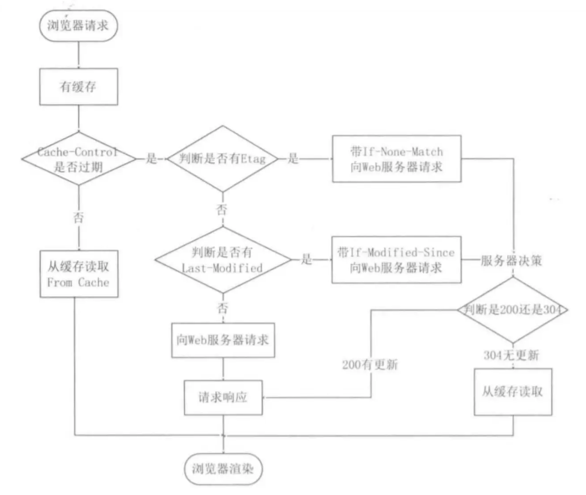

对于重复性的HTTP请求，可以把请求响应的数据缓存在本地，避免再发送HTTP请求

### 强制缓存

指只要浏览器判断缓存没有过期，则直接使用浏览器的本地缓存，由浏览器主导

利用下面两个HTTP响应头部字段实现的，用来表示资源在客户端缓存的有效期：

- Cache-Control，是一个相对时间
- Expires，是一个绝对时间

Cache-Control优先级高于Expires，实现流程如下

- 浏览器第一次请求访问服务器资源时，服务器在返回资源的同时，在response头部加上Cache-Control，Cache-Control中设置了过期时间大小
- 浏览器再次请求访问服务器中的该资源时，会先通过请求资源的时间和Cache-Control中设置的过期时间大小来计算出该资源是否过期，如果没有，则使用缓存
- 服务器再次收到请求后，会再次更新response头部的cache-control字段

### 协商缓存

第一次请求得到数据后，对于后面的客户端的请求，服务端告诉客户端是否可以继续使用缓存的方式即为协商缓存，回复请求码304表示浏览器可以使用本地缓存的资源

第一种实现：基于时间实现

响应头部中Last-Modified，标识这个响应资源的最后修改时间，
请求头部中的If-Modified-Since，标识当这个资源过期了，发现响应头中有Last-Modified声明，则再次发起请求的时候带上Last-Modified的时间，
服务端收到请求后发现有If-Modified-Since则和被请求资源的最后修改时间进行对比，如果最后修改时间较新，说明资源又被改过，返回新资源（HTTP 200 OK），否则说明资源无新修改，响应HTTP304走缓存

第二种实现：基于标识实现

响应头部中Etag：唯一标识响应资源
请求头部中的If-None-Match：当资源过期时，浏览器发现响应头里有Etag，则再次向服务器发起请求时，会将请求头If-None-Match值设置为Etag的值。服务器收到请求后进行对比，如果资源没有变化返回304，变化了返回200

两种实现，后者相对安全，前者可能出现时间篡改导致不可靠问题，当一次请求同时带有Etag和Last-Modified字段，那么客户端下一次请求时，Etag的优先级更高，如果Etag有变化就不用判断Last-Modified了，如果Etag没有变化，再看Last-Modified

**@为什么Etag优先级更高**

1. Last-Modified字段不可靠，最后修改时间可能改变
2. 有些文件是秒级以内修改的，If-Modified-Since能检查到的粒度是秒级的，Etag能保证这种需求下客户端在1s内能刷新多次
3. 有些服务器不能精确获取文件的最后修改时间

协商缓存只有在强制缓存未命中时才会触发带有协商缓存字段的请求

## HTTP/1.1特性

### 无状态

好处是服务器不需要额外的资源来记录状态信息从而减轻负担
缺点是在完成有关联性的操作时会更麻烦

> 例如登录->添加购物车->下单，这一系列操作都要知道用户的身份，但服务器不知道这些请求是有关联的，每次都要问一遍身份

一种解决方案是在请求和响应报文中加入Cookie信息来控制客户端的状态，即客户端第一次请求后，服务器下发一个cookie，客户端请求服务器时，填上cookie信息发送

### 不安全

明文传输数据，可阅读，易于调试，但也不安全，泄漏隐私

不验证通信方的身份，因此可能遭遇伪装，（访问假的淘宝网站）

无法证明报文的完整性，可能遭篡改（植入垃圾广告）

### 性能

采用了长连接和管道网络传输（默认不开启管道）

管道网络传输：即流水线传输，可以传输多个请求不必等回复，但服务端处理时必须按请求顺序串行处理，存在一个请求处理很久阻塞整个队列的问题。（解决了请求队列的队头阻塞，没有解决响应队列的队头阻塞）

整体性能一般

## HTTPS

明文传输的HTTP存在安全风险（窃听、篡改信息、冒充），HTTPS在HTTP和TCP层之间加入了SSL/TLS协议解决这个问题，分别用信息加密、校验机制、身份证书来抵御这三种风险

### 混合加密

在通信建立前采用**非对称加密**的方式交换会话密钥，在通信过程中使用**对称加密**的会话密钥加密明文数据

---

**@为什么采用混合加密**

对称加密只使用一个密钥，运算速度快，密钥必须保密，因此无法做到安全的密钥交换

**非对称加密**使用两个密钥，公钥和私钥，公钥任意分发而私钥保密，解决了密钥交换问题，但速度慢

---

### 摘要算法+数字签名

为了确保传输的内容不被篡改，对内容计算出一个指纹，同内容一起传输给对方，接收方收到内容后也计算出指纹，和发来的指纹对比相同

摘要算法（哈希函数）计算出内容的哈希值，这个哈希值是唯一的，且无法通过哈希值推导出内容

**非对称加密：**

公钥和私钥可以双向加解密，不是对内容进行加密，而是对内容的哈希值加密

公钥加密，私钥解密：可以保证内容传输的安全，只有持有私钥的人才能解读实际的内容

私钥加密，公钥解密：可以保证消息不会被冒充，公钥能解析出数据，则证明这个消息的来源是正确的

但这个过程比较耗时，因此只用于连接的建立，私钥由服务端保管，服务端会向客户端颁发公钥

**数字证书**

可以通过哈希算法来保证消息的完整性，通过数字签名来保证消息来源可靠性，但这还缺少身份验证的环节（伪造一对公私钥）

CA（数字证书认证机构）

- 将服务器公钥放在数字证书中（数字证书认证机构颁发），
- 客户端拿到服务器的数字证书后，使用CA的公钥确认服务器数字证书的真实性，（CA的公钥已事先置入了浏览器或操作系统里）
- 从数字证书获取服务器公钥后，使用它对报文加密后发送，
- 服务器用私钥对报文解密

### HTTPS如何建立连接

SSL/TLS协议基本流程：

- 客户端向服务器索要并验证服务器的公钥
- 双方协商生产会话密钥
- 双方采用会话密钥进行加密通信

前两步的握手涉及四次通信，使用不同的密钥交换算法

**TLS握手过程**

1. clienthello

   客户端向服务器发送：

   - 客户端支持的TSL协议版本、

   - 生产的随机数（用于生成会话密钥）

   - 客户端支持的密码套件列表、如RSA加密算法

2. serverhello

   服务器收到请求后，发出响应：

   - 确认TLS协议版本，不支持则关闭通信

   - 生产随机数（用于生成会话密钥）

   - 确认的密码套件列表，如RSA加密算法

   - 服务器的数字证书

3. 客户端回应

   通过浏览器或os中的CA公钥确认数字证书的真实性

   客户端从数字证书中取出服务器的公钥，使用其加密报文，向服务器发送如下信息：

   - 随机数（被服务器公钥加密）

   - 加密通信算法改变通知，表示随后的信息将用会话密钥加密通信

   - 客户端握手结束通知，表示客户端的握手阶段已经结束，这一项同时把之前所有内容发生的数据做个摘要，用来供服务端校验

   > 此时生成了三个随机数，之后的通信将依赖这三个随机数

4. 服务器最后的回应

   通过协商的加密算法，计算出本次通信的会话密钥，向客户端回应：

   - 加密通信算法改变通知，表示随后的信息都将用会话密钥加密通信

   - 服务器握手结束通知，这一项同时把之前所有内容发生的数据做个摘要，用来供服务端校验

**签发证书：**

CA把持有者的公钥、用途、颁发者、有效时间等信息打包，作hash计算得到一个hash值
CA会使用自己的私钥将该hash值加密，生成证书签名
最后添加证书签名，形成数字证书

**客户端校验服务端数字证书**

客户端使用同样的hash算法获取该证书的hash值H1
浏览器和os集成CA的公钥信息，浏览器收到证书后使用CA的公钥解密证书签名，得到hash值h2
比较H1和H2，值相同，则为可信赖的证书，否则不可信

**证书信任链**

