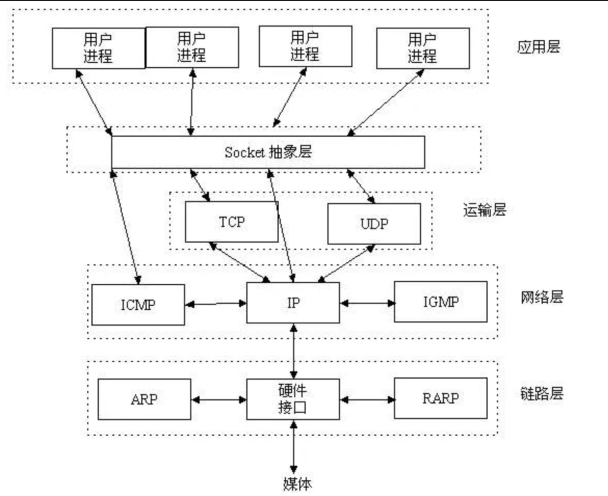
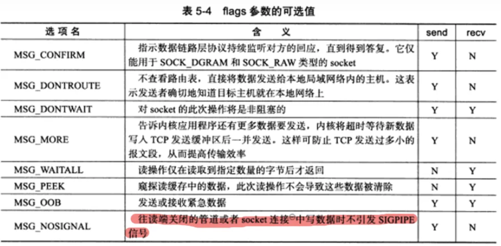
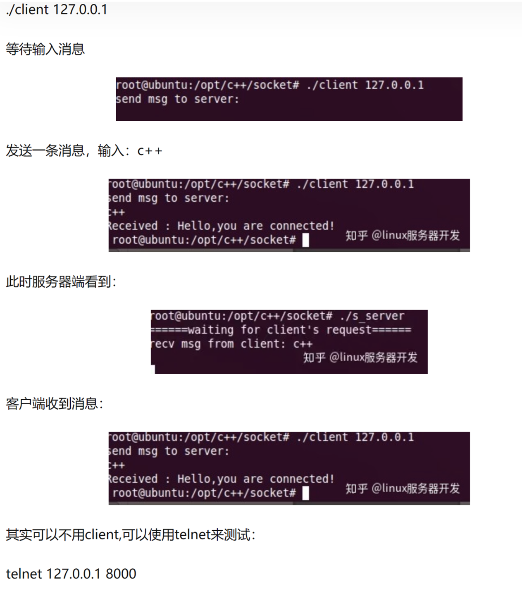

==fsdf==

# 网络中的进程通信

操作系统为本地进程通信提供了相应设施

UNIX BSD有：管道（pipe）、命名管道（named pipe）软中断信号（signal）

UNIX system V有：消息（message）、共享存储区（shared memory）和信号量（semaphore)等.

首先要解决的是网间进程标识问题。同一主机上，不同进程可用进程号（process ID）唯一标识，TCP/IP协议族已经帮我们解决了这个问题，网络层的“**ip地址**”可以唯一标识网络中的主机，而传输层的“**协议+端口**”可以唯一标识主机中的应用程序（进程）。这样利用三元组（ip地址，协议，端口）就可以标识网络的进程了。

**TCP/IP**（Transmission Control Protocol/Internet Protocol）即传输控制协议/网间协议，TCP/IP协议存在于OS中，网络服务通过OS提供，在OS中增加支持TCP/IP的系统调用——Berkeley套接字，如Socket，Connect，Send，Recv等

UDP（User Data Protocol，用户数据报协议）是与TCP相对应的协议。它是属于TCP/IP协议族中的一种

TCP/IP协议族包括运输层、网络层、链路层，而socket所在位置如图，Socket是应用层与TCP/IP协议族通信的中间软件抽象层。



## socket

Socket是应用层与TCP/IP协议族通信的中间软件抽象层，**它是一组接口**。在设计模式中属于门面模式，，它把复杂的TCP/IP协议族隐藏在Socket接口后面，对用户来说，一组简单的接口就是全部，让Socket去组织数据，以符合指定的协议。


服务器端先初始化Socket，然后与端口绑定(bind)，对端口进行监听(listen)，调用accept阻塞，等待客户端连接。在这时如果有个客户端初始化一个Socket，然后连接服务器(connect)，如果连接成功，这时客户端与服务器端的连接就建立了。客户端发送数据请求，服务器端接收请求并处理请求，然后把回应数据发送给客户端，客户端读取数据，最后关闭连接，一次交互结束。

## 套接字

是一个整数，0、1、2对应的FILE *结构的表示就是stdin、stdout、stderr，即标准输入、标准输出、标准错误输出

当应用程序要为因特网通信而创建一个套接字（socket）时，操作系统就返回一个小整数作为描述符（descriptor）来标识这个套接字

linux下socket为文件，申请一个套接字就是打开socket文件，文件描述表中这个文件的文件描述符对应一个套接字

4元组来表示（clientip:clientport， serverip:serverport）

clientip 是客户端的IP地址，clientport 是客户端的端口，serverip 是服务器的IP地址，而 serverport 是服务器的端口。

套接字的内部数据结构包含很多字段，但是系统创建套接字后，大多数字字段没有填写。应用程序创建套接字后在该套接字可以使用之前，必须调用其他的过程来填充这些字段。

**监听套接字**: 监听套接字正如accept函数的参数sockfd，由listen函数将一个主动套接字转化为监听套接字。一个服务器通常只创建一个监听socket描述子，它在该服务器的生命周期内一直存在。

**连接套接字**：而accept函数等待客户端的连接请求到达监听套接字listenfd，accept函数返回的是连接socket描述字(一个连接套接字)，它代表着一个网络已经存在的点点连接。已连接套接字是客户端与服务器之间已经建立起来了的连接的一个端点，服务器每次接受连接请求时都会创建一次已连接套接字，它只存在于服务器为一个客户端服务的过程中。

连接套接字socketfd_new依然使用的是与监听套接字socketfd_new一个类型的端口号，均只存在于服务器端

## socket接口函数

### socket

```
#include<sys/socket.h>
int  socket(int protofamily, int type, int protocol);//返回sockfd描述符
```

对应普通文件的打开操作，他创建一个socket描述符，唯一标识一个socket，作为参数可以进行一些读写操作

- `protofamily`：即协议域，又称为协议族（family）。 常用的协议族有，AF_INET(IPV4)、AF_INET6(IPV6)、AF_LOCAL（或称AF_UNIX，Unix域socket）、AF_ROUTE等等。 协议族决定了socket的地址类型，在通信中必须采用对应的地址，如AF_INET决定了要用ipv4地址（32位的）与端口号（16位的）的组合、AF_UNIX决定了要用一个绝对路径名作为地址。
- `type`：指定socket类型。 常用的socket类型有，SOCK_STREAM、SOCK_DGRAM、SOCK_RAW、SOCK_PACKET、SOCK_SEQPACKET等等。
- `protocol`：指定协议。 常用的协议有，IPPROTO_TCP、IPPTOTO_UDP、IPPROTO_SCTP、IPPROTO_TIPC等，分别对应TCP传输协议、UDP传输协议、STCP传输协议、TIPC传输协议

并不是type和protocol可以随意组合的，protocol为0时会自动选择type对应的默认协议

**socket缓冲区**

- 每个 socket 被创建后，都会分配两个缓冲区，输入缓冲区和输出缓冲区
- I/O缓冲区在每个TCP套接字中单独存在；
- 即使关闭套接字也会继续传送输出缓冲区中遗留的数据；
- 关闭套接字将丢失输入缓冲区中的数据。
- 通过 getsockopt() 函数获取缓冲区的默认大小，一般都是 8K

```cpp
unsigned optVal;
int optLen = sizeof(int);
getsockopt(servSock, SOL_SOCKET, SO_SNDBUF, (char*)&optVal, &optLen);
printf("Buffer length: %d\\n", optVal);
```

### bind

调用**socket**创建一个socket时，返回的socket描述字它存在于协议族（address family，AF_XXX）空间中，但没有一个具体的地址。如果想把一个地址族中的特定地址赋给socket，就必须调用bind()函数，否则就当调用connect()、listen()时系统会自动随机分配一个端口。

```
int bind(int sockfd, const struct sockaddr *addr, socklen_t addrlen);
```

- `sockfd`：即socket描述字
- `addr`：指向要绑定给sockfd的协议地址。这个地址结构根据地址创建socket时的地址协议族的不同而不同
- `addrlen`：对应的是地址的长度，即sizeof（addr）

```cpp
struct sockaddr_in{
	sa_family_t sin_family; //地址族，和socket函数传入的协议族是一样的
	uint16_t sin_port;      //16位TCP/UDP端口号
	struct in_addr sin_addr; //32位IP地址
	char sin_zero[8];        //不使用
}
struct in_addr{
	In_addr_t s_addr;//32位IPv4地址
}
```

通常服务器在启动的时候会绑定一个地址，用于提供服务，客户端就可以通过他来连接服务器，而客户端就不用指定，系统自动分配端口号和ip地址的组合（connect时系统随机生成一个）

> 在将一个地址绑定到socket的时候，请先将主机字节序转换成为网络字节序，而不要假定主机字节序跟网络字节序一样使用的是Big-Endian **主机字节序**就是我们平常说的大端和小端模式：
>
> a) Little-Endian就是低位字节排放在内存的低地址端，高位字节排放在内存的高地址端。
>
> b) Big-Endian就是高位字节排放在内存的低地址端，低位字节排放在内存的高地址端。 **网络字节序：** 4个字节的32 bit值以下面的次序传输：首先是0～7bit，其次8～15bit，然后16～23bit，最后是24~31bit。这种传输次序称作大端字节序。**由于TCP/IP首部中所有的二进制整数在网络中传输时都要求以这种次序，因此它又称作网络字节序。**

\#inclde<arpa/inet.h>

```
uint32_t htonl(uint32_t hostlong)
```

将一个32位数从**主机字节顺序**转换成**网络字节顺序**。

```
uint16_t htons(uint16_t hostlong)
```

将一个16位数从**主机字节顺序**转换成**网络字节顺序**

```
uint16_t ntohs(uint16_t hostlong)
```

将一个16位数由**网络字节顺序**转换为**主机字节顺序**

```
uint32_t ntohs(uint32_t hostlong)
```

uint32_t ntohs(uint32_t hostlong)

例子：

```cpp
memset(&servaddr, 0, sizeof(servaddr));
servaddr.sin_family = AF_INET;
servaddr.sin_addr.s_addr = htonl(INADDR_ANY);//让系统自动获取本机的IP地址。
servaddr.sin_port = htons(8000);//设置端口号

//将本地地址绑定到所创建的套接字上
if( bind(socket_fd, (struct sockaddr*)&servaddr, sizeof(servaddr)) == -1){
    printf("bind socket error: %s(errno: %d)\\n",strerror(errno),errno);
    exit(0);
}
```

其中一些宏：

**INADDR_ANY**

转换过来就是0.0.0.0，表示本机的所有IP，多网卡的情况下，这个就表示所有网卡ip地址的意思。

比如一台电脑有3块网卡，对应3个ip地址了。如果绑定某个具体的ip地址，你只能监听你所设置的ip地址所在的网卡的端口，其它两块网卡无法监听端口，如果我需要三个网卡都监听，那就需要绑定3个ip，

为此出现INADDR_ANY，你只需绑定INADDR_ANY，管理一个套接字就行，不管数据是从哪个网卡过来的，只要是绑定的端口号过来的数据，都可以接收到。

### listen

```
int listen(int sockfd, int backlog);
```

`sockfd`:socket描述字

`backlog`:可以排队的最大连接个数

将套接字( sockfd )变成被动的连接监听套接字（被动等待客户端的连接），相当于开启一个被动等待的状态

并不阻塞，只是将该套接字和套接字对应的连接队列长度告诉 Linux 内核，

这里的**backlog参数**：

内核为任何一个给定的监听套接口维护两个队列：

1、未完成连接队列（incomplete connection queue），已由某个客户发出并到达服务器，正在等待完成相应的 TCP 三次握手（ SYN_RCVD 状态）

2、已完成连接队列（completed connection queue），已完成 TCP 三次握手过程的（ESTABLISHED 状态）

### connect

```
int connect(int sockfd, const struct sockaddr *addr, socklen_t addrlen);
```

客户端调用connect向服务端发出连接请求

`sockfd`:socket描述字

`addr` :服务器地址

`addrlen`：为socket地址的长度

返回一个连接的socket描述字

这个过程由内核自动完成三次握手，默认一直阻塞直到连接上

这个过程也会被select函数接收为读操作

**底层实现：**从established状态的连接队列头部取出一个已经完成的连接，如果没有则一直阻塞。同样，如果队列满了客户端继续发出连接请求，并不会拒绝，只会延迟

**connetc之前的数据转换：**

```
int inet_aton(const char *cp, struct in_addr *inp);
```

转换网络主机地址ip(如192.168.1.10)为二进制数值，储存在结构体inp中

返回0表示成功，否则表示主机地址无效

（转换完，还需要调用函数将主机字节顺序转为网络字节顺序）

**`in_addr_t inet_addr(const char \*cp);`**

转换网络主机地址ip(如192.168.1.10)为二进制数值

如果参数无效返回-1，255.255.255.255也会返回-1

**`char \*inet_ntoa(struct in_addr in);`**

转换网络字节排序的地址为标准的ASCII以点分开的地址,该函数返回指向点分开的字符串地址（如192.168.1.10)的指针

\#include <arpe/inet.h>

```
int inet_pton(int family, const char *strptr, void *addrptr);
```

将点分十进制的ip地址转化为用于网络传输的数值格式

返回值：若成功则为1，若输入不是有效的表达式则为0，若出错则为-1

```
const char * inet_ntop(int family, const void *addrptr, char *strptr, size_t len);
```

将数值格式转化为点分十进制的ip地址格式

返回值：若成功则为指向结构的指针，若出错则为NULL

### accept

服务器用于监听指定的socket地址，TCP服务器监听到客户端的一个请求就会调用accept函数接收请求。

```
int accept(int sockfd, struct sockaddr *addr, socklen_t *addrlen); //返回连接connect_fd
```

`sockfd`：socket描述字

`addr` ：结果参数，用于接收一个返回值，返回客户端的地址，可为NULL

`addrlen` ：结果参数，用于接收上诉addr的结构的大小

成功返回表示连接建立，返回与客户通信的套接字

注意：accept默认会阻塞进程，直到有个客户建立连接后返回一个新可用的连接套接字

**服务器与客户端通信建立的流程**：服务器调用`accept`，等待连接请求到达监听套接字`sockfd`（假设为3，会一直在服务器生命周期内存在），客户端调用`connect`函数，发送请求到监听套接字`sockfd`，服务器的`accept`内打开一个新的已连接套接字（假设为4，只服务这次连接），在客户端和服务器间建立了连接，`accept`返回给服务器，`connect`返回给客户端，此时客户端和服务器端就可以通过套接字传送数据了

### read、write等操作函数

建立号连接关系就可以调用网络I/O进行读写操作

- read/write

```
#include <unistd.h>
ssize_t read(int fd, void *buf, size_t count);
ssize_t write(int fd, const void *buf, size_t count);
```

write成功返回，**只是buf中的数据被复制到了kernel中的TCP发送缓冲区。**至于数据什么时候被发往网络以及后面的内容，无法保证

只有每个socket的发送缓冲区满时会阻塞（）每个socket有自己的发送接收缓冲区

- send/recv

```
#include <sys/types.h>
ssize_t send(int sockfd, const void *buf, size_t len, int flags);
ssize_t recv(int sockfd, void *buf, size_t len, int flags);
```

TCP数据读写部分常用，失败返回-1，设置errno



- sendro/recvfrom

```
ssize_t sendto(int sockfd, const void *buf, size_t len, int flags, const struct sockaddr *dest_addr, socklen_t addrlen);
ssize_t recvfrom(int sockfd, void *buf, size_t len, int flags,struct sockaddr *src_addr, socklen_t *addrlen);
```

UDP常用的读写，`UDP`通信没有连接的概念，所以我们读取数据都需要获取发送端的`socket`地址，这里的`flags`参数和上面的表格相同，失败返回-1

讲最后两个参数设置NULL也可以用于面向连接的socket数据读写

- sendmsg/recvmsg

```
ssize_t sendmsg(int sockfd, const struct msghdr *msg, int flags);
ssize_t recvmsg(int sockfd, struct msghdr *msg, int flags);
```

通用数据读写

```c
struct msghdr {
		void* msg_name;// socket地址，面向连接的socket这里必须为NULL
    socklen_t msg_namelen;// socket地址的长度
		struct iovec* msg_iov;// 分散的内存块
		int msg_iovlen;// 分散内存块的数量
		void* msg_control;// 指向辅助数据的起始位置
    socklen_t msg_controllen;// 辅助数据的大小
		int msg_flags;// 复制函数中的flags参数，并且在调用过程当中更新
};
struct iovec {
    void *iov_base; // 内存起始地址
    size_t iov_len; // 这块内存的长度
}
```

**TCP阻塞模式:**

对于TCP套接字（默认情况下），当使用 write()/send() 发送数据时：

1. 检查缓冲区大小，不够时阻塞，直到有空间才唤醒
2. TCP协议在向网络发送数据时不能写入，发完后唤醒write/send函数
3. 如果要写入的数据大于缓冲区的最大长度，那么将分批写入。
4. 所有数据都写入缓冲区才返回

当使用 read()/recv() 读取数据时：

1. 检查缓冲区，有数据则读，否则阻塞
2. 要读的数据长度小于缓冲区长度，则剩余数据会不断积压直到再次读
3. 读到数据后才返回，否则阻塞

### close函数

```
#include <unistd.h>
int close(int fd);
```

close操作只是使相应socket描述字的引用计数-1，只有当引用计数为0的时候，才会触发TCP客户端向服务器发送终止连接请求。

```
int inet_pton(int af, const char *src, void *dst);//转换字符串到网络地址:
```

inet_pton 是Linux下IP地址转换函数，可以在将IP地址在“点分十进制”和“整数”之间转换 ，是inet_addr的扩展。

第一个参数af是地址族，转换后存在dst中

af = AF_INET:src为指向字符型的地址，即ASCII的地址的首地址（ddd.ddd.ddd.ddd格式的），函数将该地址转换为in_addr的结构体，并复制在*dst中

af =AF_INET6:src为指向IPV6的地址，函数将该地址转换为in6_addr的结构体，并复制在*dst中

如果函数出错将返回一个负值，并将errno设置为EAFNOSUPPORT，如果参数af指定的地址族和src格式不对，函数将返回0。

## socket编程实例

服务器端：一直监听本机的8000号端口，如果收到连接请求，将接收请求并接收客户端发来的消息，并向客户端返回消息

服务端

```cpp
/* File Name: server.c */
#include<stdio.h>
#include<stdlib.h>
#include<string.h>
#include<errno.h>
#include<sys/types.h>
#include<sys/socket.h>
#include<netinet/in.h>
#define DEFAULT_PORT 8000
#define MAXLINE 4096
int main(int argc, char** argv)
{
 int    socket_fd, connect_fd;
 struct sockaddr_in servaddr;
 char    buff[4096];
 int     n;
 //初始化Socket
 if( (socket_fd = socket(AF_INET, SOCK_STREAM, 0)) == -1 ){
	 printf("create socket error: %s(errno: %d)\\n",strerror(errno),errno);
	 exit(0);
  }
 //初始化
 memset(&servaddr, 0, sizeof(servaddr));
  servaddr.sin_family = AF_INET;
  servaddr.sin_addr.s_addr = htonl(INADDR_ANY);//IP地址设置成INADDR_ANY,让系统自动获取本机的IP地址。
  servaddr.sin_port = htons(DEFAULT_PORT);//设置的端口为DEFAULT_PORT
 
 //将本地地址绑定到所创建的套接字上
 if( bind(socket_fd, (struct sockaddr*)&servaddr, sizeof(servaddr)) == -1){
	 printf("bind socket error: %s(errno: %d)\\n",strerror(errno),errno);
	 exit(0);
  }
 //开始监听是否有客户端连接
 if( listen(socket_fd, 10) == -1){
	 printf("listen socket error: %s(errno: %d)\\n",strerror(errno),errno);
	 exit(0);
  }
 printf("======waiting for client's request======\\n");
 while(1){
		//阻塞直到有客户端连接，不然多浪费CPU资源。
	  if( (connect_fd = accept(socket_fd, (struct sockaddr*)NULL, NULL)) == -1){
			printf("accept socket error: %s(errno: %d)",strerror(errno),errno);
			continue;
	  }
		//接受客户端传过来的数据
    n = recv(connect_fd, buff, MAXLINE, 0);
		//向客户端发送回应数据
	  if(!fork()){ /*紫禁城*/
		if(send(connect_fd, "Hello,you are connected!\\n", 26,0) == -1){
        perror("send error");
        close(connect_fd);
				exit(0);
	   }
	   buff[n] = '\\0';
		 printf("recv msg from client: %s\\n", buff);
	   close(connect_fd);
	  }
	  close(socket_fd);
	}
}
```

客户端

```cpp
/* File Name: client.c */
#include<stdio.h>
#include<stdlib.h>
#include<string.h>
#include<errno.h>
#include<sys/types.h>
#include<sys/socket.h>
#include<netinet/in.h>
 
#define MAXLINE 4096
 
int main(int argc, char** argv)
{
 int    sockfd, n,rec_len;
 char    recvline[4096], sendline[4096];
 char    buf[MAXLINE];
 struct sockaddr_in servaddr;
 
 if( argc != 2){
	 printf("usage: ./client <ipaddress>\\n");
	 exit(0);
} 
 
 if( (sockfd = socket(AF_INET, SOCK_STREAM, 0)) < 0){
	 printf("create socket error: %s(errno: %d)\\n", strerror(errno),errno);
	 exit(0);
 }
 
 memset(&servaddr, 0, sizeof(servaddr));
 servaddr.sin_family = AF_INET;
 servaddr.sin_port = htons(8000);
 if( inet_pton(AF_INET, argv[1], &servaddr.sin_addr) <= 0){
	 printf("inet_pton error for %s\\n",argv[1]);
	 exit(0);
  }
 
 
 if( connect(sockfd, (struct sockaddr*)&servaddr, sizeof(servaddr)) < 0){
	 printf("connect error: %s(errno: %d)\\n",strerror(errno),errno);
		exit(0);
  }
 
 printf("send msg to server: \\n");
 fgets(sendline, 4096, stdin);
 if( send(sockfd, sendline, strlen(sendline), 0) < 0){
	 printf("send msg error: %s(errno: %d)\\n", strerror(errno), errno);
	 exit(0);
  }
 if((rec_len = recv(sockfd, buf, MAXLINE,0)) == -1) {
   perror("recv error");
	 exit(1);
  }
 buf[rec_len]  = '\\0';
 printf("Received : %s ",buf);
 close(sockfd);
 exit(0);
}
```

客户端去连接server

./client 127.0.0.1



# 传输层

传输层的数据叫作段(segment)，网络层的数据叫作包(packet)，数据链路层的数据叫作帧(frame)，物理层的数据叫作流(stream)

## **1、UDP协议**

**无连接**：当udp客户端想要给udp服务端发送数据的时候，只要知道ip地址+端口即可发送，不确认服务端此时是否有条件有能力接收数据。

**不可靠**：不保证udp数据一定到达对端机器

**面向数据报**：udp数据的接收与发送均为整条发送不可分割，并且从应用层传递数据给传输层时，若传输层的数据还未及时传递给网络层，则应用层数据需要等待传输层将数据传递给网络层后才可以将应用层数据传递给网络层。


## **2、TCP协议**


**有连接**：发送数据之前，需要进行连接。

**可靠传输**：保证数据时有序且可靠的到达对端机器。

**面向字节流**：与面向数据报相反，数据可以在传递的过程中进行分割传递。

**回环地址**：所有127.开头的都是回环地址

**0.0.0.0**指代本机的所有IP地址，即回环地址和所有网卡

**loopback地址，**每一台路由器创建一个loopback 接口，并在该接口上单独指定一个IP 地址作为管理地址，管理员会使用该地址对路由器远程登录（telnet ），该地址实际上起到了类似设备名称一类的功能。

### TCP的建立（三次握手）

第一次握手：建立连接时，客户端发送syn包(syn=j)到服务器，并进入SYN_SEND状态，等待服务器确认；SYN：同步序列编号(Synchronize Sequence Numbers)。

第二次握手：服务器收到syn包，必须确认客户的SYN（ack=j+1），同时自己也发送一个SYN包（syn=k），即SYN+ACK包，此时服务器进入SYN_RECV状态； 第三次握手：客户端收到服务器的SYN+ACK包，向服务器发送确认包ACK(ack=k+1)，此包发送完毕，客户端和服务器进入ESTABLISHED状态，完成三次握手。 一个完整的三次握手也就是： 请求---应答---再次确认。


### TCP连接的终止（四次握手释放）


### 底层实现

最大报文段长度MSS，指的是在一个 TCP 报文段中能够携带的最大有效载荷，也就是 TCP 协议在传输数据时，每个报文段中可以携带的最大数据量。MSS 的值一般由网络的最大传输单元 MTU 减去 TCP 和 IP 协议头的长度得出。

**如何确保可靠的网络传输**

ARQ协议(Automatic Repeat-reQuest)，即自动重传请求，是传输层的错误纠正协议之一，它通过使用累计确认和超时两个机制，在不可靠的网络上实现可靠的信息传输。

链路层和传输层都用了ARQ

ARQ协议有两种模式：

1. 停等ARQ协议

   基于超时重传保证可靠

   ①A为每个即将发送的数据编号，用于标识数据和给数据排序

   ②A发送数据，并设置一个超时计时器

   ③B收到数据，返回一个带编号的确认

   ③B收到错误的数据或没有收到数据

   ④A收到确认，删除副本且取消超时计时器

   ④A在超时计时器的时间内容没有收到确认，重发数据

   信道利用率低

2. 连续ARQ协议

   不用等待确认而是连续发送多组

   仅仅响应编号最大的这个数据段，表示之前的数据收到了，即UNA模式（累计确认），

   容易实现，但失效率

   流水线的通常要求：

   - 序号范围要增加，可能存在多个在输送中未确认的报文
   - 发送方和接收方能缓存多个分组的报文

   解决流水线传输的差错有两种窗口协议：回退和选择重传

**如何在有限的带宽里发送大量数据**

窗口协议，即做流量控制

1. 拥塞窗口cwnd

   慢开始门限ssthresh是一个阈值，接收窗口值RWND，发送窗口值CWND

   **慢启动：**是在刚开始发送数据时让窗口缓慢扩张（将初始的cwnd置1个MSS，然后以2倍的速度指数增长，到ssthresh时执行拥塞避免，即+1线性增长）

   **退半避让(拥塞避免)：**在网络阻塞时窗口大小减半同时让ssthresh置为减半的窗口，但不能小于2）

   AIMD算法：乘法减小（慢开始和拥塞避免阶段，出现超时就把开始门限ssthresh的值减半），加法增大（执行拥塞避免算法后，使拥塞窗口缓慢增大 ）

   **快重传：**收到失序报文时立即发出重复确认（不需要等到之间发送数据时才捎带确认），发送发只要一连收到三个重复确认就应当立即重传（不必继续等待为其设置的重传计时器到期）

   

   **快恢复**： 它允许发送方在接收到丢失数据包的部分确认（ACK包）后，把拥塞窗口cwnd设置为慢开始门限ssthresh减半后的值，然后执行拥塞避免算法（加法增大）

   

   之所以要减半，为了迅速减少主机发送到网络中的分组数，使得路由器有足够的时间把队列中积压的分组处理完。

   当采用快恢复时，慢开始只在TCP连接建立和网络超时时才使用

2. 滑动窗口

   通常与连续ARQ协议配合使用，接收方告知发送方自己可以接收的缓冲区大小

   概念：

   - 发送方和接收方之间各自维持一个滑动窗口（大小不一定相同）
   - 控制发送和接收的分组的数量和编号
   - 它允许发送方发送多个分组而不需等待确认，TCP的滑动窗口是以字节为单位的
   - 每收到一个确认，发送方就把发送窗口向前滑动。

   发送窗口之内：

   - 已发送但未收到确认的数据
   - 允许发送但尚未发送的数据

   接收窗口之内：

   - 未按序收到的数据
   - 允许接收的数据

   两种方式解决包丢失：

   **回退N帧：**即收到一个包丢失的消息后，重传这个包以后的所有包

   **选择重传：**

   linux需要双方打开SACK选项

   发送方维持一个窗口包含未被确认的序号、可发送的序号

   接收方维持一个窗口包含可接收的序号

   每到达一个帧检测他的序号是否落在窗口内，如果落在窗口内且没有接收过，则接收并返回确认，等前面的帧都到达则交付给上层

   发送端每个发送缓存都有一个超时计时器

   问题：

   

   如上情况收到0号数据时不能确认是前一组还是后一组的0（前一组发送方没有收到ACK而重发）

   解决：

   对于帧序号n，将发送窗口大小=接收窗口大小=2^（n-）

   即，对于帧序号7，发送窗口大小=4=接收窗口大小

   > TCP协议中的16位窗口大小就是为窗口协议提供支持的。

   > UDP协议的目标是尽最大努力交付，不管你收到没有，所以没有该字段

   > UDP协议每次传输的最大数据量并不是2^16 - 1 - 8 - 20（8表示UDP头长，20表示IP头长），而是与MTU有关，即数据链路层的最大传输单元(Maximum Transmission Unit)，值是1500。

   ARQ模型响应有两种，UNA（此编号前所有包已收到，如TCP）和ACK（该编号包已收到），根据情况选择其中一种

## KCP协议

**特点：**

介于TCP与UDP之间，目标是为了解决在网络拥堵的情况下TCP传输速度慢的问题

TCP为流量设计的，充分利用带宽

KCP是为流速设计的，牺牲10%-20%的带宽，换取平均延迟降低 30%-40%

KCP没有规定下层传输协议，但通常使用UDP来实现


KCP格式

KCP底层使用UDP的原因：

KCP和TCP有太多冗余功能

UDP头部更小

**KCP与TCP的区别:**

1. 缩短超时重传RTO时间

   基于ARQ协议实现可靠性，但TCP的超时计算是RTO2（2倍的速度增长），而KCP的超时计算是*RTO*1.5，也就是说假如连续丢同一个包3次，TCP第3次重传是RTO*8，而KCP则是RTO*3.375

   通过4字节发送时的时间戳ts计算往返时延RTT，再通过RTT计算RTO

2. 快速重传（从三次缩减到两次）

   通过累计确认实现，发送端发送1，2，3，4，5几个包，然后收到远端的ACK：1，3，4，5，收到ACK = 4时，知道2被跳过了2次，此时可以认为2号丢失，不用等超时，直接重传2号。

3. 选择性重传

   保有UNA，TCP下UNA重传时需要将最小序号丢失后的所有数据都重传，KCP有sn位记录包的序号，从而只对真正丢失的数据重传

4. 非延迟ACK

   连续ARQ协议中延迟发送ACK能充分利用带宽，但会有较大的往返时延RTT，延长了丢包的判断过程。KCP这一块可调节，允许收到数据立即响应

5. 非退让流控

   传递及时性要求高的小数据时，可以忽略退半避让，仅依赖滑动窗口

   （如果网络真的拥堵，其他网络ssthresh减半了，对于其他传输服务不公平）

6. ARQ响应模型是UNA和ACK选择一个，KCP是除去单独的 ACK包外，所有包都有UNA信息

# base64编码

Base64是网络中场景的用于传输8bit字节代码的编码方式，是一种基于64个可打印字符来表示二进制数据的表示方法。将byte数组变为字符串方法，编码出的字符串只包含ASCII基础字符

Base64指定了编码表，大小为64，

- `A-Z` 26个
- `a-z` 26个
- `0-9` 10个
- `+` 1个
- `/` 1个

**意义：**

数据用UTF-8编码时，通过网络转发，其中路由器、客户端、系统等网络中的各个环节都可能改变其中的字符，导致最后读取的文件内容不一致，因此Base64就是为了解决各系统以及传输协议中二进制不兼容的问题而生的

**使用场景：**

- 证书
- 电子邮件的附件，因为附件往往有不可见字符
- xml 中如果像嵌入另外一个 xml 文件，直接嵌入，往往 xml 标签就乱套了， 不容易解析，因此，需要把 xml 编译成字节数组的字符串，编译成可见字符。
- 网页中的一些小图片，可以直接以 base64 编码的方式嵌入，不用再链接请求消耗网络资源。
- 较老的纯文本协议 SMTP ，这些文本偶尔传输一个文件时，需要用 base64

**Base64编码步骤：**

将原始数据三个字节为一组，每组8字节

将3个8位字节转为4个6位字节（来表示64）

在6位前面补两个0形成8位字节，变长了字节

> base64不适合放在URL传参，一些字符会改变， 因此改进的Base64在末尾填充=号，并将标准Base64中的“+”和“/”分别改成了“-”和“_”，还有其他的变种方式


如图，将Man转为了TWFu

如果原文长度不足3的倍数，则用=补齐

# URL

统一资源定位符（Uniform Resource Locator），对互联网上资源的位置访问的简洁表示

**协议的构成：**

1)http://:这个是协议，也就是HTTP超文本传输协议，也就是网页在网上传输的协议。

2）www：这个是服务器名，是指在因特网上以超文本为基础形成的信息网。

3)[peopledaily.com.cn](http://peopledaily.com.cn)：这个是域名，是用来定位网站的独一无二的名字。

4)[www.peopledaily.com.cn](http://www.peopledaily.com.cn)：这个是网站名，由服务器名+域名组成。

5）/：这个是根目录，也就是说，通过网站名找到服务器，然后在服务器存放网页的根目录

6:）GB/news/index.html：这个是根目录下的网页

# 数据链路层

## 二进制指数退避算法

在CSMA/CD协议中，一旦检测到冲突，为降低再冲突的概率，需要等待一个随机时间，这个等待的时间计算为二进制指数退避算法

之所以是二进制指数退避而不是减法退避，因为分布系统中，假设各个节点之间不通信，一次冲突代表系统至少有两个节点，因此将资源减半（等待时间*2），之后两端取随机数的等待时间，两端再次冲突的概率随指数级减少（次数如果有第三方参与也发生冲突，也当作这一种情况）

**计算：**

1. 一般为端到端的往返时间为2t，（**冲突窗口或争用期）**
2. k=Min[冲突次数，10]，冲突次数大于10，小于16时，k不再增大，一直取值为10
3. 从[0, (2k-1)]中随机取一个数r，等待时延为r*2t
4. 冲突超过16次后发送失败
