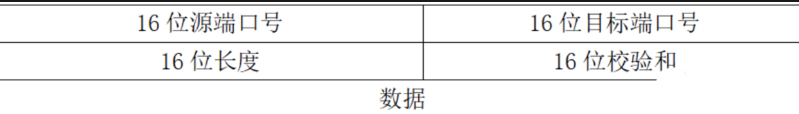
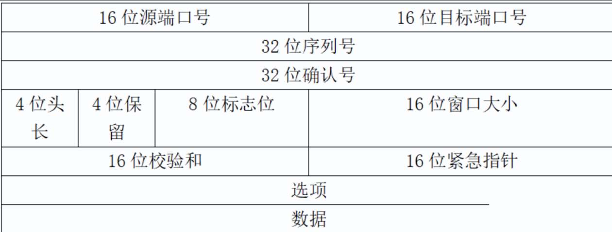
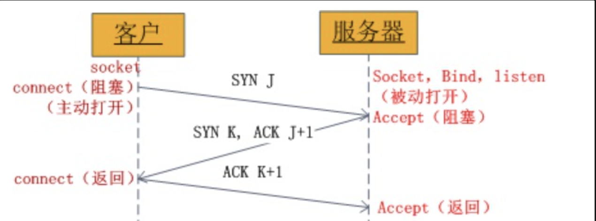
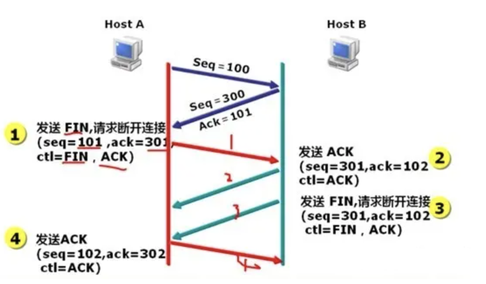
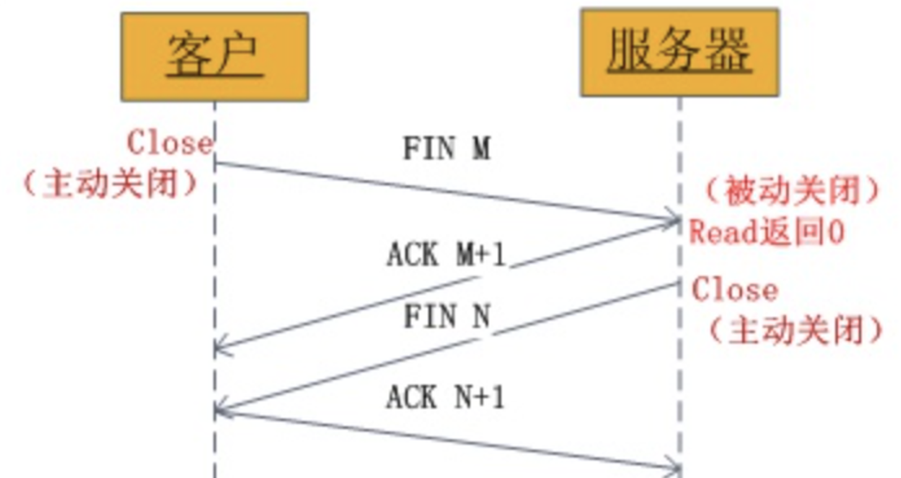
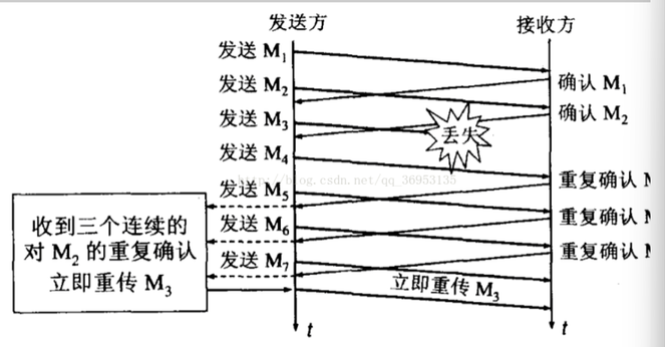

# 传输层

传输层的数据叫作段(segment)，网络层的数据叫作包(packet)，数据链路层的数据叫作帧(frame)，物理层的数据叫作流(stream)

## **1、UDP协议**

**无连接**：当udp客户端想要给udp服务端发送数据的时候，只要知道ip地址+端口即可发送，不确认服务端此时是否有条件有能力接收数据。

**不可靠**：不保证udp数据一定到达对端机器

**面向数据报**：udp数据的接收与发送均为整条发送不可分割，并且从应用层传递数据给传输层时，若传输层的数据还未及时传递给网络层，则应用层数据需要等待传输层将数据传递给网络层后才可以将应用层数据传递给网络层。

## **2、TCP协议**

**有连接**：发送数据之前，需要进行连接。

**可靠传输**：保证数据时有序且可靠的到达对端机器。

**面向字节流**：与面向数据报相反，数据可以在传递的过程中进行分割传递。

**回环地址**：所有127.开头的都是回环地址

**0.0.0.0**指代本机的所有IP地址，即回环地址和所有网卡

**loopback地址，**每一台路由器创建一个loopback 接口，并在该接口上单独指定一个IP 地址作为管理地址，管理员会使用该地址对路由器远程登录（telnet ），该地址实际上起到了类似设备名称一类的功能。

### TCP的建立（三次握手）

第一次握手：建立连接时，客户端发送syn包(syn=j)到服务器，并进入SYN_SEND状态，等待服务器确认；SYN：同步序列编号(Synchronize Sequence Numbers)。

第二次握手：服务器收到syn包，必须确认客户的SYN（ack=j+1），同时自己也发送一个SYN包（syn=k），即SYN+ACK包，此时服务器进入SYN_RECV状态； 第三次握手：客户端收到服务器的SYN+ACK包，向服务器发送确认包ACK(ack=k+1)，此包发送完毕，客户端和服务器进入ESTABLISHED状态，完成三次握手。 一个完整的三次握手也就是： 请求---应答---再次确认。

### TCP连接的终止（四次握手释放）

### 底层实现

最大报文段长度MSS，指的是在一个 TCP 报文段中能够携带的最大有效载荷，也就是 TCP 协议在传输数据时，每个报文段中可以携带的最大数据量。MSS 的值一般由网络的最大传输单元 MTU 减去 TCP 和 IP 协议头的长度得出。

**如何确保可靠的网络传输**

ARQ协议(Automatic Repeat-reQuest)，即自动重传请求，是传输层的错误纠正协议之一，它通过使用累计确认和超时两个机制，在不可靠的网络上实现可靠的信息传输。

链路层和传输层都用了ARQ

ARQ协议有两种模式：

1. 停等ARQ协议

   基于超时重传保证可靠

   ①A为每个即将发送的数据编号，用于标识数据和给数据排序

   ②A发送数据，并设置一个超时计时器

   ③B收到数据，返回一个带编号的确认

   ③B收到错误的数据或没有收到数据

   ④A收到确认，删除副本且取消超时计时器

   ④A在超时计时器的时间内容没有收到确认，重发数据

   信道利用率低

2. 连续ARQ协议

   不用等待确认而是连续发送多组

   仅仅响应编号最大的这个数据段，表示之前的数据收到了，即UNA模式（累计确认），

   容易实现，但失效率

   流水线的通常要求：

   - 序号范围要增加，可能存在多个在输送中未确认的报文
   - 发送方和接收方能缓存多个分组的报文

   解决流水线传输的差错有两种窗口协议：回退和选择重传

**如何在有限的带宽里发送大量数据**

窗口协议，即做流量控制

1. 拥塞窗口cwnd

   慢开始门限ssthresh是一个阈值，接收窗口值RWND，发送窗口值CWND

   **慢启动：**是在刚开始发送数据时让窗口缓慢扩张（将初始的cwnd置1个MSS，然后以2倍的速度指数增长，到ssthresh时执行拥塞避免，即+1线性增长）

   **退半避让(拥塞避免)：**在网络阻塞时窗口大小减半同时让ssthresh置为减半的窗口，但不能小于2）

   AIMD算法：乘法减小（慢开始和拥塞避免阶段，出现超时就把开始门限ssthresh的值减半），加法增大（执行拥塞避免算法后，使拥塞窗口缓慢增大 ）

   **快重传：**收到失序报文时立即发出重复确认（不需要等到之间发送数据时才捎带确认），发送发只要一连收到三个重复确认就应当立即重传（不必继续等待为其设置的重传计时器到期）

   

   **快恢复**： 它允许发送方在接收到丢失数据包的部分确认（ACK包）后，把拥塞窗口cwnd设置为慢开始门限ssthresh减半后的值，然后执行拥塞避免算法（加法增大）

   

   之所以要减半，为了迅速减少主机发送到网络中的分组数，使得路由器有足够的时间把队列中积压的分组处理完。

   当采用快恢复时，慢开始只在TCP连接建立和网络超时时才使用

2. 滑动窗口

   通常与连续ARQ协议配合使用，接收方告知发送方自己可以接收的缓冲区大小

   概念：

   - 发送方和接收方之间各自维持一个滑动窗口（大小不一定相同）
   - 控制发送和接收的分组的数量和编号
   - 它允许发送方发送多个分组而不需等待确认，TCP的滑动窗口是以字节为单位的
   - 每收到一个确认，发送方就把发送窗口向前滑动。

   发送窗口之内：

   - 已发送但未收到确认的数据
   - 允许发送但尚未发送的数据

   接收窗口之内：

   - 未按序收到的数据
   - 允许接收的数据

   两种方式解决包丢失：

   **回退N帧：**即收到一个包丢失的消息后，重传这个包以后的所有包

   **选择重传：**

   linux需要双方打开SACK选项

   发送方维持一个窗口包含未被确认的序号、可发送的序号

   接收方维持一个窗口包含可接收的序号

   每到达一个帧检测他的序号是否落在窗口内，如果落在窗口内且没有接收过，则接收并返回确认，等前面的帧都到达则交付给上层

   发送端每个发送缓存都有一个超时计时器

   问题：

   

   如上情况收到0号数据时不能确认是前一组还是后一组的0（前一组发送方没有收到ACK而重发）

   解决：

   对于帧序号n，将发送窗口大小=接收窗口大小=2^（n-）

   即，对于帧序号7，发送窗口大小=4=接收窗口大小

   > TCP协议中的16位窗口大小就是为窗口协议提供支持的。

   > UDP协议的目标是尽最大努力交付，不管你收到没有，所以没有该字段

   > UDP协议每次传输的最大数据量并不是2^16 - 1 - 8 - 20（8表示UDP头长，20表示IP头长），而是与MTU有关，即数据链路层的最大传输单元(Maximum Transmission Unit)，值是1500。

   ARQ模型响应有两种，UNA（此编号前所有包已收到，如TCP）和ACK（该编号包已收到），根据情况选择其中一种

## KCP协议

**特点：**

介于TCP与UDP之间，目标是为了解决在网络拥堵的情况下TCP传输速度慢的问题

TCP为流量设计的，充分利用带宽

KCP是为流速设计的，牺牲10%-20%的带宽，换取平均延迟降低 30%-40%

KCP没有规定下层传输协议，但通常使用UDP来实现

KCP格式

KCP底层使用UDP的原因：

KCP和TCP有太多冗余功能

UDP头部更小

**KCP与TCP的区别:**

1. 缩短超时重传RTO时间

   基于ARQ协议实现可靠性，但TCP的超时计算是RTO2（2倍的速度增长），而KCP的超时计算是*RTO*1.5，也就是说假如连续丢同一个包3次，TCP第3次重传是RTO*8，而KCP则是RTO*3.375

   通过4字节发送时的时间戳ts计算往返时延RTT，再通过RTT计算RTO

2. 快速重传（从三次缩减到两次）

   通过累计确认实现，发送端发送1，2，3，4，5几个包，然后收到远端的ACK：1，3，4，5，收到ACK = 4时，知道2被跳过了2次，此时可以认为2号丢失，不用等超时，直接重传2号。

3. 选择性重传

   保有UNA，TCP下UNA重传时需要将最小序号丢失后的所有数据都重传，KCP有sn位记录包的序号，从而只对真正丢失的数据重传

4. 非延迟ACK

   连续ARQ协议中延迟发送ACK能充分利用带宽，但会有较大的往返时延RTT，延长了丢包的判断过程。KCP这一块可调节，允许收到数据立即响应

5. 非退让流控

   传递及时性要求高的小数据时，可以忽略退半避让，仅依赖滑动窗口

   （如果网络真的拥堵，其他网络ssthresh减半了，对于其他传输服务不公平）

6. ARQ响应模型是UNA和ACK选择一个，KCP是除去单独的 ACK包外，所有包都有UNA信息

# base64编码

Base64是网络中场景的用于传输8bit字节代码的编码方式，是一种基于64个可打印字符来表示二进制数据的表示方法。将byte数组变为字符串方法，编码出的字符串只包含ASCII基础字符

Base64指定了编码表，大小为64，

- `A-Z` 26个
- `a-z` 26个
- `0-9` 10个
- `+` 1个
- `/` 1个

**意义：**

数据用UTF-8编码时，通过网络转发，其中路由器、客户端、系统等网络中的各个环节都可能改变其中的字符，导致最后读取的文件内容不一致，因此Base64就是为了解决各系统以及传输协议中二进制不兼容的问题而生的

**使用场景：**

- 证书
- 电子邮件的附件，因为附件往往有不可见字符
- xml 中如果像嵌入另外一个 xml 文件，直接嵌入，往往 xml 标签就乱套了， 不容易解析，因此，需要把 xml 编译成字节数组的字符串，编译成可见字符。
- 网页中的一些小图片，可以直接以 base64 编码的方式嵌入，不用再链接请求消耗网络资源。
- 较老的纯文本协议 SMTP ，这些文本偶尔传输一个文件时，需要用 base64

**Base64编码步骤：**

将原始数据三个字节为一组，每组8字节

将3个8位字节转为4个6位字节（来表示64）

在6位前面补两个0形成8位字节，变长了字节

> base64不适合放在URL传参，一些字符会改变， 因此改进的Base64在末尾填充=号，并将标准Base64中的“+”和“/”分别改成了“-”和“_”，还有其他的变种方式

如图，将Man转为了TWFu

如果原文长度不足3的倍数，则用=补齐

# URL

统一资源定位符（Uniform Resource Locator），对互联网上资源的位置访问的简洁表示

**协议的构成：**

1)http://:这个是协议，也就是HTTP超文本传输协议，也就是网页在网上传输的协议。

2）www：这个是服务器名，是指在因特网上以超文本为基础形成的信息网。

3)[peopledaily.com.cn](http://peopledaily.com.cn)：这个是域名，是用来定位网站的独一无二的名字。

4)[www.peopledaily.com.cn](http://www.peopledaily.com.cn)：这个是网站名，由服务器名+域名组成。

5）/：这个是根目录，也就是说，通过网站名找到服务器，然后在服务器存放网页的根目录

6:）GB/news/index.html：这个是根目录下的网页

# 数据链路层

## 二进制指数退避算法

在CSMA/CD协议中，一旦检测到冲突，为降低再冲突的概率，需要等待一个随机时间，这个等待的时间计算为二进制指数退避算法

之所以是二进制指数退避而不是减法退避，因为分布系统中，假设各个节点之间不通信，一次冲突代表系统至少有两个节点，因此将资源减半（等待时间*2），之后两端取随机数的等待时间，两端再次冲突的概率随指数级减少（次数如果有第三方参与也发生冲突，也当作这一种情况）

**计算：**

1. 一般为端到端的往返时间为2t，（**冲突窗口或争用期）**
2. k=Min[冲突次数，10]，冲突次数大于10，小于16时，k不再增大，一直取值为10
3. 从[0, (2k-1)]中随机取一个数r，等待时延为r*2t
4. 冲突超过16次后发送失败
